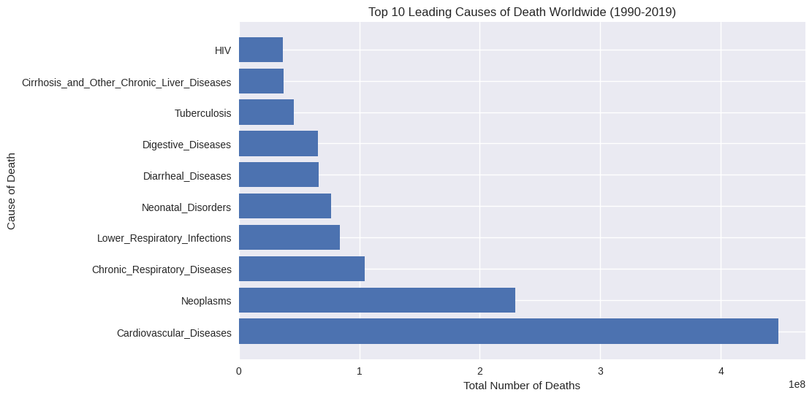
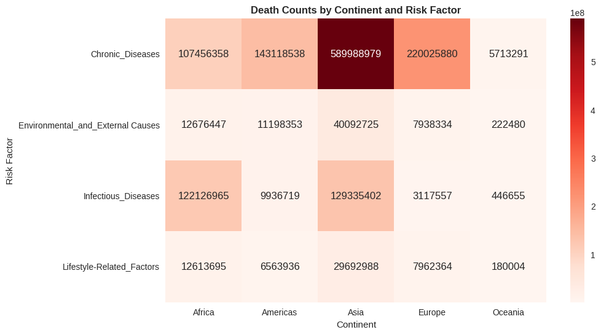
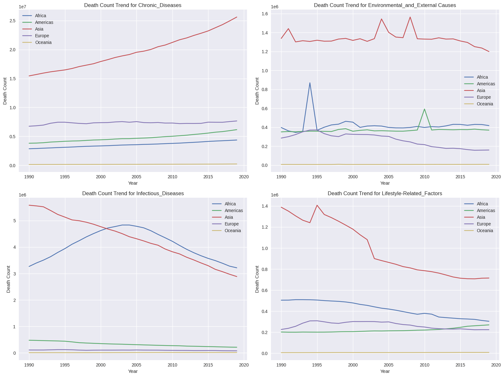
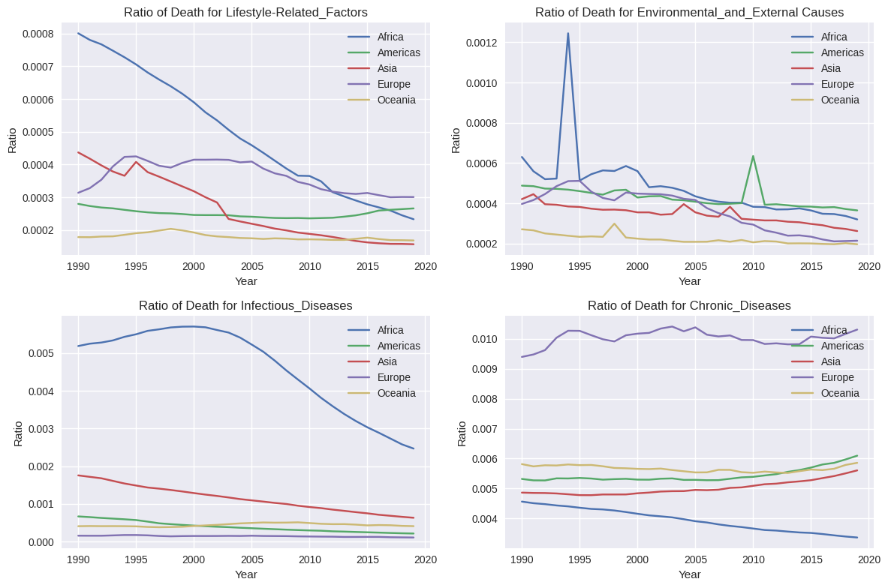
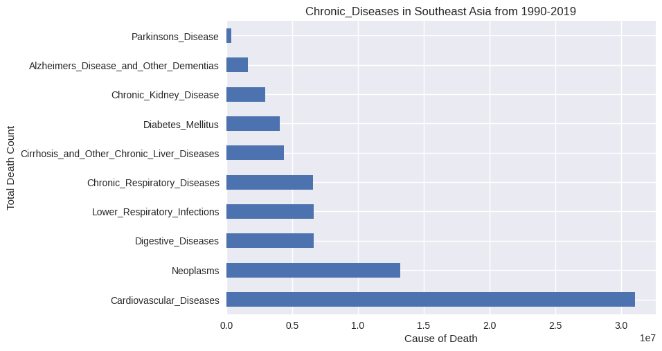
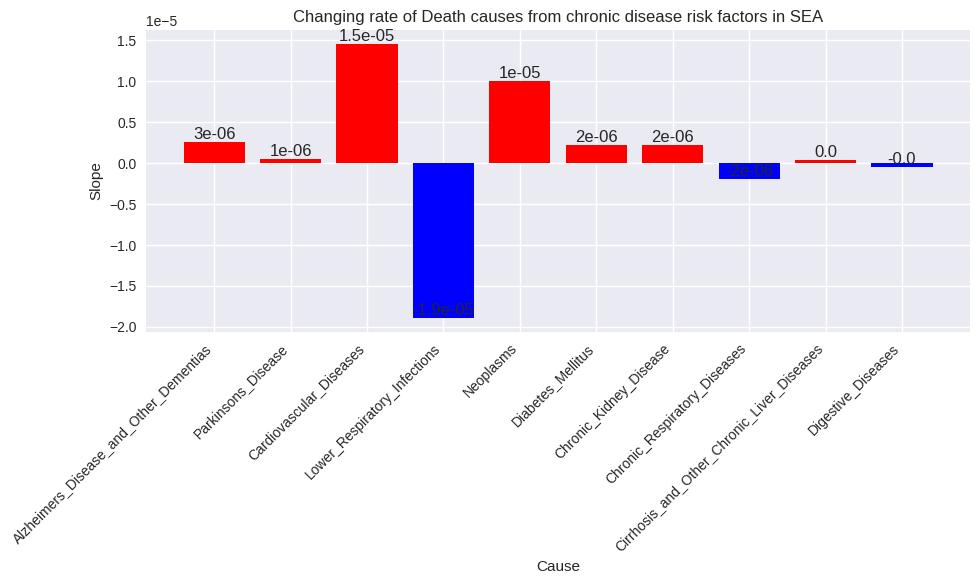
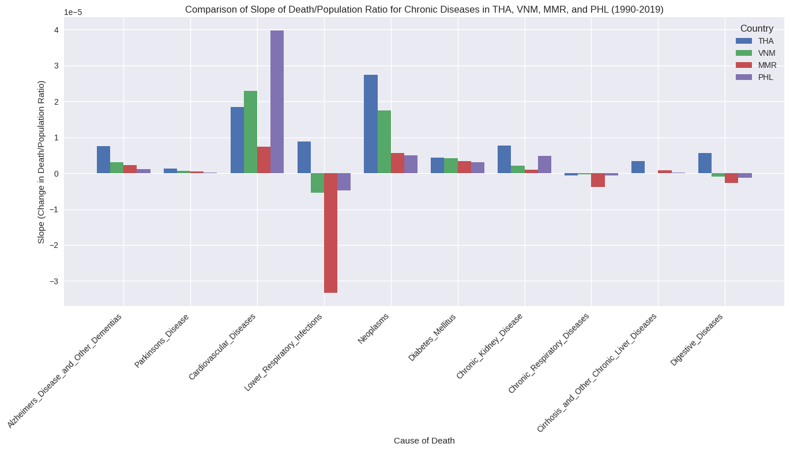

```python
import sys
import pandas as pd
import numpy as np
import IPython
from IPython.display import display

import matplotlib as mpl
%matplotlib inline
import matplotlib.pyplot as plt

# https://matplotlib.org/stable/gallery/style_sheets/style_sheets_reference.html
plt.style.use('seaborn-v0_8')   # The 'seaborn' style is deprecated

print( f"Python {sys.version}" )
print( f"Pandas {pd.__version__}" )
print( f"NumPy {np.__version__}" )
print( f"IPython {IPython.__version__}" )
print( f"Matplotlib {mpl.__version__}" )
```

    Python 3.10.12 (main, Sep 11 2024, 15:47:36) [GCC 11.4.0]
    Pandas 2.2.2
    NumPy 1.26.4
    IPython 7.34.0
    Matplotlib 3.7.1
    

#Import data

###Cause of Death


```python
df_cause_of_death = pd.read_csv('https://raw.githubusercontent.com/imyajaii/dads5001-mini-project-01/refs/heads/main/dataset/cause_of_deaths.csv')
# Preview
df_cause_of_death.info()
```

    <class 'pandas.core.frame.DataFrame'>
    RangeIndex: 6120 entries, 0 to 6119
    Data columns (total 34 columns):
     #   Column                                      Non-Null Count  Dtype 
    ---  ------                                      --------------  ----- 
     0   Country/Territory                           6120 non-null   object
     1   Code                                        6120 non-null   object
     2   Year                                        6120 non-null   int64 
     3   Meningitis                                  6120 non-null   int64 
     4   Alzheimer's Disease and Other Dementias     6120 non-null   int64 
     5   Parkinson's Disease                         6120 non-null   int64 
     6   Nutritional Deficiencies                    6120 non-null   int64 
     7   Malaria                                     6120 non-null   int64 
     8   Drowning                                    6120 non-null   int64 
     9   Interpersonal Violence                      6120 non-null   int64 
     10  Maternal Disorders                          6120 non-null   int64 
     11  HIV/AIDS                                    6120 non-null   int64 
     12  Drug Use Disorders                          6120 non-null   int64 
     13  Tuberculosis                                6120 non-null   int64 
     14  Cardiovascular Diseases                     6120 non-null   int64 
     15  Lower Respiratory Infections                6120 non-null   int64 
     16  Neonatal Disorders                          6120 non-null   int64 
     17  Alcohol Use Disorders                       6120 non-null   int64 
     18  Self-harm                                   6120 non-null   int64 
     19  Exposure to Forces of Nature                6120 non-null   int64 
     20  Diarrheal Diseases                          6120 non-null   int64 
     21  Environmental Heat and Cold Exposure        6120 non-null   int64 
     22  Neoplasms                                   6120 non-null   int64 
     23  Conflict and Terrorism                      6120 non-null   int64 
     24  Diabetes Mellitus                           6120 non-null   int64 
     25  Chronic Kidney Disease                      6120 non-null   int64 
     26  Poisonings                                  6120 non-null   int64 
     27  Protein-Energy Malnutrition                 6120 non-null   int64 
     28  Road Injuries                               6120 non-null   int64 
     29  Chronic Respiratory Diseases                6120 non-null   int64 
     30  Cirrhosis and Other Chronic Liver Diseases  6120 non-null   int64 
     31  Digestive Diseases                          6120 non-null   int64 
     32  Fire, Heat, and Hot Substances              6120 non-null   int64 
     33  Acute Hepatitis                             6120 non-null   int64 
    dtypes: int64(32), object(2)
    memory usage: 1.6+ MB
    


```python
df_cause_of_death.head()
```


  <div id="df-e80a1b51-a376-4b7e-ab36-fba39570c5e3" class="colab-df-container">
    <div>
<style scoped>
    .dataframe tbody tr th:only-of-type {
        vertical-align: middle;
    }

    .dataframe tbody tr th {
        vertical-align: top;
    }

    .dataframe thead th {
        text-align: right;
    }
</style>
<table border="1" class="dataframe">
  <thead>
    <tr style="text-align: right;">
      <th></th>
      <th>Country/Territory</th>
      <th>Code</th>
      <th>Year</th>
      <th>Meningitis</th>
      <th>Alzheimer's Disease and Other Dementias</th>
      <th>Parkinson's Disease</th>
      <th>Nutritional Deficiencies</th>
      <th>Malaria</th>
      <th>Drowning</th>
      <th>Interpersonal Violence</th>
      <th>...</th>
      <th>Diabetes Mellitus</th>
      <th>Chronic Kidney Disease</th>
      <th>Poisonings</th>
      <th>Protein-Energy Malnutrition</th>
      <th>Road Injuries</th>
      <th>Chronic Respiratory Diseases</th>
      <th>Cirrhosis and Other Chronic Liver Diseases</th>
      <th>Digestive Diseases</th>
      <th>Fire, Heat, and Hot Substances</th>
      <th>Acute Hepatitis</th>
    </tr>
  </thead>
  <tbody>
    <tr>
      <th>0</th>
      <td>Afghanistan</td>
      <td>AFG</td>
      <td>1990</td>
      <td>2159</td>
      <td>1116</td>
      <td>371</td>
      <td>2087</td>
      <td>93</td>
      <td>1370</td>
      <td>1538</td>
      <td>...</td>
      <td>2108</td>
      <td>3709</td>
      <td>338</td>
      <td>2054</td>
      <td>4154</td>
      <td>5945</td>
      <td>2673</td>
      <td>5005</td>
      <td>323</td>
      <td>2985</td>
    </tr>
    <tr>
      <th>1</th>
      <td>Afghanistan</td>
      <td>AFG</td>
      <td>1991</td>
      <td>2218</td>
      <td>1136</td>
      <td>374</td>
      <td>2153</td>
      <td>189</td>
      <td>1391</td>
      <td>2001</td>
      <td>...</td>
      <td>2120</td>
      <td>3724</td>
      <td>351</td>
      <td>2119</td>
      <td>4472</td>
      <td>6050</td>
      <td>2728</td>
      <td>5120</td>
      <td>332</td>
      <td>3092</td>
    </tr>
    <tr>
      <th>2</th>
      <td>Afghanistan</td>
      <td>AFG</td>
      <td>1992</td>
      <td>2475</td>
      <td>1162</td>
      <td>378</td>
      <td>2441</td>
      <td>239</td>
      <td>1514</td>
      <td>2299</td>
      <td>...</td>
      <td>2153</td>
      <td>3776</td>
      <td>386</td>
      <td>2404</td>
      <td>5106</td>
      <td>6223</td>
      <td>2830</td>
      <td>5335</td>
      <td>360</td>
      <td>3325</td>
    </tr>
    <tr>
      <th>3</th>
      <td>Afghanistan</td>
      <td>AFG</td>
      <td>1993</td>
      <td>2812</td>
      <td>1187</td>
      <td>384</td>
      <td>2837</td>
      <td>108</td>
      <td>1687</td>
      <td>2589</td>
      <td>...</td>
      <td>2195</td>
      <td>3862</td>
      <td>425</td>
      <td>2797</td>
      <td>5681</td>
      <td>6445</td>
      <td>2943</td>
      <td>5568</td>
      <td>396</td>
      <td>3601</td>
    </tr>
    <tr>
      <th>4</th>
      <td>Afghanistan</td>
      <td>AFG</td>
      <td>1994</td>
      <td>3027</td>
      <td>1211</td>
      <td>391</td>
      <td>3081</td>
      <td>211</td>
      <td>1809</td>
      <td>2849</td>
      <td>...</td>
      <td>2231</td>
      <td>3932</td>
      <td>451</td>
      <td>3038</td>
      <td>6001</td>
      <td>6664</td>
      <td>3027</td>
      <td>5739</td>
      <td>420</td>
      <td>3816</td>
    </tr>
  </tbody>
</table>
<p>5 rows × 34 columns</p>
</div>
    <div class="colab-df-buttons">

  <div class="colab-df-container">
    <button class="colab-df-convert" onclick="convertToInteractive('df-e80a1b51-a376-4b7e-ab36-fba39570c5e3')"
            title="Convert this dataframe to an interactive table."
            style="display:none;">

  <svg xmlns="http://www.w3.org/2000/svg" height="24px" viewBox="0 -960 960 960">
    <path d="M120-120v-720h720v720H120Zm60-500h600v-160H180v160Zm220 220h160v-160H400v160Zm0 220h160v-160H400v160ZM180-400h160v-160H180v160Zm440 0h160v-160H620v160ZM180-180h160v-160H180v160Zm440 0h160v-160H620v160Z"/>
  </svg>
    </button>

  <style>
    .colab-df-container {
      display:flex;
      gap: 12px;
    }

    .colab-df-convert {
      background-color: #E8F0FE;
      border: none;
      border-radius: 50%;
      cursor: pointer;
      display: none;
      fill: #1967D2;
      height: 32px;
      padding: 0 0 0 0;
      width: 32px;
    }

    .colab-df-convert:hover {
      background-color: #E2EBFA;
      box-shadow: 0px 1px 2px rgba(60, 64, 67, 0.3), 0px 1px 3px 1px rgba(60, 64, 67, 0.15);
      fill: #174EA6;
    }

    .colab-df-buttons div {
      margin-bottom: 4px;
    }

    [theme=dark] .colab-df-convert {
      background-color: #3B4455;
      fill: #D2E3FC;
    }

    [theme=dark] .colab-df-convert:hover {
      background-color: #434B5C;
      box-shadow: 0px 1px 3px 1px rgba(0, 0, 0, 0.15);
      filter: drop-shadow(0px 1px 2px rgba(0, 0, 0, 0.3));
      fill: #FFFFFF;
    }
  </style>

    <script>
      const buttonEl =
        document.querySelector('#df-e80a1b51-a376-4b7e-ab36-fba39570c5e3 button.colab-df-convert');
      buttonEl.style.display =
        google.colab.kernel.accessAllowed ? 'block' : 'none';

      async function convertToInteractive(key) {
        const element = document.querySelector('#df-e80a1b51-a376-4b7e-ab36-fba39570c5e3');
        const dataTable =
          await google.colab.kernel.invokeFunction('convertToInteractive',
                                                    [key], {});
        if (!dataTable) return;

        const docLinkHtml = 'Like what you see? Visit the ' +
          '<a target="_blank" href=https://colab.research.google.com/notebooks/data_table.ipynb>data table notebook</a>'
          + ' to learn more about interactive tables.';
        element.innerHTML = '';
        dataTable['output_type'] = 'display_data';
        await google.colab.output.renderOutput(dataTable, element);
        const docLink = document.createElement('div');
        docLink.innerHTML = docLinkHtml;
        element.appendChild(docLink);
      }
    </script>
  </div>


<div id="df-e799b41f-ec1b-427f-90b2-fb428e97c6a3">
  <button class="colab-df-quickchart" onclick="quickchart('df-e799b41f-ec1b-427f-90b2-fb428e97c6a3')"
            title="Suggest charts"
            style="display:none;">

<svg xmlns="http://www.w3.org/2000/svg" height="24px"viewBox="0 0 24 24"
     width="24px">
    <g>
        <path d="M19 3H5c-1.1 0-2 .9-2 2v14c0 1.1.9 2 2 2h14c1.1 0 2-.9 2-2V5c0-1.1-.9-2-2-2zM9 17H7v-7h2v7zm4 0h-2V7h2v10zm4 0h-2v-4h2v4z"/>
    </g>
</svg>
  </button>

<style>
  .colab-df-quickchart {
      --bg-color: #E8F0FE;
      --fill-color: #1967D2;
      --hover-bg-color: #E2EBFA;
      --hover-fill-color: #174EA6;
      --disabled-fill-color: #AAA;
      --disabled-bg-color: #DDD;
  }

  [theme=dark] .colab-df-quickchart {
      --bg-color: #3B4455;
      --fill-color: #D2E3FC;
      --hover-bg-color: #434B5C;
      --hover-fill-color: #FFFFFF;
      --disabled-bg-color: #3B4455;
      --disabled-fill-color: #666;
  }

  .colab-df-quickchart {
    background-color: var(--bg-color);
    border: none;
    border-radius: 50%;
    cursor: pointer;
    display: none;
    fill: var(--fill-color);
    height: 32px;
    padding: 0;
    width: 32px;
  }

  .colab-df-quickchart:hover {
    background-color: var(--hover-bg-color);
    box-shadow: 0 1px 2px rgba(60, 64, 67, 0.3), 0 1px 3px 1px rgba(60, 64, 67, 0.15);
    fill: var(--button-hover-fill-color);
  }

  .colab-df-quickchart-complete:disabled,
  .colab-df-quickchart-complete:disabled:hover {
    background-color: var(--disabled-bg-color);
    fill: var(--disabled-fill-color);
    box-shadow: none;
  }

  .colab-df-spinner {
    border: 2px solid var(--fill-color);
    border-color: transparent;
    border-bottom-color: var(--fill-color);
    animation:
      spin 1s steps(1) infinite;
  }

  @keyframes spin {
    0% {
      border-color: transparent;
      border-bottom-color: var(--fill-color);
      border-left-color: var(--fill-color);
    }
    20% {
      border-color: transparent;
      border-left-color: var(--fill-color);
      border-top-color: var(--fill-color);
    }
    30% {
      border-color: transparent;
      border-left-color: var(--fill-color);
      border-top-color: var(--fill-color);
      border-right-color: var(--fill-color);
    }
    40% {
      border-color: transparent;
      border-right-color: var(--fill-color);
      border-top-color: var(--fill-color);
    }
    60% {
      border-color: transparent;
      border-right-color: var(--fill-color);
    }
    80% {
      border-color: transparent;
      border-right-color: var(--fill-color);
      border-bottom-color: var(--fill-color);
    }
    90% {
      border-color: transparent;
      border-bottom-color: var(--fill-color);
    }
  }
</style>

  <script>
    async function quickchart(key) {
      const quickchartButtonEl =
        document.querySelector('#' + key + ' button');
      quickchartButtonEl.disabled = true;  // To prevent multiple clicks.
      quickchartButtonEl.classList.add('colab-df-spinner');
      try {
        const charts = await google.colab.kernel.invokeFunction(
            'suggestCharts', [key], {});
      } catch (error) {
        console.error('Error during call to suggestCharts:', error);
      }
      quickchartButtonEl.classList.remove('colab-df-spinner');
      quickchartButtonEl.classList.add('colab-df-quickchart-complete');
    }
    (() => {
      let quickchartButtonEl =
        document.querySelector('#df-e799b41f-ec1b-427f-90b2-fb428e97c6a3 button');
      quickchartButtonEl.style.display =
        google.colab.kernel.accessAllowed ? 'block' : 'none';
    })();
  </script>
</div>

    </div>
  </div>


```python
df_cause_of_death['Code'].unique()
```


    array(['AFG', 'ALB', 'DZA', 'ASM', 'AND', 'AGO', 'ATG', 'ARG', 'ARM',
           'AUS', 'AUT', 'AZE', 'BHS', 'BHR', 'BGD', 'BRB', 'BLR', 'BEL',
           'BLZ', 'BEN', 'BMU', 'BTN', 'BOL', 'BIH', 'BWA', 'BRA', 'BRN',
           'BGR', 'BFA', 'BDI', 'KHM', 'CMR', 'CAN', 'CPV', 'CAF', 'TCD',
           'CHL', 'CHN', 'COL', 'COM', 'COG', 'COK', 'CRI', 'CIV', 'HRV',
           'CUB', 'CYP', 'CZE', 'COD', 'DNK', 'DJI', 'DMA', 'DOM', 'ECU',
           'EGY', 'SLV', 'GNQ', 'ERI', 'EST', 'SWZ', 'ETH', 'FJI', 'FIN',
           'FRA', 'GAB', 'GMB', 'GEO', 'DEU', 'GHA', 'GRC', 'GRL', 'GRD',
           'GUM', 'GTM', 'GIN', 'GNB', 'GUY', 'HTI', 'HND', 'HUN', 'ISL',
           'IND', 'IDN', 'IRN', 'IRQ', 'IRL', 'ISR', 'ITA', 'JAM', 'JPN',
           'JOR', 'KAZ', 'KEN', 'KIR', 'KWT', 'KGZ', 'LAO', 'LVA', 'LBN',
           'LSO', 'LBR', 'LBY', 'LTU', 'LUX', 'MDG', 'MWI', 'MYS', 'MDV',
           'MLI', 'MLT', 'MHL', 'MRT', 'MUS', 'MEX', 'FSM', 'MDA', 'MCO',
           'MNG', 'MNE', 'MAR', 'MOZ', 'MMR', 'NAM', 'NRU', 'NPL', 'NLD',
           'NZL', 'NIC', 'NER', 'NGA', 'NIU', 'PRK', 'MKD', 'MNP', 'NOR',
           'OMN', 'PAK', 'PLW', 'PSE', 'PAN', 'PNG', 'PRY', 'PER', 'PHL',
           'POL', 'PRT', 'PRI', 'QAT', 'ROU', 'RUS', 'RWA', 'KNA', 'LCA',
           'VCT', 'WSM', 'SMR', 'STP', 'SAU', 'SEN', 'SRB', 'SYC', 'SLE',
           'SGP', 'SVK', 'SVN', 'SLB', 'SOM', 'ZAF', 'KOR', 'SSD', 'ESP',
           'LKA', 'SDN', 'SUR', 'SWE', 'CHE', 'SYR', 'TWN', 'TJK', 'TZA',
           'THA', 'TLS', 'TGO', 'TKL', 'TON', 'TTO', 'TUN', 'TUR', 'TKM',
           'TUV', 'UGA', 'UKR', 'ARE', 'GBR', 'USA', 'VIR', 'URY', 'UZB',
           'VUT', 'VEN', 'VNM', 'YEM', 'ZMB', 'ZWE'], dtype=object)


```python
df_cause_of_death['Code'].unique()
lst = df_cause_of_death['Code'].unique()
len(lst)
```


    204


###Continent


```python
df_continent = pd.read_csv('https://raw.githubusercontent.com/imyajaii/dads5001-mini-project-01/refs/heads/main/dataset/countryContinent.csv',encoding='latin-1') # Try 'latin-1' encoding

# Preview
df_continent.info()
```

    <class 'pandas.core.frame.DataFrame'>
    RangeIndex: 249 entries, 0 to 248
    Data columns (total 9 columns):
     #   Column           Non-Null Count  Dtype  
    ---  ------           --------------  -----  
     0   country          249 non-null    object 
     1   code_2           248 non-null    object 
     2   code_3           249 non-null    object 
     3   country_code     249 non-null    int64  
     4   iso_3166_2       249 non-null    object 
     5   continent        240 non-null    object 
     6   sub_region       240 non-null    object 
     7   region_code      240 non-null    float64
     8   sub_region_code  240 non-null    float64
    dtypes: float64(2), int64(1), object(6)
    memory usage: 17.6+ KB
    

###World Population


```python
df_population = pd.read_csv('https://raw.githubusercontent.com/imyajaii/dads5001-mini-project-01/refs/heads/main/dataset/World-population-by-countries-dataset.csv')

# Preview
df_population.info()
```

    <class 'pandas.core.frame.DataFrame'>
    RangeIndex: 266 entries, 0 to 265
    Data columns (total 64 columns):
     #   Column        Non-Null Count  Dtype  
    ---  ------        --------------  -----  
     0   Country Name  266 non-null    object 
     1   Country Code  266 non-null    object 
     2   1960          264 non-null    float64
     3   1961          264 non-null    float64
     4   1962          264 non-null    float64
     5   1963          264 non-null    float64
     6   1964          264 non-null    float64
     7   1965          264 non-null    float64
     8   1966          264 non-null    float64
     9   1967          264 non-null    float64
     10  1968          264 non-null    float64
     11  1969          264 non-null    float64
     12  1970          264 non-null    float64
     13  1971          264 non-null    float64
     14  1972          264 non-null    float64
     15  1973          264 non-null    float64
     16  1974          264 non-null    float64
     17  1975          264 non-null    float64
     18  1976          264 non-null    float64
     19  1977          264 non-null    float64
     20  1978          264 non-null    float64
     21  1979          264 non-null    float64
     22  1980          264 non-null    float64
     23  1981          264 non-null    float64
     24  1982          264 non-null    float64
     25  1983          264 non-null    float64
     26  1984          264 non-null    float64
     27  1985          264 non-null    float64
     28  1986          264 non-null    float64
     29  1987          264 non-null    float64
     30  1988          264 non-null    float64
     31  1989          264 non-null    float64
     32  1990          265 non-null    float64
     33  1991          265 non-null    float64
     34  1992          264 non-null    float64
     35  1993          264 non-null    float64
     36  1994          264 non-null    float64
     37  1995          265 non-null    float64
     38  1996          265 non-null    float64
     39  1997          265 non-null    float64
     40  1998          265 non-null    float64
     41  1999          265 non-null    float64
     42  2000          265 non-null    float64
     43  2001          265 non-null    float64
     44  2002          265 non-null    float64
     45  2003          265 non-null    float64
     46  2004          265 non-null    float64
     47  2005          265 non-null    float64
     48  2006          265 non-null    float64
     49  2007          265 non-null    float64
     50  2008          265 non-null    float64
     51  2009          265 non-null    float64
     52  2010          265 non-null    float64
     53  2011          265 non-null    float64
     54  2012          264 non-null    float64
     55  2013          264 non-null    float64
     56  2014          264 non-null    float64
     57  2015          264 non-null    float64
     58  2016          264 non-null    float64
     59  2017          264 non-null    float64
     60  2018          264 non-null    float64
     61  2019          264 non-null    float64
     62  2020          264 non-null    float64
     63  2021          264 non-null    float64
    dtypes: float64(62), object(2)
    memory usage: 133.1+ KB
    

#Cleansing

##World Population

### Drop unnecessary column


```python
df_population.head()
```


  <div id="df-1e93ddd8-d4df-4019-b73c-48dbf22a57e6" class="colab-df-container">
    <div>
<style scoped>
    .dataframe tbody tr th:only-of-type {
        vertical-align: middle;
    }

    .dataframe tbody tr th {
        vertical-align: top;
    }

    .dataframe thead th {
        text-align: right;
    }
</style>
<table border="1" class="dataframe">
  <thead>
    <tr style="text-align: right;">
      <th></th>
      <th>Country Name</th>
      <th>Country Code</th>
      <th>1960</th>
      <th>1961</th>
      <th>1962</th>
      <th>1963</th>
      <th>1964</th>
      <th>1965</th>
      <th>1966</th>
      <th>1967</th>
      <th>...</th>
      <th>2012</th>
      <th>2013</th>
      <th>2014</th>
      <th>2015</th>
      <th>2016</th>
      <th>2017</th>
      <th>2018</th>
      <th>2019</th>
      <th>2020</th>
      <th>2021</th>
    </tr>
  </thead>
  <tbody>
    <tr>
      <th>0</th>
      <td>Aruba</td>
      <td>ABW</td>
      <td>54208.0</td>
      <td>55434.0</td>
      <td>56234.0</td>
      <td>56699.0</td>
      <td>57029.0</td>
      <td>57357.0</td>
      <td>57702.0</td>
      <td>58044.0</td>
      <td>...</td>
      <td>102565.0</td>
      <td>103165.0</td>
      <td>103776.0</td>
      <td>104339.0</td>
      <td>104865.0</td>
      <td>105361.0</td>
      <td>105846.0</td>
      <td>106310.0</td>
      <td>106766.0</td>
      <td>107195.0</td>
    </tr>
    <tr>
      <th>1</th>
      <td>Africa Eastern and Southern</td>
      <td>AFE</td>
      <td>130836765.0</td>
      <td>134159786.0</td>
      <td>137614644.0</td>
      <td>141202036.0</td>
      <td>144920186.0</td>
      <td>148769974.0</td>
      <td>152752671.0</td>
      <td>156876454.0</td>
      <td>...</td>
      <td>547482863.0</td>
      <td>562601578.0</td>
      <td>578075373.0</td>
      <td>593871847.0</td>
      <td>609978946.0</td>
      <td>626392880.0</td>
      <td>643090131.0</td>
      <td>660046272.0</td>
      <td>677243299.0</td>
      <td>694665117.0</td>
    </tr>
    <tr>
      <th>2</th>
      <td>Afghanistan</td>
      <td>AFG</td>
      <td>8996967.0</td>
      <td>9169406.0</td>
      <td>9351442.0</td>
      <td>9543200.0</td>
      <td>9744772.0</td>
      <td>9956318.0</td>
      <td>10174840.0</td>
      <td>10399936.0</td>
      <td>...</td>
      <td>31161378.0</td>
      <td>32269592.0</td>
      <td>33370804.0</td>
      <td>34413603.0</td>
      <td>35383028.0</td>
      <td>36296111.0</td>
      <td>37171922.0</td>
      <td>38041757.0</td>
      <td>38928341.0</td>
      <td>39835428.0</td>
    </tr>
    <tr>
      <th>3</th>
      <td>Africa Western and Central</td>
      <td>AFW</td>
      <td>96396419.0</td>
      <td>98407221.0</td>
      <td>100506960.0</td>
      <td>102691339.0</td>
      <td>104953470.0</td>
      <td>107289875.0</td>
      <td>109701811.0</td>
      <td>112195950.0</td>
      <td>...</td>
      <td>370243017.0</td>
      <td>380437896.0</td>
      <td>390882979.0</td>
      <td>401586651.0</td>
      <td>412551299.0</td>
      <td>423769930.0</td>
      <td>435229381.0</td>
      <td>446911598.0</td>
      <td>458803476.0</td>
      <td>470898870.0</td>
    </tr>
    <tr>
      <th>4</th>
      <td>Angola</td>
      <td>AGO</td>
      <td>5454938.0</td>
      <td>5531451.0</td>
      <td>5608499.0</td>
      <td>5679409.0</td>
      <td>5734995.0</td>
      <td>5770573.0</td>
      <td>5781305.0</td>
      <td>5774440.0</td>
      <td>...</td>
      <td>25107925.0</td>
      <td>26015786.0</td>
      <td>26941773.0</td>
      <td>27884380.0</td>
      <td>28842482.0</td>
      <td>29816769.0</td>
      <td>30809787.0</td>
      <td>31825299.0</td>
      <td>32866268.0</td>
      <td>33933611.0</td>
    </tr>
  </tbody>
</table>
<p>5 rows × 64 columns</p>
</div>
    <div class="colab-df-buttons">

  <div class="colab-df-container">
    <button class="colab-df-convert" onclick="convertToInteractive('df-1e93ddd8-d4df-4019-b73c-48dbf22a57e6')"
            title="Convert this dataframe to an interactive table."
            style="display:none;">

  <svg xmlns="http://www.w3.org/2000/svg" height="24px" viewBox="0 -960 960 960">
    <path d="M120-120v-720h720v720H120Zm60-500h600v-160H180v160Zm220 220h160v-160H400v160Zm0 220h160v-160H400v160ZM180-400h160v-160H180v160Zm440 0h160v-160H620v160ZM180-180h160v-160H180v160Zm440 0h160v-160H620v160Z"/>
  </svg>
    </button>

  <style>
    .colab-df-container {
      display:flex;
      gap: 12px;
    }

    .colab-df-convert {
      background-color: #E8F0FE;
      border: none;
      border-radius: 50%;
      cursor: pointer;
      display: none;
      fill: #1967D2;
      height: 32px;
      padding: 0 0 0 0;
      width: 32px;
    }

    .colab-df-convert:hover {
      background-color: #E2EBFA;
      box-shadow: 0px 1px 2px rgba(60, 64, 67, 0.3), 0px 1px 3px 1px rgba(60, 64, 67, 0.15);
      fill: #174EA6;
    }

    .colab-df-buttons div {
      margin-bottom: 4px;
    }

    [theme=dark] .colab-df-convert {
      background-color: #3B4455;
      fill: #D2E3FC;
    }

    [theme=dark] .colab-df-convert:hover {
      background-color: #434B5C;
      box-shadow: 0px 1px 3px 1px rgba(0, 0, 0, 0.15);
      filter: drop-shadow(0px 1px 2px rgba(0, 0, 0, 0.3));
      fill: #FFFFFF;
    }
  </style>

    <script>
      const buttonEl =
        document.querySelector('#df-1e93ddd8-d4df-4019-b73c-48dbf22a57e6 button.colab-df-convert');
      buttonEl.style.display =
        google.colab.kernel.accessAllowed ? 'block' : 'none';

      async function convertToInteractive(key) {
        const element = document.querySelector('#df-1e93ddd8-d4df-4019-b73c-48dbf22a57e6');
        const dataTable =
          await google.colab.kernel.invokeFunction('convertToInteractive',
                                                    [key], {});
        if (!dataTable) return;

        const docLinkHtml = 'Like what you see? Visit the ' +
          '<a target="_blank" href=https://colab.research.google.com/notebooks/data_table.ipynb>data table notebook</a>'
          + ' to learn more about interactive tables.';
        element.innerHTML = '';
        dataTable['output_type'] = 'display_data';
        await google.colab.output.renderOutput(dataTable, element);
        const docLink = document.createElement('div');
        docLink.innerHTML = docLinkHtml;
        element.appendChild(docLink);
      }
    </script>
  </div>


<div id="df-d68d6fd8-31ac-425c-9e02-341bfbc850f9">
  <button class="colab-df-quickchart" onclick="quickchart('df-d68d6fd8-31ac-425c-9e02-341bfbc850f9')"
            title="Suggest charts"
            style="display:none;">

<svg xmlns="http://www.w3.org/2000/svg" height="24px"viewBox="0 0 24 24"
     width="24px">
    <g>
        <path d="M19 3H5c-1.1 0-2 .9-2 2v14c0 1.1.9 2 2 2h14c1.1 0 2-.9 2-2V5c0-1.1-.9-2-2-2zM9 17H7v-7h2v7zm4 0h-2V7h2v10zm4 0h-2v-4h2v4z"/>
    </g>
</svg>
  </button>

<style>
  .colab-df-quickchart {
      --bg-color: #E8F0FE;
      --fill-color: #1967D2;
      --hover-bg-color: #E2EBFA;
      --hover-fill-color: #174EA6;
      --disabled-fill-color: #AAA;
      --disabled-bg-color: #DDD;
  }

  [theme=dark] .colab-df-quickchart {
      --bg-color: #3B4455;
      --fill-color: #D2E3FC;
      --hover-bg-color: #434B5C;
      --hover-fill-color: #FFFFFF;
      --disabled-bg-color: #3B4455;
      --disabled-fill-color: #666;
  }

  .colab-df-quickchart {
    background-color: var(--bg-color);
    border: none;
    border-radius: 50%;
    cursor: pointer;
    display: none;
    fill: var(--fill-color);
    height: 32px;
    padding: 0;
    width: 32px;
  }

  .colab-df-quickchart:hover {
    background-color: var(--hover-bg-color);
    box-shadow: 0 1px 2px rgba(60, 64, 67, 0.3), 0 1px 3px 1px rgba(60, 64, 67, 0.15);
    fill: var(--button-hover-fill-color);
  }

  .colab-df-quickchart-complete:disabled,
  .colab-df-quickchart-complete:disabled:hover {
    background-color: var(--disabled-bg-color);
    fill: var(--disabled-fill-color);
    box-shadow: none;
  }

  .colab-df-spinner {
    border: 2px solid var(--fill-color);
    border-color: transparent;
    border-bottom-color: var(--fill-color);
    animation:
      spin 1s steps(1) infinite;
  }

  @keyframes spin {
    0% {
      border-color: transparent;
      border-bottom-color: var(--fill-color);
      border-left-color: var(--fill-color);
    }
    20% {
      border-color: transparent;
      border-left-color: var(--fill-color);
      border-top-color: var(--fill-color);
    }
    30% {
      border-color: transparent;
      border-left-color: var(--fill-color);
      border-top-color: var(--fill-color);
      border-right-color: var(--fill-color);
    }
    40% {
      border-color: transparent;
      border-right-color: var(--fill-color);
      border-top-color: var(--fill-color);
    }
    60% {
      border-color: transparent;
      border-right-color: var(--fill-color);
    }
    80% {
      border-color: transparent;
      border-right-color: var(--fill-color);
      border-bottom-color: var(--fill-color);
    }
    90% {
      border-color: transparent;
      border-bottom-color: var(--fill-color);
    }
  }
</style>

  <script>
    async function quickchart(key) {
      const quickchartButtonEl =
        document.querySelector('#' + key + ' button');
      quickchartButtonEl.disabled = true;  // To prevent multiple clicks.
      quickchartButtonEl.classList.add('colab-df-spinner');
      try {
        const charts = await google.colab.kernel.invokeFunction(
            'suggestCharts', [key], {});
      } catch (error) {
        console.error('Error during call to suggestCharts:', error);
      }
      quickchartButtonEl.classList.remove('colab-df-spinner');
      quickchartButtonEl.classList.add('colab-df-quickchart-complete');
    }
    (() => {
      let quickchartButtonEl =
        document.querySelector('#df-d68d6fd8-31ac-425c-9e02-341bfbc850f9 button');
      quickchartButtonEl.style.display =
        google.colab.kernel.accessAllowed ? 'block' : 'none';
    })();
  </script>
</div>

    </div>
  </div>


```python
# prompt: drop column 1960 - 1989 , 2020 , 2021 of df_population

columns_to_drop = [str(year) for year in range(1960, 1990)] + ['2020', '2021']
df_population = df_population.drop(columns=columns_to_drop)
df_population

```


  <div id="df-2dc2707b-51e6-485d-84c5-3066e9cd1b1f" class="colab-df-container">
    <div>
<style scoped>
    .dataframe tbody tr th:only-of-type {
        vertical-align: middle;
    }

    .dataframe tbody tr th {
        vertical-align: top;
    }

    .dataframe thead th {
        text-align: right;
    }
</style>
<table border="1" class="dataframe">
  <thead>
    <tr style="text-align: right;">
      <th></th>
      <th>Country Name</th>
      <th>Country Code</th>
      <th>1990</th>
      <th>1991</th>
      <th>1992</th>
      <th>1993</th>
      <th>1994</th>
      <th>1995</th>
      <th>1996</th>
      <th>1997</th>
      <th>...</th>
      <th>2010</th>
      <th>2011</th>
      <th>2012</th>
      <th>2013</th>
      <th>2014</th>
      <th>2015</th>
      <th>2016</th>
      <th>2017</th>
      <th>2018</th>
      <th>2019</th>
    </tr>
  </thead>
  <tbody>
    <tr>
      <th>0</th>
      <td>Aruba</td>
      <td>ABW</td>
      <td>62152.0</td>
      <td>64623.0</td>
      <td>68240.0</td>
      <td>72495.0</td>
      <td>76705.0</td>
      <td>80324.0</td>
      <td>83211.0</td>
      <td>85450.0</td>
      <td>...</td>
      <td>101665.0</td>
      <td>102050.0</td>
      <td>102565.0</td>
      <td>103165.0</td>
      <td>103776.0</td>
      <td>104339.0</td>
      <td>104865.0</td>
      <td>105361.0</td>
      <td>105846.0</td>
      <td>106310.0</td>
    </tr>
    <tr>
      <th>1</th>
      <td>Africa Eastern and Southern</td>
      <td>AFE</td>
      <td>304648010.0</td>
      <td>313394693.0</td>
      <td>322270073.0</td>
      <td>331265579.0</td>
      <td>340379934.0</td>
      <td>349605660.0</td>
      <td>358953595.0</td>
      <td>368440591.0</td>
      <td>...</td>
      <td>518468229.0</td>
      <td>532760424.0</td>
      <td>547482863.0</td>
      <td>562601578.0</td>
      <td>578075373.0</td>
      <td>593871847.0</td>
      <td>609978946.0</td>
      <td>626392880.0</td>
      <td>643090131.0</td>
      <td>660046272.0</td>
    </tr>
    <tr>
      <th>2</th>
      <td>Afghanistan</td>
      <td>AFG</td>
      <td>12412311.0</td>
      <td>13299016.0</td>
      <td>14485543.0</td>
      <td>15816601.0</td>
      <td>17075728.0</td>
      <td>18110662.0</td>
      <td>18853444.0</td>
      <td>19357126.0</td>
      <td>...</td>
      <td>29185511.0</td>
      <td>30117411.0</td>
      <td>31161378.0</td>
      <td>32269592.0</td>
      <td>33370804.0</td>
      <td>34413603.0</td>
      <td>35383028.0</td>
      <td>36296111.0</td>
      <td>37171922.0</td>
      <td>38041757.0</td>
    </tr>
    <tr>
      <th>3</th>
      <td>Africa Western and Central</td>
      <td>AFW</td>
      <td>204803865.0</td>
      <td>210332267.0</td>
      <td>215976366.0</td>
      <td>221754806.0</td>
      <td>227692136.0</td>
      <td>233807627.0</td>
      <td>240114179.0</td>
      <td>246613750.0</td>
      <td>...</td>
      <td>350556886.0</td>
      <td>360285439.0</td>
      <td>370243017.0</td>
      <td>380437896.0</td>
      <td>390882979.0</td>
      <td>401586651.0</td>
      <td>412551299.0</td>
      <td>423769930.0</td>
      <td>435229381.0</td>
      <td>446911598.0</td>
    </tr>
    <tr>
      <th>4</th>
      <td>Angola</td>
      <td>AGO</td>
      <td>11848385.0</td>
      <td>12248901.0</td>
      <td>12657361.0</td>
      <td>13075044.0</td>
      <td>13503753.0</td>
      <td>13945205.0</td>
      <td>14400722.0</td>
      <td>14871572.0</td>
      <td>...</td>
      <td>23356247.0</td>
      <td>24220660.0</td>
      <td>25107925.0</td>
      <td>26015786.0</td>
      <td>26941773.0</td>
      <td>27884380.0</td>
      <td>28842482.0</td>
      <td>29816769.0</td>
      <td>30809787.0</td>
      <td>31825299.0</td>
    </tr>
    <tr>
      <th>...</th>
      <td>...</td>
      <td>...</td>
      <td>...</td>
      <td>...</td>
      <td>...</td>
      <td>...</td>
      <td>...</td>
      <td>...</td>
      <td>...</td>
      <td>...</td>
      <td>...</td>
      <td>...</td>
      <td>...</td>
      <td>...</td>
      <td>...</td>
      <td>...</td>
      <td>...</td>
      <td>...</td>
      <td>...</td>
      <td>...</td>
      <td>...</td>
    </tr>
    <tr>
      <th>261</th>
      <td>Kosovo</td>
      <td>XKX</td>
      <td>1862000.0</td>
      <td>1898000.0</td>
      <td>1932000.0</td>
      <td>1965000.0</td>
      <td>1997000.0</td>
      <td>2029000.0</td>
      <td>2059000.0</td>
      <td>2086000.0</td>
      <td>...</td>
      <td>1775680.0</td>
      <td>1791000.0</td>
      <td>1807106.0</td>
      <td>1818117.0</td>
      <td>1812771.0</td>
      <td>1788196.0</td>
      <td>1777557.0</td>
      <td>1791003.0</td>
      <td>1797085.0</td>
      <td>1788878.0</td>
    </tr>
    <tr>
      <th>262</th>
      <td>Yemen, Rep.</td>
      <td>YEM</td>
      <td>11709987.0</td>
      <td>12302127.0</td>
      <td>12954157.0</td>
      <td>13634082.0</td>
      <td>14297617.0</td>
      <td>14913313.0</td>
      <td>15469274.0</td>
      <td>15975676.0</td>
      <td>...</td>
      <td>23154854.0</td>
      <td>23807586.0</td>
      <td>24473176.0</td>
      <td>25147112.0</td>
      <td>25823488.0</td>
      <td>26497881.0</td>
      <td>27168210.0</td>
      <td>27834811.0</td>
      <td>28498683.0</td>
      <td>29161922.0</td>
    </tr>
    <tr>
      <th>263</th>
      <td>South Africa</td>
      <td>ZAF</td>
      <td>36800507.0</td>
      <td>37718952.0</td>
      <td>38672611.0</td>
      <td>39633754.0</td>
      <td>40564061.0</td>
      <td>41435761.0</td>
      <td>42241007.0</td>
      <td>42987456.0</td>
      <td>...</td>
      <td>51216967.0</td>
      <td>52003759.0</td>
      <td>52832659.0</td>
      <td>53687125.0</td>
      <td>54544184.0</td>
      <td>55386369.0</td>
      <td>56207649.0</td>
      <td>57009751.0</td>
      <td>57792520.0</td>
      <td>58558267.0</td>
    </tr>
    <tr>
      <th>264</th>
      <td>Zambia</td>
      <td>ZMB</td>
      <td>8036849.0</td>
      <td>8246662.0</td>
      <td>8451346.0</td>
      <td>8656484.0</td>
      <td>8869745.0</td>
      <td>9096608.0</td>
      <td>9339740.0</td>
      <td>9597610.0</td>
      <td>...</td>
      <td>13605986.0</td>
      <td>14023199.0</td>
      <td>14465148.0</td>
      <td>14926551.0</td>
      <td>15399793.0</td>
      <td>15879370.0</td>
      <td>16363449.0</td>
      <td>16853608.0</td>
      <td>17351714.0</td>
      <td>17861034.0</td>
    </tr>
    <tr>
      <th>265</th>
      <td>Zimbabwe</td>
      <td>ZWE</td>
      <td>10432409.0</td>
      <td>10681008.0</td>
      <td>10900511.0</td>
      <td>11092775.0</td>
      <td>11261752.0</td>
      <td>11410721.0</td>
      <td>11541215.0</td>
      <td>11653254.0</td>
      <td>...</td>
      <td>12697728.0</td>
      <td>12894323.0</td>
      <td>13115149.0</td>
      <td>13350378.0</td>
      <td>13586710.0</td>
      <td>13814642.0</td>
      <td>14030338.0</td>
      <td>14236599.0</td>
      <td>14438812.0</td>
      <td>14645473.0</td>
    </tr>
  </tbody>
</table>
<p>266 rows × 32 columns</p>
</div>
    <div class="colab-df-buttons">

  <div class="colab-df-container">
    <button class="colab-df-convert" onclick="convertToInteractive('df-2dc2707b-51e6-485d-84c5-3066e9cd1b1f')"
            title="Convert this dataframe to an interactive table."
            style="display:none;">

  <svg xmlns="http://www.w3.org/2000/svg" height="24px" viewBox="0 -960 960 960">
    <path d="M120-120v-720h720v720H120Zm60-500h600v-160H180v160Zm220 220h160v-160H400v160Zm0 220h160v-160H400v160ZM180-400h160v-160H180v160Zm440 0h160v-160H620v160ZM180-180h160v-160H180v160Zm440 0h160v-160H620v160Z"/>
  </svg>
    </button>

  <style>
    .colab-df-container {
      display:flex;
      gap: 12px;
    }

    .colab-df-convert {
      background-color: #E8F0FE;
      border: none;
      border-radius: 50%;
      cursor: pointer;
      display: none;
      fill: #1967D2;
      height: 32px;
      padding: 0 0 0 0;
      width: 32px;
    }

    .colab-df-convert:hover {
      background-color: #E2EBFA;
      box-shadow: 0px 1px 2px rgba(60, 64, 67, 0.3), 0px 1px 3px 1px rgba(60, 64, 67, 0.15);
      fill: #174EA6;
    }

    .colab-df-buttons div {
      margin-bottom: 4px;
    }

    [theme=dark] .colab-df-convert {
      background-color: #3B4455;
      fill: #D2E3FC;
    }

    [theme=dark] .colab-df-convert:hover {
      background-color: #434B5C;
      box-shadow: 0px 1px 3px 1px rgba(0, 0, 0, 0.15);
      filter: drop-shadow(0px 1px 2px rgba(0, 0, 0, 0.3));
      fill: #FFFFFF;
    }
  </style>

    <script>
      const buttonEl =
        document.querySelector('#df-2dc2707b-51e6-485d-84c5-3066e9cd1b1f button.colab-df-convert');
      buttonEl.style.display =
        google.colab.kernel.accessAllowed ? 'block' : 'none';

      async function convertToInteractive(key) {
        const element = document.querySelector('#df-2dc2707b-51e6-485d-84c5-3066e9cd1b1f');
        const dataTable =
          await google.colab.kernel.invokeFunction('convertToInteractive',
                                                    [key], {});
        if (!dataTable) return;

        const docLinkHtml = 'Like what you see? Visit the ' +
          '<a target="_blank" href=https://colab.research.google.com/notebooks/data_table.ipynb>data table notebook</a>'
          + ' to learn more about interactive tables.';
        element.innerHTML = '';
        dataTable['output_type'] = 'display_data';
        await google.colab.output.renderOutput(dataTable, element);
        const docLink = document.createElement('div');
        docLink.innerHTML = docLinkHtml;
        element.appendChild(docLink);
      }
    </script>
  </div>


<div id="df-180b20d7-c908-49ee-8e47-fc51d7c64583">
  <button class="colab-df-quickchart" onclick="quickchart('df-180b20d7-c908-49ee-8e47-fc51d7c64583')"
            title="Suggest charts"
            style="display:none;">

<svg xmlns="http://www.w3.org/2000/svg" height="24px"viewBox="0 0 24 24"
     width="24px">
    <g>
        <path d="M19 3H5c-1.1 0-2 .9-2 2v14c0 1.1.9 2 2 2h14c1.1 0 2-.9 2-2V5c0-1.1-.9-2-2-2zM9 17H7v-7h2v7zm4 0h-2V7h2v10zm4 0h-2v-4h2v4z"/>
    </g>
</svg>
  </button>

<style>
  .colab-df-quickchart {
      --bg-color: #E8F0FE;
      --fill-color: #1967D2;
      --hover-bg-color: #E2EBFA;
      --hover-fill-color: #174EA6;
      --disabled-fill-color: #AAA;
      --disabled-bg-color: #DDD;
  }

  [theme=dark] .colab-df-quickchart {
      --bg-color: #3B4455;
      --fill-color: #D2E3FC;
      --hover-bg-color: #434B5C;
      --hover-fill-color: #FFFFFF;
      --disabled-bg-color: #3B4455;
      --disabled-fill-color: #666;
  }

  .colab-df-quickchart {
    background-color: var(--bg-color);
    border: none;
    border-radius: 50%;
    cursor: pointer;
    display: none;
    fill: var(--fill-color);
    height: 32px;
    padding: 0;
    width: 32px;
  }

  .colab-df-quickchart:hover {
    background-color: var(--hover-bg-color);
    box-shadow: 0 1px 2px rgba(60, 64, 67, 0.3), 0 1px 3px 1px rgba(60, 64, 67, 0.15);
    fill: var(--button-hover-fill-color);
  }

  .colab-df-quickchart-complete:disabled,
  .colab-df-quickchart-complete:disabled:hover {
    background-color: var(--disabled-bg-color);
    fill: var(--disabled-fill-color);
    box-shadow: none;
  }

  .colab-df-spinner {
    border: 2px solid var(--fill-color);
    border-color: transparent;
    border-bottom-color: var(--fill-color);
    animation:
      spin 1s steps(1) infinite;
  }

  @keyframes spin {
    0% {
      border-color: transparent;
      border-bottom-color: var(--fill-color);
      border-left-color: var(--fill-color);
    }
    20% {
      border-color: transparent;
      border-left-color: var(--fill-color);
      border-top-color: var(--fill-color);
    }
    30% {
      border-color: transparent;
      border-left-color: var(--fill-color);
      border-top-color: var(--fill-color);
      border-right-color: var(--fill-color);
    }
    40% {
      border-color: transparent;
      border-right-color: var(--fill-color);
      border-top-color: var(--fill-color);
    }
    60% {
      border-color: transparent;
      border-right-color: var(--fill-color);
    }
    80% {
      border-color: transparent;
      border-right-color: var(--fill-color);
      border-bottom-color: var(--fill-color);
    }
    90% {
      border-color: transparent;
      border-bottom-color: var(--fill-color);
    }
  }
</style>

  <script>
    async function quickchart(key) {
      const quickchartButtonEl =
        document.querySelector('#' + key + ' button');
      quickchartButtonEl.disabled = true;  // To prevent multiple clicks.
      quickchartButtonEl.classList.add('colab-df-spinner');
      try {
        const charts = await google.colab.kernel.invokeFunction(
            'suggestCharts', [key], {});
      } catch (error) {
        console.error('Error during call to suggestCharts:', error);
      }
      quickchartButtonEl.classList.remove('colab-df-spinner');
      quickchartButtonEl.classList.add('colab-df-quickchart-complete');
    }
    (() => {
      let quickchartButtonEl =
        document.querySelector('#df-180b20d7-c908-49ee-8e47-fc51d7c64583 button');
      quickchartButtonEl.style.display =
        google.colab.kernel.accessAllowed ? 'block' : 'none';
    })();
  </script>
</div>

  <div id="id_94469d6b-6ac9-44cd-b0ce-cbdf48bcfb03">
    <style>
      .colab-df-generate {
        background-color: #E8F0FE;
        border: none;
        border-radius: 50%;
        cursor: pointer;
        display: none;
        fill: #1967D2;
        height: 32px;
        padding: 0 0 0 0;
        width: 32px;
      }

      .colab-df-generate:hover {
        background-color: #E2EBFA;
        box-shadow: 0px 1px 2px rgba(60, 64, 67, 0.3), 0px 1px 3px 1px rgba(60, 64, 67, 0.15);
        fill: #174EA6;
      }

      [theme=dark] .colab-df-generate {
        background-color: #3B4455;
        fill: #D2E3FC;
      }

      [theme=dark] .colab-df-generate:hover {
        background-color: #434B5C;
        box-shadow: 0px 1px 3px 1px rgba(0, 0, 0, 0.15);
        filter: drop-shadow(0px 1px 2px rgba(0, 0, 0, 0.3));
        fill: #FFFFFF;
      }
    </style>
    <button class="colab-df-generate" onclick="generateWithVariable('df_population')"
            title="Generate code using this dataframe."
            style="display:none;">

  <svg xmlns="http://www.w3.org/2000/svg" height="24px"viewBox="0 0 24 24"
       width="24px">
    <path d="M7,19H8.4L18.45,9,17,7.55,7,17.6ZM5,21V16.75L18.45,3.32a2,2,0,0,1,2.83,0l1.4,1.43a1.91,1.91,0,0,1,.58,1.4,1.91,1.91,0,0,1-.58,1.4L9.25,21ZM18.45,9,17,7.55Zm-12,3A5.31,5.31,0,0,0,4.9,8.1,5.31,5.31,0,0,0,1,6.5,5.31,5.31,0,0,0,4.9,4.9,5.31,5.31,0,0,0,6.5,1,5.31,5.31,0,0,0,8.1,4.9,5.31,5.31,0,0,0,12,6.5,5.46,5.46,0,0,0,6.5,12Z"/>
  </svg>
    </button>
    <script>
      (() => {
      const buttonEl =
        document.querySelector('#id_94469d6b-6ac9-44cd-b0ce-cbdf48bcfb03 button.colab-df-generate');
      buttonEl.style.display =
        google.colab.kernel.accessAllowed ? 'block' : 'none';

      buttonEl.onclick = () => {
        google.colab.notebook.generateWithVariable('df_population');
      }
      })();
    </script>
  </div>

    </div>
  </div>


###Reshape data of Pupulation


```python
# prompt: i want to reshape  df_population of column 1990 - 2019 into row of each of Column Country Code (the new name of column is Population) keep column Country Name

df_population_melted = df_population.melt(id_vars=['Country Name', 'Country Code'],
                                         var_name='Year',
                                         value_name='Population')

df_population_melted.head()

```


  <div id="df-9ef5671a-8239-4ff0-ade2-a33f010154ac" class="colab-df-container">
    <div>
<style scoped>
    .dataframe tbody tr th:only-of-type {
        vertical-align: middle;
    }

    .dataframe tbody tr th {
        vertical-align: top;
    }

    .dataframe thead th {
        text-align: right;
    }
</style>
<table border="1" class="dataframe">
  <thead>
    <tr style="text-align: right;">
      <th></th>
      <th>Country Name</th>
      <th>Country Code</th>
      <th>Year</th>
      <th>Population</th>
    </tr>
  </thead>
  <tbody>
    <tr>
      <th>0</th>
      <td>Aruba</td>
      <td>ABW</td>
      <td>1990</td>
      <td>62152.0</td>
    </tr>
    <tr>
      <th>1</th>
      <td>Africa Eastern and Southern</td>
      <td>AFE</td>
      <td>1990</td>
      <td>304648010.0</td>
    </tr>
    <tr>
      <th>2</th>
      <td>Afghanistan</td>
      <td>AFG</td>
      <td>1990</td>
      <td>12412311.0</td>
    </tr>
    <tr>
      <th>3</th>
      <td>Africa Western and Central</td>
      <td>AFW</td>
      <td>1990</td>
      <td>204803865.0</td>
    </tr>
    <tr>
      <th>4</th>
      <td>Angola</td>
      <td>AGO</td>
      <td>1990</td>
      <td>11848385.0</td>
    </tr>
  </tbody>
</table>
</div>
    <div class="colab-df-buttons">

  <div class="colab-df-container">
    <button class="colab-df-convert" onclick="convertToInteractive('df-9ef5671a-8239-4ff0-ade2-a33f010154ac')"
            title="Convert this dataframe to an interactive table."
            style="display:none;">

  <svg xmlns="http://www.w3.org/2000/svg" height="24px" viewBox="0 -960 960 960">
    <path d="M120-120v-720h720v720H120Zm60-500h600v-160H180v160Zm220 220h160v-160H400v160Zm0 220h160v-160H400v160ZM180-400h160v-160H180v160Zm440 0h160v-160H620v160ZM180-180h160v-160H180v160Zm440 0h160v-160H620v160Z"/>
  </svg>
    </button>

  <style>
    .colab-df-container {
      display:flex;
      gap: 12px;
    }

    .colab-df-convert {
      background-color: #E8F0FE;
      border: none;
      border-radius: 50%;
      cursor: pointer;
      display: none;
      fill: #1967D2;
      height: 32px;
      padding: 0 0 0 0;
      width: 32px;
    }

    .colab-df-convert:hover {
      background-color: #E2EBFA;
      box-shadow: 0px 1px 2px rgba(60, 64, 67, 0.3), 0px 1px 3px 1px rgba(60, 64, 67, 0.15);
      fill: #174EA6;
    }

    .colab-df-buttons div {
      margin-bottom: 4px;
    }

    [theme=dark] .colab-df-convert {
      background-color: #3B4455;
      fill: #D2E3FC;
    }

    [theme=dark] .colab-df-convert:hover {
      background-color: #434B5C;
      box-shadow: 0px 1px 3px 1px rgba(0, 0, 0, 0.15);
      filter: drop-shadow(0px 1px 2px rgba(0, 0, 0, 0.3));
      fill: #FFFFFF;
    }
  </style>

    <script>
      const buttonEl =
        document.querySelector('#df-9ef5671a-8239-4ff0-ade2-a33f010154ac button.colab-df-convert');
      buttonEl.style.display =
        google.colab.kernel.accessAllowed ? 'block' : 'none';

      async function convertToInteractive(key) {
        const element = document.querySelector('#df-9ef5671a-8239-4ff0-ade2-a33f010154ac');
        const dataTable =
          await google.colab.kernel.invokeFunction('convertToInteractive',
                                                    [key], {});
        if (!dataTable) return;

        const docLinkHtml = 'Like what you see? Visit the ' +
          '<a target="_blank" href=https://colab.research.google.com/notebooks/data_table.ipynb>data table notebook</a>'
          + ' to learn more about interactive tables.';
        element.innerHTML = '';
        dataTable['output_type'] = 'display_data';
        await google.colab.output.renderOutput(dataTable, element);
        const docLink = document.createElement('div');
        docLink.innerHTML = docLinkHtml;
        element.appendChild(docLink);
      }
    </script>
  </div>


<div id="df-fcac3246-406e-4229-a609-d9646e9f0986">
  <button class="colab-df-quickchart" onclick="quickchart('df-fcac3246-406e-4229-a609-d9646e9f0986')"
            title="Suggest charts"
            style="display:none;">

<svg xmlns="http://www.w3.org/2000/svg" height="24px"viewBox="0 0 24 24"
     width="24px">
    <g>
        <path d="M19 3H5c-1.1 0-2 .9-2 2v14c0 1.1.9 2 2 2h14c1.1 0 2-.9 2-2V5c0-1.1-.9-2-2-2zM9 17H7v-7h2v7zm4 0h-2V7h2v10zm4 0h-2v-4h2v4z"/>
    </g>
</svg>
  </button>

<style>
  .colab-df-quickchart {
      --bg-color: #E8F0FE;
      --fill-color: #1967D2;
      --hover-bg-color: #E2EBFA;
      --hover-fill-color: #174EA6;
      --disabled-fill-color: #AAA;
      --disabled-bg-color: #DDD;
  }

  [theme=dark] .colab-df-quickchart {
      --bg-color: #3B4455;
      --fill-color: #D2E3FC;
      --hover-bg-color: #434B5C;
      --hover-fill-color: #FFFFFF;
      --disabled-bg-color: #3B4455;
      --disabled-fill-color: #666;
  }

  .colab-df-quickchart {
    background-color: var(--bg-color);
    border: none;
    border-radius: 50%;
    cursor: pointer;
    display: none;
    fill: var(--fill-color);
    height: 32px;
    padding: 0;
    width: 32px;
  }

  .colab-df-quickchart:hover {
    background-color: var(--hover-bg-color);
    box-shadow: 0 1px 2px rgba(60, 64, 67, 0.3), 0 1px 3px 1px rgba(60, 64, 67, 0.15);
    fill: var(--button-hover-fill-color);
  }

  .colab-df-quickchart-complete:disabled,
  .colab-df-quickchart-complete:disabled:hover {
    background-color: var(--disabled-bg-color);
    fill: var(--disabled-fill-color);
    box-shadow: none;
  }

  .colab-df-spinner {
    border: 2px solid var(--fill-color);
    border-color: transparent;
    border-bottom-color: var(--fill-color);
    animation:
      spin 1s steps(1) infinite;
  }

  @keyframes spin {
    0% {
      border-color: transparent;
      border-bottom-color: var(--fill-color);
      border-left-color: var(--fill-color);
    }
    20% {
      border-color: transparent;
      border-left-color: var(--fill-color);
      border-top-color: var(--fill-color);
    }
    30% {
      border-color: transparent;
      border-left-color: var(--fill-color);
      border-top-color: var(--fill-color);
      border-right-color: var(--fill-color);
    }
    40% {
      border-color: transparent;
      border-right-color: var(--fill-color);
      border-top-color: var(--fill-color);
    }
    60% {
      border-color: transparent;
      border-right-color: var(--fill-color);
    }
    80% {
      border-color: transparent;
      border-right-color: var(--fill-color);
      border-bottom-color: var(--fill-color);
    }
    90% {
      border-color: transparent;
      border-bottom-color: var(--fill-color);
    }
  }
</style>

  <script>
    async function quickchart(key) {
      const quickchartButtonEl =
        document.querySelector('#' + key + ' button');
      quickchartButtonEl.disabled = true;  // To prevent multiple clicks.
      quickchartButtonEl.classList.add('colab-df-spinner');
      try {
        const charts = await google.colab.kernel.invokeFunction(
            'suggestCharts', [key], {});
      } catch (error) {
        console.error('Error during call to suggestCharts:', error);
      }
      quickchartButtonEl.classList.remove('colab-df-spinner');
      quickchartButtonEl.classList.add('colab-df-quickchart-complete');
    }
    (() => {
      let quickchartButtonEl =
        document.querySelector('#df-fcac3246-406e-4229-a609-d9646e9f0986 button');
      quickchartButtonEl.style.display =
        google.colab.kernel.accessAllowed ? 'block' : 'none';
    })();
  </script>
</div>

    </div>
  </div>


```python
df_population_melted.info()
```

    <class 'pandas.core.frame.DataFrame'>
    RangeIndex: 7980 entries, 0 to 7979
    Data columns (total 4 columns):
     #   Column        Non-Null Count  Dtype  
    ---  ------        --------------  -----  
     0   Country Name  7980 non-null   object 
     1   Country Code  7980 non-null   object 
     2   Year          7980 non-null   object 
     3   Population    7939 non-null   float64
    dtypes: float64(1), object(3)
    memory usage: 249.5+ KB
    

##Continent

###Drop unnecessary column of continent


```python
df_continent = df_continent.drop(['country', 'code_2', 'country_code', 'iso_3166_2', 'region_code', 'sub_region_code'], axis=1)

```


```python
df_continent.info()
df_continent.head()
```

    <class 'pandas.core.frame.DataFrame'>
    RangeIndex: 249 entries, 0 to 248
    Data columns (total 3 columns):
     #   Column      Non-Null Count  Dtype 
    ---  ------      --------------  ----- 
     0   code_3      249 non-null    object
     1   continent   240 non-null    object
     2   sub_region  240 non-null    object
    dtypes: object(3)
    memory usage: 6.0+ KB
    


  <div id="df-399ce807-ec28-4232-be99-b10d082e17ec" class="colab-df-container">
    <div>
<style scoped>
    .dataframe tbody tr th:only-of-type {
        vertical-align: middle;
    }

    .dataframe tbody tr th {
        vertical-align: top;
    }

    .dataframe thead th {
        text-align: right;
    }
</style>
<table border="1" class="dataframe">
  <thead>
    <tr style="text-align: right;">
      <th></th>
      <th>code_3</th>
      <th>continent</th>
      <th>sub_region</th>
    </tr>
  </thead>
  <tbody>
    <tr>
      <th>0</th>
      <td>AFG</td>
      <td>Asia</td>
      <td>Southern Asia</td>
    </tr>
    <tr>
      <th>1</th>
      <td>ALA</td>
      <td>Europe</td>
      <td>Northern Europe</td>
    </tr>
    <tr>
      <th>2</th>
      <td>ALB</td>
      <td>Europe</td>
      <td>Southern Europe</td>
    </tr>
    <tr>
      <th>3</th>
      <td>DZA</td>
      <td>Africa</td>
      <td>Northern Africa</td>
    </tr>
    <tr>
      <th>4</th>
      <td>ASM</td>
      <td>Oceania</td>
      <td>Polynesia</td>
    </tr>
  </tbody>
</table>
</div>
    <div class="colab-df-buttons">

  <div class="colab-df-container">
    <button class="colab-df-convert" onclick="convertToInteractive('df-399ce807-ec28-4232-be99-b10d082e17ec')"
            title="Convert this dataframe to an interactive table."
            style="display:none;">

  <svg xmlns="http://www.w3.org/2000/svg" height="24px" viewBox="0 -960 960 960">
    <path d="M120-120v-720h720v720H120Zm60-500h600v-160H180v160Zm220 220h160v-160H400v160Zm0 220h160v-160H400v160ZM180-400h160v-160H180v160Zm440 0h160v-160H620v160ZM180-180h160v-160H180v160Zm440 0h160v-160H620v160Z"/>
  </svg>
    </button>

  <style>
    .colab-df-container {
      display:flex;
      gap: 12px;
    }

    .colab-df-convert {
      background-color: #E8F0FE;
      border: none;
      border-radius: 50%;
      cursor: pointer;
      display: none;
      fill: #1967D2;
      height: 32px;
      padding: 0 0 0 0;
      width: 32px;
    }

    .colab-df-convert:hover {
      background-color: #E2EBFA;
      box-shadow: 0px 1px 2px rgba(60, 64, 67, 0.3), 0px 1px 3px 1px rgba(60, 64, 67, 0.15);
      fill: #174EA6;
    }

    .colab-df-buttons div {
      margin-bottom: 4px;
    }

    [theme=dark] .colab-df-convert {
      background-color: #3B4455;
      fill: #D2E3FC;
    }

    [theme=dark] .colab-df-convert:hover {
      background-color: #434B5C;
      box-shadow: 0px 1px 3px 1px rgba(0, 0, 0, 0.15);
      filter: drop-shadow(0px 1px 2px rgba(0, 0, 0, 0.3));
      fill: #FFFFFF;
    }
  </style>

    <script>
      const buttonEl =
        document.querySelector('#df-399ce807-ec28-4232-be99-b10d082e17ec button.colab-df-convert');
      buttonEl.style.display =
        google.colab.kernel.accessAllowed ? 'block' : 'none';

      async function convertToInteractive(key) {
        const element = document.querySelector('#df-399ce807-ec28-4232-be99-b10d082e17ec');
        const dataTable =
          await google.colab.kernel.invokeFunction('convertToInteractive',
                                                    [key], {});
        if (!dataTable) return;

        const docLinkHtml = 'Like what you see? Visit the ' +
          '<a target="_blank" href=https://colab.research.google.com/notebooks/data_table.ipynb>data table notebook</a>'
          + ' to learn more about interactive tables.';
        element.innerHTML = '';
        dataTable['output_type'] = 'display_data';
        await google.colab.output.renderOutput(dataTable, element);
        const docLink = document.createElement('div');
        docLink.innerHTML = docLinkHtml;
        element.appendChild(docLink);
      }
    </script>
  </div>


<div id="df-dac6a085-443e-4196-995d-1b1ce6c8a383">
  <button class="colab-df-quickchart" onclick="quickchart('df-dac6a085-443e-4196-995d-1b1ce6c8a383')"
            title="Suggest charts"
            style="display:none;">

<svg xmlns="http://www.w3.org/2000/svg" height="24px"viewBox="0 0 24 24"
     width="24px">
    <g>
        <path d="M19 3H5c-1.1 0-2 .9-2 2v14c0 1.1.9 2 2 2h14c1.1 0 2-.9 2-2V5c0-1.1-.9-2-2-2zM9 17H7v-7h2v7zm4 0h-2V7h2v10zm4 0h-2v-4h2v4z"/>
    </g>
</svg>
  </button>

<style>
  .colab-df-quickchart {
      --bg-color: #E8F0FE;
      --fill-color: #1967D2;
      --hover-bg-color: #E2EBFA;
      --hover-fill-color: #174EA6;
      --disabled-fill-color: #AAA;
      --disabled-bg-color: #DDD;
  }

  [theme=dark] .colab-df-quickchart {
      --bg-color: #3B4455;
      --fill-color: #D2E3FC;
      --hover-bg-color: #434B5C;
      --hover-fill-color: #FFFFFF;
      --disabled-bg-color: #3B4455;
      --disabled-fill-color: #666;
  }

  .colab-df-quickchart {
    background-color: var(--bg-color);
    border: none;
    border-radius: 50%;
    cursor: pointer;
    display: none;
    fill: var(--fill-color);
    height: 32px;
    padding: 0;
    width: 32px;
  }

  .colab-df-quickchart:hover {
    background-color: var(--hover-bg-color);
    box-shadow: 0 1px 2px rgba(60, 64, 67, 0.3), 0 1px 3px 1px rgba(60, 64, 67, 0.15);
    fill: var(--button-hover-fill-color);
  }

  .colab-df-quickchart-complete:disabled,
  .colab-df-quickchart-complete:disabled:hover {
    background-color: var(--disabled-bg-color);
    fill: var(--disabled-fill-color);
    box-shadow: none;
  }

  .colab-df-spinner {
    border: 2px solid var(--fill-color);
    border-color: transparent;
    border-bottom-color: var(--fill-color);
    animation:
      spin 1s steps(1) infinite;
  }

  @keyframes spin {
    0% {
      border-color: transparent;
      border-bottom-color: var(--fill-color);
      border-left-color: var(--fill-color);
    }
    20% {
      border-color: transparent;
      border-left-color: var(--fill-color);
      border-top-color: var(--fill-color);
    }
    30% {
      border-color: transparent;
      border-left-color: var(--fill-color);
      border-top-color: var(--fill-color);
      border-right-color: var(--fill-color);
    }
    40% {
      border-color: transparent;
      border-right-color: var(--fill-color);
      border-top-color: var(--fill-color);
    }
    60% {
      border-color: transparent;
      border-right-color: var(--fill-color);
    }
    80% {
      border-color: transparent;
      border-right-color: var(--fill-color);
      border-bottom-color: var(--fill-color);
    }
    90% {
      border-color: transparent;
      border-bottom-color: var(--fill-color);
    }
  }
</style>

  <script>
    async function quickchart(key) {
      const quickchartButtonEl =
        document.querySelector('#' + key + ' button');
      quickchartButtonEl.disabled = true;  // To prevent multiple clicks.
      quickchartButtonEl.classList.add('colab-df-spinner');
      try {
        const charts = await google.colab.kernel.invokeFunction(
            'suggestCharts', [key], {});
      } catch (error) {
        console.error('Error during call to suggestCharts:', error);
      }
      quickchartButtonEl.classList.remove('colab-df-spinner');
      quickchartButtonEl.classList.add('colab-df-quickchart-complete');
    }
    (() => {
      let quickchartButtonEl =
        document.querySelector('#df-dac6a085-443e-4196-995d-1b1ce6c8a383 button');
      quickchartButtonEl.style.display =
        google.colab.kernel.accessAllowed ? 'block' : 'none';
    })();
  </script>
</div>

    </div>
  </div>


##Cause of Death

###Merge data by Country code 3 digits


```python
# prompt: check if the column Code of df_cause_of_death was all in column code_3 of df_cintinent

# Convert both columns to sets for efficient comparison
cause_of_death_codes = set(df_cause_of_death['Code'].unique())
continent_codes = set(df_continent['code_3'].unique())

# Check if all codes in df_cause_of_death are present in df_continent
all_codes_present = cause_of_death_codes.issubset(continent_codes)

print(f"Are all 'Code' values from df_cause_of_death present in 'code_3' of df_continent? {all_codes_present}")

```

    Are all 'Code' values from df_cause_of_death present in 'code_3' of df_continent? True
    


```python
df_join1 = pd.merge( df_cause_of_death, df_continent, left_on='Code', right_on='code_3', how='left' )
df_join1.head()
```


  <div id="df-06735e97-4f4f-49e7-bf3a-41bbd0798f55" class="colab-df-container">
    <div>
<style scoped>
    .dataframe tbody tr th:only-of-type {
        vertical-align: middle;
    }

    .dataframe tbody tr th {
        vertical-align: top;
    }

    .dataframe thead th {
        text-align: right;
    }
</style>
<table border="1" class="dataframe">
  <thead>
    <tr style="text-align: right;">
      <th></th>
      <th>Country/Territory</th>
      <th>Code</th>
      <th>Year</th>
      <th>Meningitis</th>
      <th>Alzheimer's Disease and Other Dementias</th>
      <th>Parkinson's Disease</th>
      <th>Nutritional Deficiencies</th>
      <th>Malaria</th>
      <th>Drowning</th>
      <th>Interpersonal Violence</th>
      <th>...</th>
      <th>Protein-Energy Malnutrition</th>
      <th>Road Injuries</th>
      <th>Chronic Respiratory Diseases</th>
      <th>Cirrhosis and Other Chronic Liver Diseases</th>
      <th>Digestive Diseases</th>
      <th>Fire, Heat, and Hot Substances</th>
      <th>Acute Hepatitis</th>
      <th>code_3</th>
      <th>continent</th>
      <th>sub_region</th>
    </tr>
  </thead>
  <tbody>
    <tr>
      <th>0</th>
      <td>Afghanistan</td>
      <td>AFG</td>
      <td>1990</td>
      <td>2159</td>
      <td>1116</td>
      <td>371</td>
      <td>2087</td>
      <td>93</td>
      <td>1370</td>
      <td>1538</td>
      <td>...</td>
      <td>2054</td>
      <td>4154</td>
      <td>5945</td>
      <td>2673</td>
      <td>5005</td>
      <td>323</td>
      <td>2985</td>
      <td>AFG</td>
      <td>Asia</td>
      <td>Southern Asia</td>
    </tr>
    <tr>
      <th>1</th>
      <td>Afghanistan</td>
      <td>AFG</td>
      <td>1991</td>
      <td>2218</td>
      <td>1136</td>
      <td>374</td>
      <td>2153</td>
      <td>189</td>
      <td>1391</td>
      <td>2001</td>
      <td>...</td>
      <td>2119</td>
      <td>4472</td>
      <td>6050</td>
      <td>2728</td>
      <td>5120</td>
      <td>332</td>
      <td>3092</td>
      <td>AFG</td>
      <td>Asia</td>
      <td>Southern Asia</td>
    </tr>
    <tr>
      <th>2</th>
      <td>Afghanistan</td>
      <td>AFG</td>
      <td>1992</td>
      <td>2475</td>
      <td>1162</td>
      <td>378</td>
      <td>2441</td>
      <td>239</td>
      <td>1514</td>
      <td>2299</td>
      <td>...</td>
      <td>2404</td>
      <td>5106</td>
      <td>6223</td>
      <td>2830</td>
      <td>5335</td>
      <td>360</td>
      <td>3325</td>
      <td>AFG</td>
      <td>Asia</td>
      <td>Southern Asia</td>
    </tr>
    <tr>
      <th>3</th>
      <td>Afghanistan</td>
      <td>AFG</td>
      <td>1993</td>
      <td>2812</td>
      <td>1187</td>
      <td>384</td>
      <td>2837</td>
      <td>108</td>
      <td>1687</td>
      <td>2589</td>
      <td>...</td>
      <td>2797</td>
      <td>5681</td>
      <td>6445</td>
      <td>2943</td>
      <td>5568</td>
      <td>396</td>
      <td>3601</td>
      <td>AFG</td>
      <td>Asia</td>
      <td>Southern Asia</td>
    </tr>
    <tr>
      <th>4</th>
      <td>Afghanistan</td>
      <td>AFG</td>
      <td>1994</td>
      <td>3027</td>
      <td>1211</td>
      <td>391</td>
      <td>3081</td>
      <td>211</td>
      <td>1809</td>
      <td>2849</td>
      <td>...</td>
      <td>3038</td>
      <td>6001</td>
      <td>6664</td>
      <td>3027</td>
      <td>5739</td>
      <td>420</td>
      <td>3816</td>
      <td>AFG</td>
      <td>Asia</td>
      <td>Southern Asia</td>
    </tr>
  </tbody>
</table>
<p>5 rows × 37 columns</p>
</div>
    <div class="colab-df-buttons">

  <div class="colab-df-container">
    <button class="colab-df-convert" onclick="convertToInteractive('df-06735e97-4f4f-49e7-bf3a-41bbd0798f55')"
            title="Convert this dataframe to an interactive table."
            style="display:none;">

  <svg xmlns="http://www.w3.org/2000/svg" height="24px" viewBox="0 -960 960 960">
    <path d="M120-120v-720h720v720H120Zm60-500h600v-160H180v160Zm220 220h160v-160H400v160Zm0 220h160v-160H400v160ZM180-400h160v-160H180v160Zm440 0h160v-160H620v160ZM180-180h160v-160H180v160Zm440 0h160v-160H620v160Z"/>
  </svg>
    </button>

  <style>
    .colab-df-container {
      display:flex;
      gap: 12px;
    }

    .colab-df-convert {
      background-color: #E8F0FE;
      border: none;
      border-radius: 50%;
      cursor: pointer;
      display: none;
      fill: #1967D2;
      height: 32px;
      padding: 0 0 0 0;
      width: 32px;
    }

    .colab-df-convert:hover {
      background-color: #E2EBFA;
      box-shadow: 0px 1px 2px rgba(60, 64, 67, 0.3), 0px 1px 3px 1px rgba(60, 64, 67, 0.15);
      fill: #174EA6;
    }

    .colab-df-buttons div {
      margin-bottom: 4px;
    }

    [theme=dark] .colab-df-convert {
      background-color: #3B4455;
      fill: #D2E3FC;
    }

    [theme=dark] .colab-df-convert:hover {
      background-color: #434B5C;
      box-shadow: 0px 1px 3px 1px rgba(0, 0, 0, 0.15);
      filter: drop-shadow(0px 1px 2px rgba(0, 0, 0, 0.3));
      fill: #FFFFFF;
    }
  </style>

    <script>
      const buttonEl =
        document.querySelector('#df-06735e97-4f4f-49e7-bf3a-41bbd0798f55 button.colab-df-convert');
      buttonEl.style.display =
        google.colab.kernel.accessAllowed ? 'block' : 'none';

      async function convertToInteractive(key) {
        const element = document.querySelector('#df-06735e97-4f4f-49e7-bf3a-41bbd0798f55');
        const dataTable =
          await google.colab.kernel.invokeFunction('convertToInteractive',
                                                    [key], {});
        if (!dataTable) return;

        const docLinkHtml = 'Like what you see? Visit the ' +
          '<a target="_blank" href=https://colab.research.google.com/notebooks/data_table.ipynb>data table notebook</a>'
          + ' to learn more about interactive tables.';
        element.innerHTML = '';
        dataTable['output_type'] = 'display_data';
        await google.colab.output.renderOutput(dataTable, element);
        const docLink = document.createElement('div');
        docLink.innerHTML = docLinkHtml;
        element.appendChild(docLink);
      }
    </script>
  </div>


<div id="df-5f18c43e-1634-4e95-8594-b7c0a2f0a400">
  <button class="colab-df-quickchart" onclick="quickchart('df-5f18c43e-1634-4e95-8594-b7c0a2f0a400')"
            title="Suggest charts"
            style="display:none;">

<svg xmlns="http://www.w3.org/2000/svg" height="24px"viewBox="0 0 24 24"
     width="24px">
    <g>
        <path d="M19 3H5c-1.1 0-2 .9-2 2v14c0 1.1.9 2 2 2h14c1.1 0 2-.9 2-2V5c0-1.1-.9-2-2-2zM9 17H7v-7h2v7zm4 0h-2V7h2v10zm4 0h-2v-4h2v4z"/>
    </g>
</svg>
  </button>

<style>
  .colab-df-quickchart {
      --bg-color: #E8F0FE;
      --fill-color: #1967D2;
      --hover-bg-color: #E2EBFA;
      --hover-fill-color: #174EA6;
      --disabled-fill-color: #AAA;
      --disabled-bg-color: #DDD;
  }

  [theme=dark] .colab-df-quickchart {
      --bg-color: #3B4455;
      --fill-color: #D2E3FC;
      --hover-bg-color: #434B5C;
      --hover-fill-color: #FFFFFF;
      --disabled-bg-color: #3B4455;
      --disabled-fill-color: #666;
  }

  .colab-df-quickchart {
    background-color: var(--bg-color);
    border: none;
    border-radius: 50%;
    cursor: pointer;
    display: none;
    fill: var(--fill-color);
    height: 32px;
    padding: 0;
    width: 32px;
  }

  .colab-df-quickchart:hover {
    background-color: var(--hover-bg-color);
    box-shadow: 0 1px 2px rgba(60, 64, 67, 0.3), 0 1px 3px 1px rgba(60, 64, 67, 0.15);
    fill: var(--button-hover-fill-color);
  }

  .colab-df-quickchart-complete:disabled,
  .colab-df-quickchart-complete:disabled:hover {
    background-color: var(--disabled-bg-color);
    fill: var(--disabled-fill-color);
    box-shadow: none;
  }

  .colab-df-spinner {
    border: 2px solid var(--fill-color);
    border-color: transparent;
    border-bottom-color: var(--fill-color);
    animation:
      spin 1s steps(1) infinite;
  }

  @keyframes spin {
    0% {
      border-color: transparent;
      border-bottom-color: var(--fill-color);
      border-left-color: var(--fill-color);
    }
    20% {
      border-color: transparent;
      border-left-color: var(--fill-color);
      border-top-color: var(--fill-color);
    }
    30% {
      border-color: transparent;
      border-left-color: var(--fill-color);
      border-top-color: var(--fill-color);
      border-right-color: var(--fill-color);
    }
    40% {
      border-color: transparent;
      border-right-color: var(--fill-color);
      border-top-color: var(--fill-color);
    }
    60% {
      border-color: transparent;
      border-right-color: var(--fill-color);
    }
    80% {
      border-color: transparent;
      border-right-color: var(--fill-color);
      border-bottom-color: var(--fill-color);
    }
    90% {
      border-color: transparent;
      border-bottom-color: var(--fill-color);
    }
  }
</style>

  <script>
    async function quickchart(key) {
      const quickchartButtonEl =
        document.querySelector('#' + key + ' button');
      quickchartButtonEl.disabled = true;  // To prevent multiple clicks.
      quickchartButtonEl.classList.add('colab-df-spinner');
      try {
        const charts = await google.colab.kernel.invokeFunction(
            'suggestCharts', [key], {});
      } catch (error) {
        console.error('Error during call to suggestCharts:', error);
      }
      quickchartButtonEl.classList.remove('colab-df-spinner');
      quickchartButtonEl.classList.add('colab-df-quickchart-complete');
    }
    (() => {
      let quickchartButtonEl =
        document.querySelector('#df-5f18c43e-1634-4e95-8594-b7c0a2f0a400 button');
      quickchartButtonEl.style.display =
        google.colab.kernel.accessAllowed ? 'block' : 'none';
    })();
  </script>
</div>

    </div>
  </div>


```python
df_join1.info()
```

    <class 'pandas.core.frame.DataFrame'>
    RangeIndex: 6120 entries, 0 to 6119
    Data columns (total 37 columns):
     #   Column                                      Non-Null Count  Dtype 
    ---  ------                                      --------------  ----- 
     0   Country/Territory                           6120 non-null   object
     1   Code                                        6120 non-null   object
     2   Year                                        6120 non-null   int64 
     3   Meningitis                                  6120 non-null   int64 
     4   Alzheimer's Disease and Other Dementias     6120 non-null   int64 
     5   Parkinson's Disease                         6120 non-null   int64 
     6   Nutritional Deficiencies                    6120 non-null   int64 
     7   Malaria                                     6120 non-null   int64 
     8   Drowning                                    6120 non-null   int64 
     9   Interpersonal Violence                      6120 non-null   int64 
     10  Maternal Disorders                          6120 non-null   int64 
     11  HIV/AIDS                                    6120 non-null   int64 
     12  Drug Use Disorders                          6120 non-null   int64 
     13  Tuberculosis                                6120 non-null   int64 
     14  Cardiovascular Diseases                     6120 non-null   int64 
     15  Lower Respiratory Infections                6120 non-null   int64 
     16  Neonatal Disorders                          6120 non-null   int64 
     17  Alcohol Use Disorders                       6120 non-null   int64 
     18  Self-harm                                   6120 non-null   int64 
     19  Exposure to Forces of Nature                6120 non-null   int64 
     20  Diarrheal Diseases                          6120 non-null   int64 
     21  Environmental Heat and Cold Exposure        6120 non-null   int64 
     22  Neoplasms                                   6120 non-null   int64 
     23  Conflict and Terrorism                      6120 non-null   int64 
     24  Diabetes Mellitus                           6120 non-null   int64 
     25  Chronic Kidney Disease                      6120 non-null   int64 
     26  Poisonings                                  6120 non-null   int64 
     27  Protein-Energy Malnutrition                 6120 non-null   int64 
     28  Road Injuries                               6120 non-null   int64 
     29  Chronic Respiratory Diseases                6120 non-null   int64 
     30  Cirrhosis and Other Chronic Liver Diseases  6120 non-null   int64 
     31  Digestive Diseases                          6120 non-null   int64 
     32  Fire, Heat, and Hot Substances              6120 non-null   int64 
     33  Acute Hepatitis                             6120 non-null   int64 
     34  code_3                                      6120 non-null   object
     35  continent                                   6120 non-null   object
     36  sub_region                                  6120 non-null   object
    dtypes: int64(32), object(5)
    memory usage: 1.7+ MB
    


```python
df_join1 = df_join1.drop(['code_3'], axis=1) # Drop duplicate column
df_join1.head()
```


  <div id="df-05727757-371d-46c4-b215-8cb45c7d2728" class="colab-df-container">
    <div>
<style scoped>
    .dataframe tbody tr th:only-of-type {
        vertical-align: middle;
    }

    .dataframe tbody tr th {
        vertical-align: top;
    }

    .dataframe thead th {
        text-align: right;
    }
</style>
<table border="1" class="dataframe">
  <thead>
    <tr style="text-align: right;">
      <th></th>
      <th>Country/Territory</th>
      <th>Code</th>
      <th>Year</th>
      <th>Meningitis</th>
      <th>Alzheimer's Disease and Other Dementias</th>
      <th>Parkinson's Disease</th>
      <th>Nutritional Deficiencies</th>
      <th>Malaria</th>
      <th>Drowning</th>
      <th>Interpersonal Violence</th>
      <th>...</th>
      <th>Poisonings</th>
      <th>Protein-Energy Malnutrition</th>
      <th>Road Injuries</th>
      <th>Chronic Respiratory Diseases</th>
      <th>Cirrhosis and Other Chronic Liver Diseases</th>
      <th>Digestive Diseases</th>
      <th>Fire, Heat, and Hot Substances</th>
      <th>Acute Hepatitis</th>
      <th>continent</th>
      <th>sub_region</th>
    </tr>
  </thead>
  <tbody>
    <tr>
      <th>0</th>
      <td>Afghanistan</td>
      <td>AFG</td>
      <td>1990</td>
      <td>2159</td>
      <td>1116</td>
      <td>371</td>
      <td>2087</td>
      <td>93</td>
      <td>1370</td>
      <td>1538</td>
      <td>...</td>
      <td>338</td>
      <td>2054</td>
      <td>4154</td>
      <td>5945</td>
      <td>2673</td>
      <td>5005</td>
      <td>323</td>
      <td>2985</td>
      <td>Asia</td>
      <td>Southern Asia</td>
    </tr>
    <tr>
      <th>1</th>
      <td>Afghanistan</td>
      <td>AFG</td>
      <td>1991</td>
      <td>2218</td>
      <td>1136</td>
      <td>374</td>
      <td>2153</td>
      <td>189</td>
      <td>1391</td>
      <td>2001</td>
      <td>...</td>
      <td>351</td>
      <td>2119</td>
      <td>4472</td>
      <td>6050</td>
      <td>2728</td>
      <td>5120</td>
      <td>332</td>
      <td>3092</td>
      <td>Asia</td>
      <td>Southern Asia</td>
    </tr>
    <tr>
      <th>2</th>
      <td>Afghanistan</td>
      <td>AFG</td>
      <td>1992</td>
      <td>2475</td>
      <td>1162</td>
      <td>378</td>
      <td>2441</td>
      <td>239</td>
      <td>1514</td>
      <td>2299</td>
      <td>...</td>
      <td>386</td>
      <td>2404</td>
      <td>5106</td>
      <td>6223</td>
      <td>2830</td>
      <td>5335</td>
      <td>360</td>
      <td>3325</td>
      <td>Asia</td>
      <td>Southern Asia</td>
    </tr>
    <tr>
      <th>3</th>
      <td>Afghanistan</td>
      <td>AFG</td>
      <td>1993</td>
      <td>2812</td>
      <td>1187</td>
      <td>384</td>
      <td>2837</td>
      <td>108</td>
      <td>1687</td>
      <td>2589</td>
      <td>...</td>
      <td>425</td>
      <td>2797</td>
      <td>5681</td>
      <td>6445</td>
      <td>2943</td>
      <td>5568</td>
      <td>396</td>
      <td>3601</td>
      <td>Asia</td>
      <td>Southern Asia</td>
    </tr>
    <tr>
      <th>4</th>
      <td>Afghanistan</td>
      <td>AFG</td>
      <td>1994</td>
      <td>3027</td>
      <td>1211</td>
      <td>391</td>
      <td>3081</td>
      <td>211</td>
      <td>1809</td>
      <td>2849</td>
      <td>...</td>
      <td>451</td>
      <td>3038</td>
      <td>6001</td>
      <td>6664</td>
      <td>3027</td>
      <td>5739</td>
      <td>420</td>
      <td>3816</td>
      <td>Asia</td>
      <td>Southern Asia</td>
    </tr>
  </tbody>
</table>
<p>5 rows × 36 columns</p>
</div>
    <div class="colab-df-buttons">

  <div class="colab-df-container">
    <button class="colab-df-convert" onclick="convertToInteractive('df-05727757-371d-46c4-b215-8cb45c7d2728')"
            title="Convert this dataframe to an interactive table."
            style="display:none;">

  <svg xmlns="http://www.w3.org/2000/svg" height="24px" viewBox="0 -960 960 960">
    <path d="M120-120v-720h720v720H120Zm60-500h600v-160H180v160Zm220 220h160v-160H400v160Zm0 220h160v-160H400v160ZM180-400h160v-160H180v160Zm440 0h160v-160H620v160ZM180-180h160v-160H180v160Zm440 0h160v-160H620v160Z"/>
  </svg>
    </button>

  <style>
    .colab-df-container {
      display:flex;
      gap: 12px;
    }

    .colab-df-convert {
      background-color: #E8F0FE;
      border: none;
      border-radius: 50%;
      cursor: pointer;
      display: none;
      fill: #1967D2;
      height: 32px;
      padding: 0 0 0 0;
      width: 32px;
    }

    .colab-df-convert:hover {
      background-color: #E2EBFA;
      box-shadow: 0px 1px 2px rgba(60, 64, 67, 0.3), 0px 1px 3px 1px rgba(60, 64, 67, 0.15);
      fill: #174EA6;
    }

    .colab-df-buttons div {
      margin-bottom: 4px;
    }

    [theme=dark] .colab-df-convert {
      background-color: #3B4455;
      fill: #D2E3FC;
    }

    [theme=dark] .colab-df-convert:hover {
      background-color: #434B5C;
      box-shadow: 0px 1px 3px 1px rgba(0, 0, 0, 0.15);
      filter: drop-shadow(0px 1px 2px rgba(0, 0, 0, 0.3));
      fill: #FFFFFF;
    }
  </style>

    <script>
      const buttonEl =
        document.querySelector('#df-05727757-371d-46c4-b215-8cb45c7d2728 button.colab-df-convert');
      buttonEl.style.display =
        google.colab.kernel.accessAllowed ? 'block' : 'none';

      async function convertToInteractive(key) {
        const element = document.querySelector('#df-05727757-371d-46c4-b215-8cb45c7d2728');
        const dataTable =
          await google.colab.kernel.invokeFunction('convertToInteractive',
                                                    [key], {});
        if (!dataTable) return;

        const docLinkHtml = 'Like what you see? Visit the ' +
          '<a target="_blank" href=https://colab.research.google.com/notebooks/data_table.ipynb>data table notebook</a>'
          + ' to learn more about interactive tables.';
        element.innerHTML = '';
        dataTable['output_type'] = 'display_data';
        await google.colab.output.renderOutput(dataTable, element);
        const docLink = document.createElement('div');
        docLink.innerHTML = docLinkHtml;
        element.appendChild(docLink);
      }
    </script>
  </div>


<div id="df-bab80a93-1382-43b0-a3b6-2aefdc3021b7">
  <button class="colab-df-quickchart" onclick="quickchart('df-bab80a93-1382-43b0-a3b6-2aefdc3021b7')"
            title="Suggest charts"
            style="display:none;">

<svg xmlns="http://www.w3.org/2000/svg" height="24px"viewBox="0 0 24 24"
     width="24px">
    <g>
        <path d="M19 3H5c-1.1 0-2 .9-2 2v14c0 1.1.9 2 2 2h14c1.1 0 2-.9 2-2V5c0-1.1-.9-2-2-2zM9 17H7v-7h2v7zm4 0h-2V7h2v10zm4 0h-2v-4h2v4z"/>
    </g>
</svg>
  </button>

<style>
  .colab-df-quickchart {
      --bg-color: #E8F0FE;
      --fill-color: #1967D2;
      --hover-bg-color: #E2EBFA;
      --hover-fill-color: #174EA6;
      --disabled-fill-color: #AAA;
      --disabled-bg-color: #DDD;
  }

  [theme=dark] .colab-df-quickchart {
      --bg-color: #3B4455;
      --fill-color: #D2E3FC;
      --hover-bg-color: #434B5C;
      --hover-fill-color: #FFFFFF;
      --disabled-bg-color: #3B4455;
      --disabled-fill-color: #666;
  }

  .colab-df-quickchart {
    background-color: var(--bg-color);
    border: none;
    border-radius: 50%;
    cursor: pointer;
    display: none;
    fill: var(--fill-color);
    height: 32px;
    padding: 0;
    width: 32px;
  }

  .colab-df-quickchart:hover {
    background-color: var(--hover-bg-color);
    box-shadow: 0 1px 2px rgba(60, 64, 67, 0.3), 0 1px 3px 1px rgba(60, 64, 67, 0.15);
    fill: var(--button-hover-fill-color);
  }

  .colab-df-quickchart-complete:disabled,
  .colab-df-quickchart-complete:disabled:hover {
    background-color: var(--disabled-bg-color);
    fill: var(--disabled-fill-color);
    box-shadow: none;
  }

  .colab-df-spinner {
    border: 2px solid var(--fill-color);
    border-color: transparent;
    border-bottom-color: var(--fill-color);
    animation:
      spin 1s steps(1) infinite;
  }

  @keyframes spin {
    0% {
      border-color: transparent;
      border-bottom-color: var(--fill-color);
      border-left-color: var(--fill-color);
    }
    20% {
      border-color: transparent;
      border-left-color: var(--fill-color);
      border-top-color: var(--fill-color);
    }
    30% {
      border-color: transparent;
      border-left-color: var(--fill-color);
      border-top-color: var(--fill-color);
      border-right-color: var(--fill-color);
    }
    40% {
      border-color: transparent;
      border-right-color: var(--fill-color);
      border-top-color: var(--fill-color);
    }
    60% {
      border-color: transparent;
      border-right-color: var(--fill-color);
    }
    80% {
      border-color: transparent;
      border-right-color: var(--fill-color);
      border-bottom-color: var(--fill-color);
    }
    90% {
      border-color: transparent;
      border-bottom-color: var(--fill-color);
    }
  }
</style>

  <script>
    async function quickchart(key) {
      const quickchartButtonEl =
        document.querySelector('#' + key + ' button');
      quickchartButtonEl.disabled = true;  // To prevent multiple clicks.
      quickchartButtonEl.classList.add('colab-df-spinner');
      try {
        const charts = await google.colab.kernel.invokeFunction(
            'suggestCharts', [key], {});
      } catch (error) {
        console.error('Error during call to suggestCharts:', error);
      }
      quickchartButtonEl.classList.remove('colab-df-spinner');
      quickchartButtonEl.classList.add('colab-df-quickchart-complete');
    }
    (() => {
      let quickchartButtonEl =
        document.querySelector('#df-bab80a93-1382-43b0-a3b6-2aefdc3021b7 button');
      quickchartButtonEl.style.display =
        google.colab.kernel.accessAllowed ? 'block' : 'none';
    })();
  </script>
</div>

    </div>
  </div>


```python
# prompt: move column continent and sub_region into next of column Code

cols = list(df_join1.columns)
continent_index = cols.index('continent')
sub_region_index = cols.index('sub_region')
code_index = cols.index('Code')

# Move 'continent' and 'sub_region' columns to the right of 'Code'
new_cols = cols[:code_index+1] + [cols[continent_index]] + [cols[sub_region_index]] + cols[code_index+1:continent_index] + cols[continent_index+1:sub_region_index] + cols[sub_region_index+1:]
df_join1 = df_join1[new_cols]

df_join1.head()

```


  <div id="df-b4f6e801-4143-44ef-abec-d4ca9202c751" class="colab-df-container">
    <div>
<style scoped>
    .dataframe tbody tr th:only-of-type {
        vertical-align: middle;
    }

    .dataframe tbody tr th {
        vertical-align: top;
    }

    .dataframe thead th {
        text-align: right;
    }
</style>
<table border="1" class="dataframe">
  <thead>
    <tr style="text-align: right;">
      <th></th>
      <th>Country/Territory</th>
      <th>Code</th>
      <th>continent</th>
      <th>sub_region</th>
      <th>Year</th>
      <th>Meningitis</th>
      <th>Alzheimer's Disease and Other Dementias</th>
      <th>Parkinson's Disease</th>
      <th>Nutritional Deficiencies</th>
      <th>Malaria</th>
      <th>...</th>
      <th>Diabetes Mellitus</th>
      <th>Chronic Kidney Disease</th>
      <th>Poisonings</th>
      <th>Protein-Energy Malnutrition</th>
      <th>Road Injuries</th>
      <th>Chronic Respiratory Diseases</th>
      <th>Cirrhosis and Other Chronic Liver Diseases</th>
      <th>Digestive Diseases</th>
      <th>Fire, Heat, and Hot Substances</th>
      <th>Acute Hepatitis</th>
    </tr>
  </thead>
  <tbody>
    <tr>
      <th>0</th>
      <td>Afghanistan</td>
      <td>AFG</td>
      <td>Asia</td>
      <td>Southern Asia</td>
      <td>1990</td>
      <td>2159</td>
      <td>1116</td>
      <td>371</td>
      <td>2087</td>
      <td>93</td>
      <td>...</td>
      <td>2108</td>
      <td>3709</td>
      <td>338</td>
      <td>2054</td>
      <td>4154</td>
      <td>5945</td>
      <td>2673</td>
      <td>5005</td>
      <td>323</td>
      <td>2985</td>
    </tr>
    <tr>
      <th>1</th>
      <td>Afghanistan</td>
      <td>AFG</td>
      <td>Asia</td>
      <td>Southern Asia</td>
      <td>1991</td>
      <td>2218</td>
      <td>1136</td>
      <td>374</td>
      <td>2153</td>
      <td>189</td>
      <td>...</td>
      <td>2120</td>
      <td>3724</td>
      <td>351</td>
      <td>2119</td>
      <td>4472</td>
      <td>6050</td>
      <td>2728</td>
      <td>5120</td>
      <td>332</td>
      <td>3092</td>
    </tr>
    <tr>
      <th>2</th>
      <td>Afghanistan</td>
      <td>AFG</td>
      <td>Asia</td>
      <td>Southern Asia</td>
      <td>1992</td>
      <td>2475</td>
      <td>1162</td>
      <td>378</td>
      <td>2441</td>
      <td>239</td>
      <td>...</td>
      <td>2153</td>
      <td>3776</td>
      <td>386</td>
      <td>2404</td>
      <td>5106</td>
      <td>6223</td>
      <td>2830</td>
      <td>5335</td>
      <td>360</td>
      <td>3325</td>
    </tr>
    <tr>
      <th>3</th>
      <td>Afghanistan</td>
      <td>AFG</td>
      <td>Asia</td>
      <td>Southern Asia</td>
      <td>1993</td>
      <td>2812</td>
      <td>1187</td>
      <td>384</td>
      <td>2837</td>
      <td>108</td>
      <td>...</td>
      <td>2195</td>
      <td>3862</td>
      <td>425</td>
      <td>2797</td>
      <td>5681</td>
      <td>6445</td>
      <td>2943</td>
      <td>5568</td>
      <td>396</td>
      <td>3601</td>
    </tr>
    <tr>
      <th>4</th>
      <td>Afghanistan</td>
      <td>AFG</td>
      <td>Asia</td>
      <td>Southern Asia</td>
      <td>1994</td>
      <td>3027</td>
      <td>1211</td>
      <td>391</td>
      <td>3081</td>
      <td>211</td>
      <td>...</td>
      <td>2231</td>
      <td>3932</td>
      <td>451</td>
      <td>3038</td>
      <td>6001</td>
      <td>6664</td>
      <td>3027</td>
      <td>5739</td>
      <td>420</td>
      <td>3816</td>
    </tr>
  </tbody>
</table>
<p>5 rows × 36 columns</p>
</div>
    <div class="colab-df-buttons">

  <div class="colab-df-container">
    <button class="colab-df-convert" onclick="convertToInteractive('df-b4f6e801-4143-44ef-abec-d4ca9202c751')"
            title="Convert this dataframe to an interactive table."
            style="display:none;">

  <svg xmlns="http://www.w3.org/2000/svg" height="24px" viewBox="0 -960 960 960">
    <path d="M120-120v-720h720v720H120Zm60-500h600v-160H180v160Zm220 220h160v-160H400v160Zm0 220h160v-160H400v160ZM180-400h160v-160H180v160Zm440 0h160v-160H620v160ZM180-180h160v-160H180v160Zm440 0h160v-160H620v160Z"/>
  </svg>
    </button>

  <style>
    .colab-df-container {
      display:flex;
      gap: 12px;
    }

    .colab-df-convert {
      background-color: #E8F0FE;
      border: none;
      border-radius: 50%;
      cursor: pointer;
      display: none;
      fill: #1967D2;
      height: 32px;
      padding: 0 0 0 0;
      width: 32px;
    }

    .colab-df-convert:hover {
      background-color: #E2EBFA;
      box-shadow: 0px 1px 2px rgba(60, 64, 67, 0.3), 0px 1px 3px 1px rgba(60, 64, 67, 0.15);
      fill: #174EA6;
    }

    .colab-df-buttons div {
      margin-bottom: 4px;
    }

    [theme=dark] .colab-df-convert {
      background-color: #3B4455;
      fill: #D2E3FC;
    }

    [theme=dark] .colab-df-convert:hover {
      background-color: #434B5C;
      box-shadow: 0px 1px 3px 1px rgba(0, 0, 0, 0.15);
      filter: drop-shadow(0px 1px 2px rgba(0, 0, 0, 0.3));
      fill: #FFFFFF;
    }
  </style>

    <script>
      const buttonEl =
        document.querySelector('#df-b4f6e801-4143-44ef-abec-d4ca9202c751 button.colab-df-convert');
      buttonEl.style.display =
        google.colab.kernel.accessAllowed ? 'block' : 'none';

      async function convertToInteractive(key) {
        const element = document.querySelector('#df-b4f6e801-4143-44ef-abec-d4ca9202c751');
        const dataTable =
          await google.colab.kernel.invokeFunction('convertToInteractive',
                                                    [key], {});
        if (!dataTable) return;

        const docLinkHtml = 'Like what you see? Visit the ' +
          '<a target="_blank" href=https://colab.research.google.com/notebooks/data_table.ipynb>data table notebook</a>'
          + ' to learn more about interactive tables.';
        element.innerHTML = '';
        dataTable['output_type'] = 'display_data';
        await google.colab.output.renderOutput(dataTable, element);
        const docLink = document.createElement('div');
        docLink.innerHTML = docLinkHtml;
        element.appendChild(docLink);
      }
    </script>
  </div>


<div id="df-b311a3fc-22fd-43b3-be9b-c353e9748c6d">
  <button class="colab-df-quickchart" onclick="quickchart('df-b311a3fc-22fd-43b3-be9b-c353e9748c6d')"
            title="Suggest charts"
            style="display:none;">

<svg xmlns="http://www.w3.org/2000/svg" height="24px"viewBox="0 0 24 24"
     width="24px">
    <g>
        <path d="M19 3H5c-1.1 0-2 .9-2 2v14c0 1.1.9 2 2 2h14c1.1 0 2-.9 2-2V5c0-1.1-.9-2-2-2zM9 17H7v-7h2v7zm4 0h-2V7h2v10zm4 0h-2v-4h2v4z"/>
    </g>
</svg>
  </button>

<style>
  .colab-df-quickchart {
      --bg-color: #E8F0FE;
      --fill-color: #1967D2;
      --hover-bg-color: #E2EBFA;
      --hover-fill-color: #174EA6;
      --disabled-fill-color: #AAA;
      --disabled-bg-color: #DDD;
  }

  [theme=dark] .colab-df-quickchart {
      --bg-color: #3B4455;
      --fill-color: #D2E3FC;
      --hover-bg-color: #434B5C;
      --hover-fill-color: #FFFFFF;
      --disabled-bg-color: #3B4455;
      --disabled-fill-color: #666;
  }

  .colab-df-quickchart {
    background-color: var(--bg-color);
    border: none;
    border-radius: 50%;
    cursor: pointer;
    display: none;
    fill: var(--fill-color);
    height: 32px;
    padding: 0;
    width: 32px;
  }

  .colab-df-quickchart:hover {
    background-color: var(--hover-bg-color);
    box-shadow: 0 1px 2px rgba(60, 64, 67, 0.3), 0 1px 3px 1px rgba(60, 64, 67, 0.15);
    fill: var(--button-hover-fill-color);
  }

  .colab-df-quickchart-complete:disabled,
  .colab-df-quickchart-complete:disabled:hover {
    background-color: var(--disabled-bg-color);
    fill: var(--disabled-fill-color);
    box-shadow: none;
  }

  .colab-df-spinner {
    border: 2px solid var(--fill-color);
    border-color: transparent;
    border-bottom-color: var(--fill-color);
    animation:
      spin 1s steps(1) infinite;
  }

  @keyframes spin {
    0% {
      border-color: transparent;
      border-bottom-color: var(--fill-color);
      border-left-color: var(--fill-color);
    }
    20% {
      border-color: transparent;
      border-left-color: var(--fill-color);
      border-top-color: var(--fill-color);
    }
    30% {
      border-color: transparent;
      border-left-color: var(--fill-color);
      border-top-color: var(--fill-color);
      border-right-color: var(--fill-color);
    }
    40% {
      border-color: transparent;
      border-right-color: var(--fill-color);
      border-top-color: var(--fill-color);
    }
    60% {
      border-color: transparent;
      border-right-color: var(--fill-color);
    }
    80% {
      border-color: transparent;
      border-right-color: var(--fill-color);
      border-bottom-color: var(--fill-color);
    }
    90% {
      border-color: transparent;
      border-bottom-color: var(--fill-color);
    }
  }
</style>

  <script>
    async function quickchart(key) {
      const quickchartButtonEl =
        document.querySelector('#' + key + ' button');
      quickchartButtonEl.disabled = true;  // To prevent multiple clicks.
      quickchartButtonEl.classList.add('colab-df-spinner');
      try {
        const charts = await google.colab.kernel.invokeFunction(
            'suggestCharts', [key], {});
      } catch (error) {
        console.error('Error during call to suggestCharts:', error);
      }
      quickchartButtonEl.classList.remove('colab-df-spinner');
      quickchartButtonEl.classList.add('colab-df-quickchart-complete');
    }
    (() => {
      let quickchartButtonEl =
        document.querySelector('#df-b311a3fc-22fd-43b3-be9b-c353e9748c6d button');
      quickchartButtonEl.style.display =
        google.colab.kernel.accessAllowed ? 'block' : 'none';
    })();
  </script>
</div>

    </div>
  </div>


###Check Invalid Country


```python
join1_codes = set(df_join1['Code'].unique())
population_codes = set(df_population_melted['Country Code'].unique())

codes_not_in_population = join1_codes - population_codes

print("Codes in df_join1['Code'] that are not in df_population['Country Code']:\n", codes_not_in_population)
```

    Codes in df_join1['Code'] that are not in df_population['Country Code']:
     {'TKL', 'COK', 'TWN', 'NIU'}
    


```python
join1 = set(df_join1['Code'].unique())
population = set(df_population_melted['Country Code'].unique())

# Check if all codes in df_cause_of_death are present in df_continent
all_codes_present = join1.issubset(population)

print(f"Are all 'Code' values from df_cause_of_death present in 'code_3' of df_continent? {all_codes_present}")
```

    Are all 'Code' values from df_cause_of_death present in 'code_3' of df_continent? False
    

####Import Taiwan


```python
df_taiwan = pd.read_csv('https://raw.githubusercontent.com/imyajaii/dads5001-mini-project-01/refs/heads/develop/dataset/taiwan-population.csv')
# Preview
df_taiwan.info()
```

    <class 'pandas.core.frame.DataFrame'>
    RangeIndex: 151 entries, 0 to 150
    Data columns (total 3 columns):
     #   Column            Non-Null Count  Dtype  
    ---  ------            --------------  -----  
     0   date              151 non-null    object 
     1    Population       151 non-null    int64  
     2    Annual % Change  150 non-null    float64
    dtypes: float64(1), int64(1), object(1)
    memory usage: 3.7+ KB
    


```python
df_taiwan.head()
```


  <div id="df-da13a948-6b8b-4a3e-896f-4462f27952b3" class="colab-df-container">
    <div>
<style scoped>
    .dataframe tbody tr th:only-of-type {
        vertical-align: middle;
    }

    .dataframe tbody tr th {
        vertical-align: top;
    }

    .dataframe thead th {
        text-align: right;
    }
</style>
<table border="1" class="dataframe">
  <thead>
    <tr style="text-align: right;">
      <th></th>
      <th>date</th>
      <th>Population</th>
      <th>Annual % Change</th>
    </tr>
  </thead>
  <tbody>
    <tr>
      <th>0</th>
      <td>31/12/1950</td>
      <td>7623130</td>
      <td>NaN</td>
    </tr>
    <tr>
      <th>1</th>
      <td>31/12/1951</td>
      <td>7934689</td>
      <td>4.09</td>
    </tr>
    <tr>
      <th>2</th>
      <td>31/12/1952</td>
      <td>8251039</td>
      <td>3.99</td>
    </tr>
    <tr>
      <th>3</th>
      <td>31/12/1953</td>
      <td>8572131</td>
      <td>3.89</td>
    </tr>
    <tr>
      <th>4</th>
      <td>31/12/1954</td>
      <td>8897776</td>
      <td>3.80</td>
    </tr>
  </tbody>
</table>
</div>
    <div class="colab-df-buttons">

  <div class="colab-df-container">
    <button class="colab-df-convert" onclick="convertToInteractive('df-da13a948-6b8b-4a3e-896f-4462f27952b3')"
            title="Convert this dataframe to an interactive table."
            style="display:none;">

  <svg xmlns="http://www.w3.org/2000/svg" height="24px" viewBox="0 -960 960 960">
    <path d="M120-120v-720h720v720H120Zm60-500h600v-160H180v160Zm220 220h160v-160H400v160Zm0 220h160v-160H400v160ZM180-400h160v-160H180v160Zm440 0h160v-160H620v160ZM180-180h160v-160H180v160Zm440 0h160v-160H620v160Z"/>
  </svg>
    </button>

  <style>
    .colab-df-container {
      display:flex;
      gap: 12px;
    }

    .colab-df-convert {
      background-color: #E8F0FE;
      border: none;
      border-radius: 50%;
      cursor: pointer;
      display: none;
      fill: #1967D2;
      height: 32px;
      padding: 0 0 0 0;
      width: 32px;
    }

    .colab-df-convert:hover {
      background-color: #E2EBFA;
      box-shadow: 0px 1px 2px rgba(60, 64, 67, 0.3), 0px 1px 3px 1px rgba(60, 64, 67, 0.15);
      fill: #174EA6;
    }

    .colab-df-buttons div {
      margin-bottom: 4px;
    }

    [theme=dark] .colab-df-convert {
      background-color: #3B4455;
      fill: #D2E3FC;
    }

    [theme=dark] .colab-df-convert:hover {
      background-color: #434B5C;
      box-shadow: 0px 1px 3px 1px rgba(0, 0, 0, 0.15);
      filter: drop-shadow(0px 1px 2px rgba(0, 0, 0, 0.3));
      fill: #FFFFFF;
    }
  </style>

    <script>
      const buttonEl =
        document.querySelector('#df-da13a948-6b8b-4a3e-896f-4462f27952b3 button.colab-df-convert');
      buttonEl.style.display =
        google.colab.kernel.accessAllowed ? 'block' : 'none';

      async function convertToInteractive(key) {
        const element = document.querySelector('#df-da13a948-6b8b-4a3e-896f-4462f27952b3');
        const dataTable =
          await google.colab.kernel.invokeFunction('convertToInteractive',
                                                    [key], {});
        if (!dataTable) return;

        const docLinkHtml = 'Like what you see? Visit the ' +
          '<a target="_blank" href=https://colab.research.google.com/notebooks/data_table.ipynb>data table notebook</a>'
          + ' to learn more about interactive tables.';
        element.innerHTML = '';
        dataTable['output_type'] = 'display_data';
        await google.colab.output.renderOutput(dataTable, element);
        const docLink = document.createElement('div');
        docLink.innerHTML = docLinkHtml;
        element.appendChild(docLink);
      }
    </script>
  </div>


<div id="df-dfa5aa57-d96b-4e4c-9827-09656ba2179a">
  <button class="colab-df-quickchart" onclick="quickchart('df-dfa5aa57-d96b-4e4c-9827-09656ba2179a')"
            title="Suggest charts"
            style="display:none;">

<svg xmlns="http://www.w3.org/2000/svg" height="24px"viewBox="0 0 24 24"
     width="24px">
    <g>
        <path d="M19 3H5c-1.1 0-2 .9-2 2v14c0 1.1.9 2 2 2h14c1.1 0 2-.9 2-2V5c0-1.1-.9-2-2-2zM9 17H7v-7h2v7zm4 0h-2V7h2v10zm4 0h-2v-4h2v4z"/>
    </g>
</svg>
  </button>

<style>
  .colab-df-quickchart {
      --bg-color: #E8F0FE;
      --fill-color: #1967D2;
      --hover-bg-color: #E2EBFA;
      --hover-fill-color: #174EA6;
      --disabled-fill-color: #AAA;
      --disabled-bg-color: #DDD;
  }

  [theme=dark] .colab-df-quickchart {
      --bg-color: #3B4455;
      --fill-color: #D2E3FC;
      --hover-bg-color: #434B5C;
      --hover-fill-color: #FFFFFF;
      --disabled-bg-color: #3B4455;
      --disabled-fill-color: #666;
  }

  .colab-df-quickchart {
    background-color: var(--bg-color);
    border: none;
    border-radius: 50%;
    cursor: pointer;
    display: none;
    fill: var(--fill-color);
    height: 32px;
    padding: 0;
    width: 32px;
  }

  .colab-df-quickchart:hover {
    background-color: var(--hover-bg-color);
    box-shadow: 0 1px 2px rgba(60, 64, 67, 0.3), 0 1px 3px 1px rgba(60, 64, 67, 0.15);
    fill: var(--button-hover-fill-color);
  }

  .colab-df-quickchart-complete:disabled,
  .colab-df-quickchart-complete:disabled:hover {
    background-color: var(--disabled-bg-color);
    fill: var(--disabled-fill-color);
    box-shadow: none;
  }

  .colab-df-spinner {
    border: 2px solid var(--fill-color);
    border-color: transparent;
    border-bottom-color: var(--fill-color);
    animation:
      spin 1s steps(1) infinite;
  }

  @keyframes spin {
    0% {
      border-color: transparent;
      border-bottom-color: var(--fill-color);
      border-left-color: var(--fill-color);
    }
    20% {
      border-color: transparent;
      border-left-color: var(--fill-color);
      border-top-color: var(--fill-color);
    }
    30% {
      border-color: transparent;
      border-left-color: var(--fill-color);
      border-top-color: var(--fill-color);
      border-right-color: var(--fill-color);
    }
    40% {
      border-color: transparent;
      border-right-color: var(--fill-color);
      border-top-color: var(--fill-color);
    }
    60% {
      border-color: transparent;
      border-right-color: var(--fill-color);
    }
    80% {
      border-color: transparent;
      border-right-color: var(--fill-color);
      border-bottom-color: var(--fill-color);
    }
    90% {
      border-color: transparent;
      border-bottom-color: var(--fill-color);
    }
  }
</style>

  <script>
    async function quickchart(key) {
      const quickchartButtonEl =
        document.querySelector('#' + key + ' button');
      quickchartButtonEl.disabled = true;  // To prevent multiple clicks.
      quickchartButtonEl.classList.add('colab-df-spinner');
      try {
        const charts = await google.colab.kernel.invokeFunction(
            'suggestCharts', [key], {});
      } catch (error) {
        console.error('Error during call to suggestCharts:', error);
      }
      quickchartButtonEl.classList.remove('colab-df-spinner');
      quickchartButtonEl.classList.add('colab-df-quickchart-complete');
    }
    (() => {
      let quickchartButtonEl =
        document.querySelector('#df-dfa5aa57-d96b-4e4c-9827-09656ba2179a button');
      quickchartButtonEl.style.display =
        google.colab.kernel.accessAllowed ? 'block' : 'none';
    })();
  </script>
</div>

    </div>
  </div>


```python
# prompt: change date of column date into year
# Assuming 'df_taiwan' is your DataFrame and 'date' is the column containing dates
df_taiwan['Year'] = pd.to_datetime(df_taiwan['date']).dt.year
df_taiwan
```

    <ipython-input-249-22807dbae3d2>:3: UserWarning: Parsing dates in %d/%m/%Y format when dayfirst=False (the default) was specified. Pass `dayfirst=True` or specify a format to silence this warning.
      df_taiwan['Year'] = pd.to_datetime(df_taiwan['date']).dt.year
    


  <div id="df-92311ea9-7ad0-454b-8630-34cd28a5f7f4" class="colab-df-container">
    <div>
<style scoped>
    .dataframe tbody tr th:only-of-type {
        vertical-align: middle;
    }

    .dataframe tbody tr th {
        vertical-align: top;
    }

    .dataframe thead th {
        text-align: right;
    }
</style>
<table border="1" class="dataframe">
  <thead>
    <tr style="text-align: right;">
      <th></th>
      <th>date</th>
      <th>Population</th>
      <th>Annual % Change</th>
      <th>Year</th>
    </tr>
  </thead>
  <tbody>
    <tr>
      <th>0</th>
      <td>31/12/1950</td>
      <td>7623130</td>
      <td>NaN</td>
      <td>1950</td>
    </tr>
    <tr>
      <th>1</th>
      <td>31/12/1951</td>
      <td>7934689</td>
      <td>4.09</td>
      <td>1951</td>
    </tr>
    <tr>
      <th>2</th>
      <td>31/12/1952</td>
      <td>8251039</td>
      <td>3.99</td>
      <td>1952</td>
    </tr>
    <tr>
      <th>3</th>
      <td>31/12/1953</td>
      <td>8572131</td>
      <td>3.89</td>
      <td>1953</td>
    </tr>
    <tr>
      <th>4</th>
      <td>31/12/1954</td>
      <td>8897776</td>
      <td>3.80</td>
      <td>1954</td>
    </tr>
    <tr>
      <th>...</th>
      <td>...</td>
      <td>...</td>
      <td>...</td>
      <td>...</td>
    </tr>
    <tr>
      <th>146</th>
      <td>31/12/2096</td>
      <td>15590180</td>
      <td>-0.62</td>
      <td>2096</td>
    </tr>
    <tr>
      <th>147</th>
      <td>31/12/2097</td>
      <td>15497260</td>
      <td>-0.60</td>
      <td>2097</td>
    </tr>
    <tr>
      <th>148</th>
      <td>31/12/2098</td>
      <td>15408434</td>
      <td>-0.57</td>
      <td>2098</td>
    </tr>
    <tr>
      <th>149</th>
      <td>31/12/2099</td>
      <td>15323545</td>
      <td>-0.55</td>
      <td>2099</td>
    </tr>
    <tr>
      <th>150</th>
      <td>31/12/2100</td>
      <td>15241961</td>
      <td>-0.53</td>
      <td>2100</td>
    </tr>
  </tbody>
</table>
<p>151 rows × 4 columns</p>
</div>
    <div class="colab-df-buttons">

  <div class="colab-df-container">
    <button class="colab-df-convert" onclick="convertToInteractive('df-92311ea9-7ad0-454b-8630-34cd28a5f7f4')"
            title="Convert this dataframe to an interactive table."
            style="display:none;">

  <svg xmlns="http://www.w3.org/2000/svg" height="24px" viewBox="0 -960 960 960">
    <path d="M120-120v-720h720v720H120Zm60-500h600v-160H180v160Zm220 220h160v-160H400v160Zm0 220h160v-160H400v160ZM180-400h160v-160H180v160Zm440 0h160v-160H620v160ZM180-180h160v-160H180v160Zm440 0h160v-160H620v160Z"/>
  </svg>
    </button>

  <style>
    .colab-df-container {
      display:flex;
      gap: 12px;
    }

    .colab-df-convert {
      background-color: #E8F0FE;
      border: none;
      border-radius: 50%;
      cursor: pointer;
      display: none;
      fill: #1967D2;
      height: 32px;
      padding: 0 0 0 0;
      width: 32px;
    }

    .colab-df-convert:hover {
      background-color: #E2EBFA;
      box-shadow: 0px 1px 2px rgba(60, 64, 67, 0.3), 0px 1px 3px 1px rgba(60, 64, 67, 0.15);
      fill: #174EA6;
    }

    .colab-df-buttons div {
      margin-bottom: 4px;
    }

    [theme=dark] .colab-df-convert {
      background-color: #3B4455;
      fill: #D2E3FC;
    }

    [theme=dark] .colab-df-convert:hover {
      background-color: #434B5C;
      box-shadow: 0px 1px 3px 1px rgba(0, 0, 0, 0.15);
      filter: drop-shadow(0px 1px 2px rgba(0, 0, 0, 0.3));
      fill: #FFFFFF;
    }
  </style>

    <script>
      const buttonEl =
        document.querySelector('#df-92311ea9-7ad0-454b-8630-34cd28a5f7f4 button.colab-df-convert');
      buttonEl.style.display =
        google.colab.kernel.accessAllowed ? 'block' : 'none';

      async function convertToInteractive(key) {
        const element = document.querySelector('#df-92311ea9-7ad0-454b-8630-34cd28a5f7f4');
        const dataTable =
          await google.colab.kernel.invokeFunction('convertToInteractive',
                                                    [key], {});
        if (!dataTable) return;

        const docLinkHtml = 'Like what you see? Visit the ' +
          '<a target="_blank" href=https://colab.research.google.com/notebooks/data_table.ipynb>data table notebook</a>'
          + ' to learn more about interactive tables.';
        element.innerHTML = '';
        dataTable['output_type'] = 'display_data';
        await google.colab.output.renderOutput(dataTable, element);
        const docLink = document.createElement('div');
        docLink.innerHTML = docLinkHtml;
        element.appendChild(docLink);
      }
    </script>
  </div>


<div id="df-b0e546dd-5abb-487e-9e02-c3f8d424926d">
  <button class="colab-df-quickchart" onclick="quickchart('df-b0e546dd-5abb-487e-9e02-c3f8d424926d')"
            title="Suggest charts"
            style="display:none;">

<svg xmlns="http://www.w3.org/2000/svg" height="24px"viewBox="0 0 24 24"
     width="24px">
    <g>
        <path d="M19 3H5c-1.1 0-2 .9-2 2v14c0 1.1.9 2 2 2h14c1.1 0 2-.9 2-2V5c0-1.1-.9-2-2-2zM9 17H7v-7h2v7zm4 0h-2V7h2v10zm4 0h-2v-4h2v4z"/>
    </g>
</svg>
  </button>

<style>
  .colab-df-quickchart {
      --bg-color: #E8F0FE;
      --fill-color: #1967D2;
      --hover-bg-color: #E2EBFA;
      --hover-fill-color: #174EA6;
      --disabled-fill-color: #AAA;
      --disabled-bg-color: #DDD;
  }

  [theme=dark] .colab-df-quickchart {
      --bg-color: #3B4455;
      --fill-color: #D2E3FC;
      --hover-bg-color: #434B5C;
      --hover-fill-color: #FFFFFF;
      --disabled-bg-color: #3B4455;
      --disabled-fill-color: #666;
  }

  .colab-df-quickchart {
    background-color: var(--bg-color);
    border: none;
    border-radius: 50%;
    cursor: pointer;
    display: none;
    fill: var(--fill-color);
    height: 32px;
    padding: 0;
    width: 32px;
  }

  .colab-df-quickchart:hover {
    background-color: var(--hover-bg-color);
    box-shadow: 0 1px 2px rgba(60, 64, 67, 0.3), 0 1px 3px 1px rgba(60, 64, 67, 0.15);
    fill: var(--button-hover-fill-color);
  }

  .colab-df-quickchart-complete:disabled,
  .colab-df-quickchart-complete:disabled:hover {
    background-color: var(--disabled-bg-color);
    fill: var(--disabled-fill-color);
    box-shadow: none;
  }

  .colab-df-spinner {
    border: 2px solid var(--fill-color);
    border-color: transparent;
    border-bottom-color: var(--fill-color);
    animation:
      spin 1s steps(1) infinite;
  }

  @keyframes spin {
    0% {
      border-color: transparent;
      border-bottom-color: var(--fill-color);
      border-left-color: var(--fill-color);
    }
    20% {
      border-color: transparent;
      border-left-color: var(--fill-color);
      border-top-color: var(--fill-color);
    }
    30% {
      border-color: transparent;
      border-left-color: var(--fill-color);
      border-top-color: var(--fill-color);
      border-right-color: var(--fill-color);
    }
    40% {
      border-color: transparent;
      border-right-color: var(--fill-color);
      border-top-color: var(--fill-color);
    }
    60% {
      border-color: transparent;
      border-right-color: var(--fill-color);
    }
    80% {
      border-color: transparent;
      border-right-color: var(--fill-color);
      border-bottom-color: var(--fill-color);
    }
    90% {
      border-color: transparent;
      border-bottom-color: var(--fill-color);
    }
  }
</style>

  <script>
    async function quickchart(key) {
      const quickchartButtonEl =
        document.querySelector('#' + key + ' button');
      quickchartButtonEl.disabled = true;  // To prevent multiple clicks.
      quickchartButtonEl.classList.add('colab-df-spinner');
      try {
        const charts = await google.colab.kernel.invokeFunction(
            'suggestCharts', [key], {});
      } catch (error) {
        console.error('Error during call to suggestCharts:', error);
      }
      quickchartButtonEl.classList.remove('colab-df-spinner');
      quickchartButtonEl.classList.add('colab-df-quickchart-complete');
    }
    (() => {
      let quickchartButtonEl =
        document.querySelector('#df-b0e546dd-5abb-487e-9e02-c3f8d424926d button');
      quickchartButtonEl.style.display =
        google.colab.kernel.accessAllowed ? 'block' : 'none';
    })();
  </script>
</div>

  <div id="id_f0a60dd2-5320-418f-92b6-74f0b97d33dd">
    <style>
      .colab-df-generate {
        background-color: #E8F0FE;
        border: none;
        border-radius: 50%;
        cursor: pointer;
        display: none;
        fill: #1967D2;
        height: 32px;
        padding: 0 0 0 0;
        width: 32px;
      }

      .colab-df-generate:hover {
        background-color: #E2EBFA;
        box-shadow: 0px 1px 2px rgba(60, 64, 67, 0.3), 0px 1px 3px 1px rgba(60, 64, 67, 0.15);
        fill: #174EA6;
      }

      [theme=dark] .colab-df-generate {
        background-color: #3B4455;
        fill: #D2E3FC;
      }

      [theme=dark] .colab-df-generate:hover {
        background-color: #434B5C;
        box-shadow: 0px 1px 3px 1px rgba(0, 0, 0, 0.15);
        filter: drop-shadow(0px 1px 2px rgba(0, 0, 0, 0.3));
        fill: #FFFFFF;
      }
    </style>
    <button class="colab-df-generate" onclick="generateWithVariable('df_taiwan')"
            title="Generate code using this dataframe."
            style="display:none;">

  <svg xmlns="http://www.w3.org/2000/svg" height="24px"viewBox="0 0 24 24"
       width="24px">
    <path d="M7,19H8.4L18.45,9,17,7.55,7,17.6ZM5,21V16.75L18.45,3.32a2,2,0,0,1,2.83,0l1.4,1.43a1.91,1.91,0,0,1,.58,1.4,1.91,1.91,0,0,1-.58,1.4L9.25,21ZM18.45,9,17,7.55Zm-12,3A5.31,5.31,0,0,0,4.9,8.1,5.31,5.31,0,0,0,1,6.5,5.31,5.31,0,0,0,4.9,4.9,5.31,5.31,0,0,0,6.5,1,5.31,5.31,0,0,0,8.1,4.9,5.31,5.31,0,0,0,12,6.5,5.46,5.46,0,0,0,6.5,12Z"/>
  </svg>
    </button>
    <script>
      (() => {
      const buttonEl =
        document.querySelector('#id_f0a60dd2-5320-418f-92b6-74f0b97d33dd button.colab-df-generate');
      buttonEl.style.display =
        google.colab.kernel.accessAllowed ? 'block' : 'none';

      buttonEl.onclick = () => {
        google.colab.notebook.generateWithVariable('df_taiwan');
      }
      })();
    </script>
  </div>

    </div>
  </div>


```python
# prompt: create column Country in first column all data was Taiwan , column Code in second column all data was TWN and move column Year into third column

# Create new columns 'Country' and 'Code'
df_taiwan['Country'] = 'Taiwan'
df_taiwan['Code'] = 'TWN'

# Get the list of column names
cols = list(df_taiwan.columns)

# Find the index of the 'Year' column
year_index = cols.index('Year')

# Remove 'Year' from its original position
cols.pop(year_index)

# Insert 'Year' at the third position (index 2)
cols.insert(2, 'Year')

# Reorder the DataFrame columns based on the new list
df_taiwan = df_taiwan[cols]

df_taiwan.head()

```


  <div id="df-d48b55ce-a37a-4808-86af-7500493ea8df" class="colab-df-container">
    <div>
<style scoped>
    .dataframe tbody tr th:only-of-type {
        vertical-align: middle;
    }

    .dataframe tbody tr th {
        vertical-align: top;
    }

    .dataframe thead th {
        text-align: right;
    }
</style>
<table border="1" class="dataframe">
  <thead>
    <tr style="text-align: right;">
      <th></th>
      <th>date</th>
      <th>Population</th>
      <th>Year</th>
      <th>Annual % Change</th>
      <th>Country</th>
      <th>Code</th>
    </tr>
  </thead>
  <tbody>
    <tr>
      <th>0</th>
      <td>31/12/1950</td>
      <td>7623130</td>
      <td>1950</td>
      <td>NaN</td>
      <td>Taiwan</td>
      <td>TWN</td>
    </tr>
    <tr>
      <th>1</th>
      <td>31/12/1951</td>
      <td>7934689</td>
      <td>1951</td>
      <td>4.09</td>
      <td>Taiwan</td>
      <td>TWN</td>
    </tr>
    <tr>
      <th>2</th>
      <td>31/12/1952</td>
      <td>8251039</td>
      <td>1952</td>
      <td>3.99</td>
      <td>Taiwan</td>
      <td>TWN</td>
    </tr>
    <tr>
      <th>3</th>
      <td>31/12/1953</td>
      <td>8572131</td>
      <td>1953</td>
      <td>3.89</td>
      <td>Taiwan</td>
      <td>TWN</td>
    </tr>
    <tr>
      <th>4</th>
      <td>31/12/1954</td>
      <td>8897776</td>
      <td>1954</td>
      <td>3.80</td>
      <td>Taiwan</td>
      <td>TWN</td>
    </tr>
  </tbody>
</table>
</div>
    <div class="colab-df-buttons">

  <div class="colab-df-container">
    <button class="colab-df-convert" onclick="convertToInteractive('df-d48b55ce-a37a-4808-86af-7500493ea8df')"
            title="Convert this dataframe to an interactive table."
            style="display:none;">

  <svg xmlns="http://www.w3.org/2000/svg" height="24px" viewBox="0 -960 960 960">
    <path d="M120-120v-720h720v720H120Zm60-500h600v-160H180v160Zm220 220h160v-160H400v160Zm0 220h160v-160H400v160ZM180-400h160v-160H180v160Zm440 0h160v-160H620v160ZM180-180h160v-160H180v160Zm440 0h160v-160H620v160Z"/>
  </svg>
    </button>

  <style>
    .colab-df-container {
      display:flex;
      gap: 12px;
    }

    .colab-df-convert {
      background-color: #E8F0FE;
      border: none;
      border-radius: 50%;
      cursor: pointer;
      display: none;
      fill: #1967D2;
      height: 32px;
      padding: 0 0 0 0;
      width: 32px;
    }

    .colab-df-convert:hover {
      background-color: #E2EBFA;
      box-shadow: 0px 1px 2px rgba(60, 64, 67, 0.3), 0px 1px 3px 1px rgba(60, 64, 67, 0.15);
      fill: #174EA6;
    }

    .colab-df-buttons div {
      margin-bottom: 4px;
    }

    [theme=dark] .colab-df-convert {
      background-color: #3B4455;
      fill: #D2E3FC;
    }

    [theme=dark] .colab-df-convert:hover {
      background-color: #434B5C;
      box-shadow: 0px 1px 3px 1px rgba(0, 0, 0, 0.15);
      filter: drop-shadow(0px 1px 2px rgba(0, 0, 0, 0.3));
      fill: #FFFFFF;
    }
  </style>

    <script>
      const buttonEl =
        document.querySelector('#df-d48b55ce-a37a-4808-86af-7500493ea8df button.colab-df-convert');
      buttonEl.style.display =
        google.colab.kernel.accessAllowed ? 'block' : 'none';

      async function convertToInteractive(key) {
        const element = document.querySelector('#df-d48b55ce-a37a-4808-86af-7500493ea8df');
        const dataTable =
          await google.colab.kernel.invokeFunction('convertToInteractive',
                                                    [key], {});
        if (!dataTable) return;

        const docLinkHtml = 'Like what you see? Visit the ' +
          '<a target="_blank" href=https://colab.research.google.com/notebooks/data_table.ipynb>data table notebook</a>'
          + ' to learn more about interactive tables.';
        element.innerHTML = '';
        dataTable['output_type'] = 'display_data';
        await google.colab.output.renderOutput(dataTable, element);
        const docLink = document.createElement('div');
        docLink.innerHTML = docLinkHtml;
        element.appendChild(docLink);
      }
    </script>
  </div>


<div id="df-a2c858c1-7cee-4479-9bfd-7033587be274">
  <button class="colab-df-quickchart" onclick="quickchart('df-a2c858c1-7cee-4479-9bfd-7033587be274')"
            title="Suggest charts"
            style="display:none;">

<svg xmlns="http://www.w3.org/2000/svg" height="24px"viewBox="0 0 24 24"
     width="24px">
    <g>
        <path d="M19 3H5c-1.1 0-2 .9-2 2v14c0 1.1.9 2 2 2h14c1.1 0 2-.9 2-2V5c0-1.1-.9-2-2-2zM9 17H7v-7h2v7zm4 0h-2V7h2v10zm4 0h-2v-4h2v4z"/>
    </g>
</svg>
  </button>

<style>
  .colab-df-quickchart {
      --bg-color: #E8F0FE;
      --fill-color: #1967D2;
      --hover-bg-color: #E2EBFA;
      --hover-fill-color: #174EA6;
      --disabled-fill-color: #AAA;
      --disabled-bg-color: #DDD;
  }

  [theme=dark] .colab-df-quickchart {
      --bg-color: #3B4455;
      --fill-color: #D2E3FC;
      --hover-bg-color: #434B5C;
      --hover-fill-color: #FFFFFF;
      --disabled-bg-color: #3B4455;
      --disabled-fill-color: #666;
  }

  .colab-df-quickchart {
    background-color: var(--bg-color);
    border: none;
    border-radius: 50%;
    cursor: pointer;
    display: none;
    fill: var(--fill-color);
    height: 32px;
    padding: 0;
    width: 32px;
  }

  .colab-df-quickchart:hover {
    background-color: var(--hover-bg-color);
    box-shadow: 0 1px 2px rgba(60, 64, 67, 0.3), 0 1px 3px 1px rgba(60, 64, 67, 0.15);
    fill: var(--button-hover-fill-color);
  }

  .colab-df-quickchart-complete:disabled,
  .colab-df-quickchart-complete:disabled:hover {
    background-color: var(--disabled-bg-color);
    fill: var(--disabled-fill-color);
    box-shadow: none;
  }

  .colab-df-spinner {
    border: 2px solid var(--fill-color);
    border-color: transparent;
    border-bottom-color: var(--fill-color);
    animation:
      spin 1s steps(1) infinite;
  }

  @keyframes spin {
    0% {
      border-color: transparent;
      border-bottom-color: var(--fill-color);
      border-left-color: var(--fill-color);
    }
    20% {
      border-color: transparent;
      border-left-color: var(--fill-color);
      border-top-color: var(--fill-color);
    }
    30% {
      border-color: transparent;
      border-left-color: var(--fill-color);
      border-top-color: var(--fill-color);
      border-right-color: var(--fill-color);
    }
    40% {
      border-color: transparent;
      border-right-color: var(--fill-color);
      border-top-color: var(--fill-color);
    }
    60% {
      border-color: transparent;
      border-right-color: var(--fill-color);
    }
    80% {
      border-color: transparent;
      border-right-color: var(--fill-color);
      border-bottom-color: var(--fill-color);
    }
    90% {
      border-color: transparent;
      border-bottom-color: var(--fill-color);
    }
  }
</style>

  <script>
    async function quickchart(key) {
      const quickchartButtonEl =
        document.querySelector('#' + key + ' button');
      quickchartButtonEl.disabled = true;  // To prevent multiple clicks.
      quickchartButtonEl.classList.add('colab-df-spinner');
      try {
        const charts = await google.colab.kernel.invokeFunction(
            'suggestCharts', [key], {});
      } catch (error) {
        console.error('Error during call to suggestCharts:', error);
      }
      quickchartButtonEl.classList.remove('colab-df-spinner');
      quickchartButtonEl.classList.add('colab-df-quickchart-complete');
    }
    (() => {
      let quickchartButtonEl =
        document.querySelector('#df-a2c858c1-7cee-4479-9bfd-7033587be274 button');
      quickchartButtonEl.style.display =
        google.colab.kernel.accessAllowed ? 'block' : 'none';
    })();
  </script>
</div>

    </div>
  </div>


```python
# prompt: drop column date , Annual % Change

df_taiwan = df_taiwan.drop(['date', ' Annual % Change'], axis=1)

```


```python
df_taiwan.head()
```


  <div id="df-33b6ad17-0765-4cb3-80a3-25cedfb0dee1" class="colab-df-container">
    <div>
<style scoped>
    .dataframe tbody tr th:only-of-type {
        vertical-align: middle;
    }

    .dataframe tbody tr th {
        vertical-align: top;
    }

    .dataframe thead th {
        text-align: right;
    }
</style>
<table border="1" class="dataframe">
  <thead>
    <tr style="text-align: right;">
      <th></th>
      <th>Population</th>
      <th>Year</th>
      <th>Country</th>
      <th>Code</th>
    </tr>
  </thead>
  <tbody>
    <tr>
      <th>0</th>
      <td>7623130</td>
      <td>1950</td>
      <td>Taiwan</td>
      <td>TWN</td>
    </tr>
    <tr>
      <th>1</th>
      <td>7934689</td>
      <td>1951</td>
      <td>Taiwan</td>
      <td>TWN</td>
    </tr>
    <tr>
      <th>2</th>
      <td>8251039</td>
      <td>1952</td>
      <td>Taiwan</td>
      <td>TWN</td>
    </tr>
    <tr>
      <th>3</th>
      <td>8572131</td>
      <td>1953</td>
      <td>Taiwan</td>
      <td>TWN</td>
    </tr>
    <tr>
      <th>4</th>
      <td>8897776</td>
      <td>1954</td>
      <td>Taiwan</td>
      <td>TWN</td>
    </tr>
  </tbody>
</table>
</div>
    <div class="colab-df-buttons">

  <div class="colab-df-container">
    <button class="colab-df-convert" onclick="convertToInteractive('df-33b6ad17-0765-4cb3-80a3-25cedfb0dee1')"
            title="Convert this dataframe to an interactive table."
            style="display:none;">

  <svg xmlns="http://www.w3.org/2000/svg" height="24px" viewBox="0 -960 960 960">
    <path d="M120-120v-720h720v720H120Zm60-500h600v-160H180v160Zm220 220h160v-160H400v160Zm0 220h160v-160H400v160ZM180-400h160v-160H180v160Zm440 0h160v-160H620v160ZM180-180h160v-160H180v160Zm440 0h160v-160H620v160Z"/>
  </svg>
    </button>

  <style>
    .colab-df-container {
      display:flex;
      gap: 12px;
    }

    .colab-df-convert {
      background-color: #E8F0FE;
      border: none;
      border-radius: 50%;
      cursor: pointer;
      display: none;
      fill: #1967D2;
      height: 32px;
      padding: 0 0 0 0;
      width: 32px;
    }

    .colab-df-convert:hover {
      background-color: #E2EBFA;
      box-shadow: 0px 1px 2px rgba(60, 64, 67, 0.3), 0px 1px 3px 1px rgba(60, 64, 67, 0.15);
      fill: #174EA6;
    }

    .colab-df-buttons div {
      margin-bottom: 4px;
    }

    [theme=dark] .colab-df-convert {
      background-color: #3B4455;
      fill: #D2E3FC;
    }

    [theme=dark] .colab-df-convert:hover {
      background-color: #434B5C;
      box-shadow: 0px 1px 3px 1px rgba(0, 0, 0, 0.15);
      filter: drop-shadow(0px 1px 2px rgba(0, 0, 0, 0.3));
      fill: #FFFFFF;
    }
  </style>

    <script>
      const buttonEl =
        document.querySelector('#df-33b6ad17-0765-4cb3-80a3-25cedfb0dee1 button.colab-df-convert');
      buttonEl.style.display =
        google.colab.kernel.accessAllowed ? 'block' : 'none';

      async function convertToInteractive(key) {
        const element = document.querySelector('#df-33b6ad17-0765-4cb3-80a3-25cedfb0dee1');
        const dataTable =
          await google.colab.kernel.invokeFunction('convertToInteractive',
                                                    [key], {});
        if (!dataTable) return;

        const docLinkHtml = 'Like what you see? Visit the ' +
          '<a target="_blank" href=https://colab.research.google.com/notebooks/data_table.ipynb>data table notebook</a>'
          + ' to learn more about interactive tables.';
        element.innerHTML = '';
        dataTable['output_type'] = 'display_data';
        await google.colab.output.renderOutput(dataTable, element);
        const docLink = document.createElement('div');
        docLink.innerHTML = docLinkHtml;
        element.appendChild(docLink);
      }
    </script>
  </div>


<div id="df-42c11949-6836-422b-8a3d-8d8423470dee">
  <button class="colab-df-quickchart" onclick="quickchart('df-42c11949-6836-422b-8a3d-8d8423470dee')"
            title="Suggest charts"
            style="display:none;">

<svg xmlns="http://www.w3.org/2000/svg" height="24px"viewBox="0 0 24 24"
     width="24px">
    <g>
        <path d="M19 3H5c-1.1 0-2 .9-2 2v14c0 1.1.9 2 2 2h14c1.1 0 2-.9 2-2V5c0-1.1-.9-2-2-2zM9 17H7v-7h2v7zm4 0h-2V7h2v10zm4 0h-2v-4h2v4z"/>
    </g>
</svg>
  </button>

<style>
  .colab-df-quickchart {
      --bg-color: #E8F0FE;
      --fill-color: #1967D2;
      --hover-bg-color: #E2EBFA;
      --hover-fill-color: #174EA6;
      --disabled-fill-color: #AAA;
      --disabled-bg-color: #DDD;
  }

  [theme=dark] .colab-df-quickchart {
      --bg-color: #3B4455;
      --fill-color: #D2E3FC;
      --hover-bg-color: #434B5C;
      --hover-fill-color: #FFFFFF;
      --disabled-bg-color: #3B4455;
      --disabled-fill-color: #666;
  }

  .colab-df-quickchart {
    background-color: var(--bg-color);
    border: none;
    border-radius: 50%;
    cursor: pointer;
    display: none;
    fill: var(--fill-color);
    height: 32px;
    padding: 0;
    width: 32px;
  }

  .colab-df-quickchart:hover {
    background-color: var(--hover-bg-color);
    box-shadow: 0 1px 2px rgba(60, 64, 67, 0.3), 0 1px 3px 1px rgba(60, 64, 67, 0.15);
    fill: var(--button-hover-fill-color);
  }

  .colab-df-quickchart-complete:disabled,
  .colab-df-quickchart-complete:disabled:hover {
    background-color: var(--disabled-bg-color);
    fill: var(--disabled-fill-color);
    box-shadow: none;
  }

  .colab-df-spinner {
    border: 2px solid var(--fill-color);
    border-color: transparent;
    border-bottom-color: var(--fill-color);
    animation:
      spin 1s steps(1) infinite;
  }

  @keyframes spin {
    0% {
      border-color: transparent;
      border-bottom-color: var(--fill-color);
      border-left-color: var(--fill-color);
    }
    20% {
      border-color: transparent;
      border-left-color: var(--fill-color);
      border-top-color: var(--fill-color);
    }
    30% {
      border-color: transparent;
      border-left-color: var(--fill-color);
      border-top-color: var(--fill-color);
      border-right-color: var(--fill-color);
    }
    40% {
      border-color: transparent;
      border-right-color: var(--fill-color);
      border-top-color: var(--fill-color);
    }
    60% {
      border-color: transparent;
      border-right-color: var(--fill-color);
    }
    80% {
      border-color: transparent;
      border-right-color: var(--fill-color);
      border-bottom-color: var(--fill-color);
    }
    90% {
      border-color: transparent;
      border-bottom-color: var(--fill-color);
    }
  }
</style>

  <script>
    async function quickchart(key) {
      const quickchartButtonEl =
        document.querySelector('#' + key + ' button');
      quickchartButtonEl.disabled = true;  // To prevent multiple clicks.
      quickchartButtonEl.classList.add('colab-df-spinner');
      try {
        const charts = await google.colab.kernel.invokeFunction(
            'suggestCharts', [key], {});
      } catch (error) {
        console.error('Error during call to suggestCharts:', error);
      }
      quickchartButtonEl.classList.remove('colab-df-spinner');
      quickchartButtonEl.classList.add('colab-df-quickchart-complete');
    }
    (() => {
      let quickchartButtonEl =
        document.querySelector('#df-42c11949-6836-422b-8a3d-8d8423470dee button');
      quickchartButtonEl.style.display =
        google.colab.kernel.accessAllowed ? 'block' : 'none';
    })();
  </script>
</div>

    </div>
  </div>


```python
df_taiwan.info()
```

    <class 'pandas.core.frame.DataFrame'>
    RangeIndex: 151 entries, 0 to 150
    Data columns (total 4 columns):
     #   Column       Non-Null Count  Dtype 
    ---  ------       --------------  ----- 
     0    Population  151 non-null    int64 
     1   Year         151 non-null    int32 
     2   Country      151 non-null    object
     3   Code         151 non-null    object
    dtypes: int32(1), int64(1), object(2)
    memory usage: 4.3+ KB
    


```python
# prompt: change name of column

df_taiwan = df_taiwan.rename(columns={' Population': 'Population', 'Country': 'Country Name', 'Code': 'Country Code'})
df_taiwan.head()

```


  <div id="df-0702b70b-662c-4f44-ac27-6906567b8bd3" class="colab-df-container">
    <div>
<style scoped>
    .dataframe tbody tr th:only-of-type {
        vertical-align: middle;
    }

    .dataframe tbody tr th {
        vertical-align: top;
    }

    .dataframe thead th {
        text-align: right;
    }
</style>
<table border="1" class="dataframe">
  <thead>
    <tr style="text-align: right;">
      <th></th>
      <th>Population</th>
      <th>Year</th>
      <th>Country Name</th>
      <th>Country Code</th>
    </tr>
  </thead>
  <tbody>
    <tr>
      <th>0</th>
      <td>7623130</td>
      <td>1950</td>
      <td>Taiwan</td>
      <td>TWN</td>
    </tr>
    <tr>
      <th>1</th>
      <td>7934689</td>
      <td>1951</td>
      <td>Taiwan</td>
      <td>TWN</td>
    </tr>
    <tr>
      <th>2</th>
      <td>8251039</td>
      <td>1952</td>
      <td>Taiwan</td>
      <td>TWN</td>
    </tr>
    <tr>
      <th>3</th>
      <td>8572131</td>
      <td>1953</td>
      <td>Taiwan</td>
      <td>TWN</td>
    </tr>
    <tr>
      <th>4</th>
      <td>8897776</td>
      <td>1954</td>
      <td>Taiwan</td>
      <td>TWN</td>
    </tr>
  </tbody>
</table>
</div>
    <div class="colab-df-buttons">

  <div class="colab-df-container">
    <button class="colab-df-convert" onclick="convertToInteractive('df-0702b70b-662c-4f44-ac27-6906567b8bd3')"
            title="Convert this dataframe to an interactive table."
            style="display:none;">

  <svg xmlns="http://www.w3.org/2000/svg" height="24px" viewBox="0 -960 960 960">
    <path d="M120-120v-720h720v720H120Zm60-500h600v-160H180v160Zm220 220h160v-160H400v160Zm0 220h160v-160H400v160ZM180-400h160v-160H180v160Zm440 0h160v-160H620v160ZM180-180h160v-160H180v160Zm440 0h160v-160H620v160Z"/>
  </svg>
    </button>

  <style>
    .colab-df-container {
      display:flex;
      gap: 12px;
    }

    .colab-df-convert {
      background-color: #E8F0FE;
      border: none;
      border-radius: 50%;
      cursor: pointer;
      display: none;
      fill: #1967D2;
      height: 32px;
      padding: 0 0 0 0;
      width: 32px;
    }

    .colab-df-convert:hover {
      background-color: #E2EBFA;
      box-shadow: 0px 1px 2px rgba(60, 64, 67, 0.3), 0px 1px 3px 1px rgba(60, 64, 67, 0.15);
      fill: #174EA6;
    }

    .colab-df-buttons div {
      margin-bottom: 4px;
    }

    [theme=dark] .colab-df-convert {
      background-color: #3B4455;
      fill: #D2E3FC;
    }

    [theme=dark] .colab-df-convert:hover {
      background-color: #434B5C;
      box-shadow: 0px 1px 3px 1px rgba(0, 0, 0, 0.15);
      filter: drop-shadow(0px 1px 2px rgba(0, 0, 0, 0.3));
      fill: #FFFFFF;
    }
  </style>

    <script>
      const buttonEl =
        document.querySelector('#df-0702b70b-662c-4f44-ac27-6906567b8bd3 button.colab-df-convert');
      buttonEl.style.display =
        google.colab.kernel.accessAllowed ? 'block' : 'none';

      async function convertToInteractive(key) {
        const element = document.querySelector('#df-0702b70b-662c-4f44-ac27-6906567b8bd3');
        const dataTable =
          await google.colab.kernel.invokeFunction('convertToInteractive',
                                                    [key], {});
        if (!dataTable) return;

        const docLinkHtml = 'Like what you see? Visit the ' +
          '<a target="_blank" href=https://colab.research.google.com/notebooks/data_table.ipynb>data table notebook</a>'
          + ' to learn more about interactive tables.';
        element.innerHTML = '';
        dataTable['output_type'] = 'display_data';
        await google.colab.output.renderOutput(dataTable, element);
        const docLink = document.createElement('div');
        docLink.innerHTML = docLinkHtml;
        element.appendChild(docLink);
      }
    </script>
  </div>


<div id="df-2df1ac46-26ed-45dc-a49a-64300a068582">
  <button class="colab-df-quickchart" onclick="quickchart('df-2df1ac46-26ed-45dc-a49a-64300a068582')"
            title="Suggest charts"
            style="display:none;">

<svg xmlns="http://www.w3.org/2000/svg" height="24px"viewBox="0 0 24 24"
     width="24px">
    <g>
        <path d="M19 3H5c-1.1 0-2 .9-2 2v14c0 1.1.9 2 2 2h14c1.1 0 2-.9 2-2V5c0-1.1-.9-2-2-2zM9 17H7v-7h2v7zm4 0h-2V7h2v10zm4 0h-2v-4h2v4z"/>
    </g>
</svg>
  </button>

<style>
  .colab-df-quickchart {
      --bg-color: #E8F0FE;
      --fill-color: #1967D2;
      --hover-bg-color: #E2EBFA;
      --hover-fill-color: #174EA6;
      --disabled-fill-color: #AAA;
      --disabled-bg-color: #DDD;
  }

  [theme=dark] .colab-df-quickchart {
      --bg-color: #3B4455;
      --fill-color: #D2E3FC;
      --hover-bg-color: #434B5C;
      --hover-fill-color: #FFFFFF;
      --disabled-bg-color: #3B4455;
      --disabled-fill-color: #666;
  }

  .colab-df-quickchart {
    background-color: var(--bg-color);
    border: none;
    border-radius: 50%;
    cursor: pointer;
    display: none;
    fill: var(--fill-color);
    height: 32px;
    padding: 0;
    width: 32px;
  }

  .colab-df-quickchart:hover {
    background-color: var(--hover-bg-color);
    box-shadow: 0 1px 2px rgba(60, 64, 67, 0.3), 0 1px 3px 1px rgba(60, 64, 67, 0.15);
    fill: var(--button-hover-fill-color);
  }

  .colab-df-quickchart-complete:disabled,
  .colab-df-quickchart-complete:disabled:hover {
    background-color: var(--disabled-bg-color);
    fill: var(--disabled-fill-color);
    box-shadow: none;
  }

  .colab-df-spinner {
    border: 2px solid var(--fill-color);
    border-color: transparent;
    border-bottom-color: var(--fill-color);
    animation:
      spin 1s steps(1) infinite;
  }

  @keyframes spin {
    0% {
      border-color: transparent;
      border-bottom-color: var(--fill-color);
      border-left-color: var(--fill-color);
    }
    20% {
      border-color: transparent;
      border-left-color: var(--fill-color);
      border-top-color: var(--fill-color);
    }
    30% {
      border-color: transparent;
      border-left-color: var(--fill-color);
      border-top-color: var(--fill-color);
      border-right-color: var(--fill-color);
    }
    40% {
      border-color: transparent;
      border-right-color: var(--fill-color);
      border-top-color: var(--fill-color);
    }
    60% {
      border-color: transparent;
      border-right-color: var(--fill-color);
    }
    80% {
      border-color: transparent;
      border-right-color: var(--fill-color);
      border-bottom-color: var(--fill-color);
    }
    90% {
      border-color: transparent;
      border-bottom-color: var(--fill-color);
    }
  }
</style>

  <script>
    async function quickchart(key) {
      const quickchartButtonEl =
        document.querySelector('#' + key + ' button');
      quickchartButtonEl.disabled = true;  // To prevent multiple clicks.
      quickchartButtonEl.classList.add('colab-df-spinner');
      try {
        const charts = await google.colab.kernel.invokeFunction(
            'suggestCharts', [key], {});
      } catch (error) {
        console.error('Error during call to suggestCharts:', error);
      }
      quickchartButtonEl.classList.remove('colab-df-spinner');
      quickchartButtonEl.classList.add('colab-df-quickchart-complete');
    }
    (() => {
      let quickchartButtonEl =
        document.querySelector('#df-2df1ac46-26ed-45dc-a49a-64300a068582 button');
      quickchartButtonEl.style.display =
        google.colab.kernel.accessAllowed ? 'block' : 'none';
    })();
  </script>
</div>

    </div>
  </div>


```python
# prompt: move column in this way Country Name , Country Code , Year , Population

new_order = ['Country Name', 'Country Code', 'Year', 'Population']
df_taiwan = df_taiwan[new_order]
df_taiwan.head()

```


  <div id="df-418a22a9-305c-4033-aa58-4323f2dd2ab3" class="colab-df-container">
    <div>
<style scoped>
    .dataframe tbody tr th:only-of-type {
        vertical-align: middle;
    }

    .dataframe tbody tr th {
        vertical-align: top;
    }

    .dataframe thead th {
        text-align: right;
    }
</style>
<table border="1" class="dataframe">
  <thead>
    <tr style="text-align: right;">
      <th></th>
      <th>Country Name</th>
      <th>Country Code</th>
      <th>Year</th>
      <th>Population</th>
    </tr>
  </thead>
  <tbody>
    <tr>
      <th>0</th>
      <td>Taiwan</td>
      <td>TWN</td>
      <td>1950</td>
      <td>7623130</td>
    </tr>
    <tr>
      <th>1</th>
      <td>Taiwan</td>
      <td>TWN</td>
      <td>1951</td>
      <td>7934689</td>
    </tr>
    <tr>
      <th>2</th>
      <td>Taiwan</td>
      <td>TWN</td>
      <td>1952</td>
      <td>8251039</td>
    </tr>
    <tr>
      <th>3</th>
      <td>Taiwan</td>
      <td>TWN</td>
      <td>1953</td>
      <td>8572131</td>
    </tr>
    <tr>
      <th>4</th>
      <td>Taiwan</td>
      <td>TWN</td>
      <td>1954</td>
      <td>8897776</td>
    </tr>
  </tbody>
</table>
</div>
    <div class="colab-df-buttons">

  <div class="colab-df-container">
    <button class="colab-df-convert" onclick="convertToInteractive('df-418a22a9-305c-4033-aa58-4323f2dd2ab3')"
            title="Convert this dataframe to an interactive table."
            style="display:none;">

  <svg xmlns="http://www.w3.org/2000/svg" height="24px" viewBox="0 -960 960 960">
    <path d="M120-120v-720h720v720H120Zm60-500h600v-160H180v160Zm220 220h160v-160H400v160Zm0 220h160v-160H400v160ZM180-400h160v-160H180v160Zm440 0h160v-160H620v160ZM180-180h160v-160H180v160Zm440 0h160v-160H620v160Z"/>
  </svg>
    </button>

  <style>
    .colab-df-container {
      display:flex;
      gap: 12px;
    }

    .colab-df-convert {
      background-color: #E8F0FE;
      border: none;
      border-radius: 50%;
      cursor: pointer;
      display: none;
      fill: #1967D2;
      height: 32px;
      padding: 0 0 0 0;
      width: 32px;
    }

    .colab-df-convert:hover {
      background-color: #E2EBFA;
      box-shadow: 0px 1px 2px rgba(60, 64, 67, 0.3), 0px 1px 3px 1px rgba(60, 64, 67, 0.15);
      fill: #174EA6;
    }

    .colab-df-buttons div {
      margin-bottom: 4px;
    }

    [theme=dark] .colab-df-convert {
      background-color: #3B4455;
      fill: #D2E3FC;
    }

    [theme=dark] .colab-df-convert:hover {
      background-color: #434B5C;
      box-shadow: 0px 1px 3px 1px rgba(0, 0, 0, 0.15);
      filter: drop-shadow(0px 1px 2px rgba(0, 0, 0, 0.3));
      fill: #FFFFFF;
    }
  </style>

    <script>
      const buttonEl =
        document.querySelector('#df-418a22a9-305c-4033-aa58-4323f2dd2ab3 button.colab-df-convert');
      buttonEl.style.display =
        google.colab.kernel.accessAllowed ? 'block' : 'none';

      async function convertToInteractive(key) {
        const element = document.querySelector('#df-418a22a9-305c-4033-aa58-4323f2dd2ab3');
        const dataTable =
          await google.colab.kernel.invokeFunction('convertToInteractive',
                                                    [key], {});
        if (!dataTable) return;

        const docLinkHtml = 'Like what you see? Visit the ' +
          '<a target="_blank" href=https://colab.research.google.com/notebooks/data_table.ipynb>data table notebook</a>'
          + ' to learn more about interactive tables.';
        element.innerHTML = '';
        dataTable['output_type'] = 'display_data';
        await google.colab.output.renderOutput(dataTable, element);
        const docLink = document.createElement('div');
        docLink.innerHTML = docLinkHtml;
        element.appendChild(docLink);
      }
    </script>
  </div>


<div id="df-3955bb2b-4c3a-4f41-9197-3c1f09dd49e7">
  <button class="colab-df-quickchart" onclick="quickchart('df-3955bb2b-4c3a-4f41-9197-3c1f09dd49e7')"
            title="Suggest charts"
            style="display:none;">

<svg xmlns="http://www.w3.org/2000/svg" height="24px"viewBox="0 0 24 24"
     width="24px">
    <g>
        <path d="M19 3H5c-1.1 0-2 .9-2 2v14c0 1.1.9 2 2 2h14c1.1 0 2-.9 2-2V5c0-1.1-.9-2-2-2zM9 17H7v-7h2v7zm4 0h-2V7h2v10zm4 0h-2v-4h2v4z"/>
    </g>
</svg>
  </button>

<style>
  .colab-df-quickchart {
      --bg-color: #E8F0FE;
      --fill-color: #1967D2;
      --hover-bg-color: #E2EBFA;
      --hover-fill-color: #174EA6;
      --disabled-fill-color: #AAA;
      --disabled-bg-color: #DDD;
  }

  [theme=dark] .colab-df-quickchart {
      --bg-color: #3B4455;
      --fill-color: #D2E3FC;
      --hover-bg-color: #434B5C;
      --hover-fill-color: #FFFFFF;
      --disabled-bg-color: #3B4455;
      --disabled-fill-color: #666;
  }

  .colab-df-quickchart {
    background-color: var(--bg-color);
    border: none;
    border-radius: 50%;
    cursor: pointer;
    display: none;
    fill: var(--fill-color);
    height: 32px;
    padding: 0;
    width: 32px;
  }

  .colab-df-quickchart:hover {
    background-color: var(--hover-bg-color);
    box-shadow: 0 1px 2px rgba(60, 64, 67, 0.3), 0 1px 3px 1px rgba(60, 64, 67, 0.15);
    fill: var(--button-hover-fill-color);
  }

  .colab-df-quickchart-complete:disabled,
  .colab-df-quickchart-complete:disabled:hover {
    background-color: var(--disabled-bg-color);
    fill: var(--disabled-fill-color);
    box-shadow: none;
  }

  .colab-df-spinner {
    border: 2px solid var(--fill-color);
    border-color: transparent;
    border-bottom-color: var(--fill-color);
    animation:
      spin 1s steps(1) infinite;
  }

  @keyframes spin {
    0% {
      border-color: transparent;
      border-bottom-color: var(--fill-color);
      border-left-color: var(--fill-color);
    }
    20% {
      border-color: transparent;
      border-left-color: var(--fill-color);
      border-top-color: var(--fill-color);
    }
    30% {
      border-color: transparent;
      border-left-color: var(--fill-color);
      border-top-color: var(--fill-color);
      border-right-color: var(--fill-color);
    }
    40% {
      border-color: transparent;
      border-right-color: var(--fill-color);
      border-top-color: var(--fill-color);
    }
    60% {
      border-color: transparent;
      border-right-color: var(--fill-color);
    }
    80% {
      border-color: transparent;
      border-right-color: var(--fill-color);
      border-bottom-color: var(--fill-color);
    }
    90% {
      border-color: transparent;
      border-bottom-color: var(--fill-color);
    }
  }
</style>

  <script>
    async function quickchart(key) {
      const quickchartButtonEl =
        document.querySelector('#' + key + ' button');
      quickchartButtonEl.disabled = true;  // To prevent multiple clicks.
      quickchartButtonEl.classList.add('colab-df-spinner');
      try {
        const charts = await google.colab.kernel.invokeFunction(
            'suggestCharts', [key], {});
      } catch (error) {
        console.error('Error during call to suggestCharts:', error);
      }
      quickchartButtonEl.classList.remove('colab-df-spinner');
      quickchartButtonEl.classList.add('colab-df-quickchart-complete');
    }
    (() => {
      let quickchartButtonEl =
        document.querySelector('#df-3955bb2b-4c3a-4f41-9197-3c1f09dd49e7 button');
      quickchartButtonEl.style.display =
        google.colab.kernel.accessAllowed ? 'block' : 'none';
    })();
  </script>
</div>

    </div>
  </div>


```python
df_taiwan
```


  <div id="df-bd67ee55-e194-4b4b-a82a-46f4310c91e1" class="colab-df-container">
    <div>
<style scoped>
    .dataframe tbody tr th:only-of-type {
        vertical-align: middle;
    }

    .dataframe tbody tr th {
        vertical-align: top;
    }

    .dataframe thead th {
        text-align: right;
    }
</style>
<table border="1" class="dataframe">
  <thead>
    <tr style="text-align: right;">
      <th></th>
      <th>Country Name</th>
      <th>Country Code</th>
      <th>Year</th>
      <th>Population</th>
    </tr>
  </thead>
  <tbody>
    <tr>
      <th>0</th>
      <td>Taiwan</td>
      <td>TWN</td>
      <td>1950</td>
      <td>7623130</td>
    </tr>
    <tr>
      <th>1</th>
      <td>Taiwan</td>
      <td>TWN</td>
      <td>1951</td>
      <td>7934689</td>
    </tr>
    <tr>
      <th>2</th>
      <td>Taiwan</td>
      <td>TWN</td>
      <td>1952</td>
      <td>8251039</td>
    </tr>
    <tr>
      <th>3</th>
      <td>Taiwan</td>
      <td>TWN</td>
      <td>1953</td>
      <td>8572131</td>
    </tr>
    <tr>
      <th>4</th>
      <td>Taiwan</td>
      <td>TWN</td>
      <td>1954</td>
      <td>8897776</td>
    </tr>
    <tr>
      <th>...</th>
      <td>...</td>
      <td>...</td>
      <td>...</td>
      <td>...</td>
    </tr>
    <tr>
      <th>146</th>
      <td>Taiwan</td>
      <td>TWN</td>
      <td>2096</td>
      <td>15590180</td>
    </tr>
    <tr>
      <th>147</th>
      <td>Taiwan</td>
      <td>TWN</td>
      <td>2097</td>
      <td>15497260</td>
    </tr>
    <tr>
      <th>148</th>
      <td>Taiwan</td>
      <td>TWN</td>
      <td>2098</td>
      <td>15408434</td>
    </tr>
    <tr>
      <th>149</th>
      <td>Taiwan</td>
      <td>TWN</td>
      <td>2099</td>
      <td>15323545</td>
    </tr>
    <tr>
      <th>150</th>
      <td>Taiwan</td>
      <td>TWN</td>
      <td>2100</td>
      <td>15241961</td>
    </tr>
  </tbody>
</table>
<p>151 rows × 4 columns</p>
</div>
    <div class="colab-df-buttons">

  <div class="colab-df-container">
    <button class="colab-df-convert" onclick="convertToInteractive('df-bd67ee55-e194-4b4b-a82a-46f4310c91e1')"
            title="Convert this dataframe to an interactive table."
            style="display:none;">

  <svg xmlns="http://www.w3.org/2000/svg" height="24px" viewBox="0 -960 960 960">
    <path d="M120-120v-720h720v720H120Zm60-500h600v-160H180v160Zm220 220h160v-160H400v160Zm0 220h160v-160H400v160ZM180-400h160v-160H180v160Zm440 0h160v-160H620v160ZM180-180h160v-160H180v160Zm440 0h160v-160H620v160Z"/>
  </svg>
    </button>

  <style>
    .colab-df-container {
      display:flex;
      gap: 12px;
    }

    .colab-df-convert {
      background-color: #E8F0FE;
      border: none;
      border-radius: 50%;
      cursor: pointer;
      display: none;
      fill: #1967D2;
      height: 32px;
      padding: 0 0 0 0;
      width: 32px;
    }

    .colab-df-convert:hover {
      background-color: #E2EBFA;
      box-shadow: 0px 1px 2px rgba(60, 64, 67, 0.3), 0px 1px 3px 1px rgba(60, 64, 67, 0.15);
      fill: #174EA6;
    }

    .colab-df-buttons div {
      margin-bottom: 4px;
    }

    [theme=dark] .colab-df-convert {
      background-color: #3B4455;
      fill: #D2E3FC;
    }

    [theme=dark] .colab-df-convert:hover {
      background-color: #434B5C;
      box-shadow: 0px 1px 3px 1px rgba(0, 0, 0, 0.15);
      filter: drop-shadow(0px 1px 2px rgba(0, 0, 0, 0.3));
      fill: #FFFFFF;
    }
  </style>

    <script>
      const buttonEl =
        document.querySelector('#df-bd67ee55-e194-4b4b-a82a-46f4310c91e1 button.colab-df-convert');
      buttonEl.style.display =
        google.colab.kernel.accessAllowed ? 'block' : 'none';

      async function convertToInteractive(key) {
        const element = document.querySelector('#df-bd67ee55-e194-4b4b-a82a-46f4310c91e1');
        const dataTable =
          await google.colab.kernel.invokeFunction('convertToInteractive',
                                                    [key], {});
        if (!dataTable) return;

        const docLinkHtml = 'Like what you see? Visit the ' +
          '<a target="_blank" href=https://colab.research.google.com/notebooks/data_table.ipynb>data table notebook</a>'
          + ' to learn more about interactive tables.';
        element.innerHTML = '';
        dataTable['output_type'] = 'display_data';
        await google.colab.output.renderOutput(dataTable, element);
        const docLink = document.createElement('div');
        docLink.innerHTML = docLinkHtml;
        element.appendChild(docLink);
      }
    </script>
  </div>


<div id="df-981c908a-564f-4279-a474-1c32fdef6c68">
  <button class="colab-df-quickchart" onclick="quickchart('df-981c908a-564f-4279-a474-1c32fdef6c68')"
            title="Suggest charts"
            style="display:none;">

<svg xmlns="http://www.w3.org/2000/svg" height="24px"viewBox="0 0 24 24"
     width="24px">
    <g>
        <path d="M19 3H5c-1.1 0-2 .9-2 2v14c0 1.1.9 2 2 2h14c1.1 0 2-.9 2-2V5c0-1.1-.9-2-2-2zM9 17H7v-7h2v7zm4 0h-2V7h2v10zm4 0h-2v-4h2v4z"/>
    </g>
</svg>
  </button>

<style>
  .colab-df-quickchart {
      --bg-color: #E8F0FE;
      --fill-color: #1967D2;
      --hover-bg-color: #E2EBFA;
      --hover-fill-color: #174EA6;
      --disabled-fill-color: #AAA;
      --disabled-bg-color: #DDD;
  }

  [theme=dark] .colab-df-quickchart {
      --bg-color: #3B4455;
      --fill-color: #D2E3FC;
      --hover-bg-color: #434B5C;
      --hover-fill-color: #FFFFFF;
      --disabled-bg-color: #3B4455;
      --disabled-fill-color: #666;
  }

  .colab-df-quickchart {
    background-color: var(--bg-color);
    border: none;
    border-radius: 50%;
    cursor: pointer;
    display: none;
    fill: var(--fill-color);
    height: 32px;
    padding: 0;
    width: 32px;
  }

  .colab-df-quickchart:hover {
    background-color: var(--hover-bg-color);
    box-shadow: 0 1px 2px rgba(60, 64, 67, 0.3), 0 1px 3px 1px rgba(60, 64, 67, 0.15);
    fill: var(--button-hover-fill-color);
  }

  .colab-df-quickchart-complete:disabled,
  .colab-df-quickchart-complete:disabled:hover {
    background-color: var(--disabled-bg-color);
    fill: var(--disabled-fill-color);
    box-shadow: none;
  }

  .colab-df-spinner {
    border: 2px solid var(--fill-color);
    border-color: transparent;
    border-bottom-color: var(--fill-color);
    animation:
      spin 1s steps(1) infinite;
  }

  @keyframes spin {
    0% {
      border-color: transparent;
      border-bottom-color: var(--fill-color);
      border-left-color: var(--fill-color);
    }
    20% {
      border-color: transparent;
      border-left-color: var(--fill-color);
      border-top-color: var(--fill-color);
    }
    30% {
      border-color: transparent;
      border-left-color: var(--fill-color);
      border-top-color: var(--fill-color);
      border-right-color: var(--fill-color);
    }
    40% {
      border-color: transparent;
      border-right-color: var(--fill-color);
      border-top-color: var(--fill-color);
    }
    60% {
      border-color: transparent;
      border-right-color: var(--fill-color);
    }
    80% {
      border-color: transparent;
      border-right-color: var(--fill-color);
      border-bottom-color: var(--fill-color);
    }
    90% {
      border-color: transparent;
      border-bottom-color: var(--fill-color);
    }
  }
</style>

  <script>
    async function quickchart(key) {
      const quickchartButtonEl =
        document.querySelector('#' + key + ' button');
      quickchartButtonEl.disabled = true;  // To prevent multiple clicks.
      quickchartButtonEl.classList.add('colab-df-spinner');
      try {
        const charts = await google.colab.kernel.invokeFunction(
            'suggestCharts', [key], {});
      } catch (error) {
        console.error('Error during call to suggestCharts:', error);
      }
      quickchartButtonEl.classList.remove('colab-df-spinner');
      quickchartButtonEl.classList.add('colab-df-quickchart-complete');
    }
    (() => {
      let quickchartButtonEl =
        document.querySelector('#df-981c908a-564f-4279-a474-1c32fdef6c68 button');
      quickchartButtonEl.style.display =
        google.colab.kernel.accessAllowed ? 'block' : 'none';
    })();
  </script>
</div>

  <div id="id_c5f1ccc9-ad1c-4bed-9080-5136718dd052">
    <style>
      .colab-df-generate {
        background-color: #E8F0FE;
        border: none;
        border-radius: 50%;
        cursor: pointer;
        display: none;
        fill: #1967D2;
        height: 32px;
        padding: 0 0 0 0;
        width: 32px;
      }

      .colab-df-generate:hover {
        background-color: #E2EBFA;
        box-shadow: 0px 1px 2px rgba(60, 64, 67, 0.3), 0px 1px 3px 1px rgba(60, 64, 67, 0.15);
        fill: #174EA6;
      }

      [theme=dark] .colab-df-generate {
        background-color: #3B4455;
        fill: #D2E3FC;
      }

      [theme=dark] .colab-df-generate:hover {
        background-color: #434B5C;
        box-shadow: 0px 1px 3px 1px rgba(0, 0, 0, 0.15);
        filter: drop-shadow(0px 1px 2px rgba(0, 0, 0, 0.3));
        fill: #FFFFFF;
      }
    </style>
    <button class="colab-df-generate" onclick="generateWithVariable('df_taiwan')"
            title="Generate code using this dataframe."
            style="display:none;">

  <svg xmlns="http://www.w3.org/2000/svg" height="24px"viewBox="0 0 24 24"
       width="24px">
    <path d="M7,19H8.4L18.45,9,17,7.55,7,17.6ZM5,21V16.75L18.45,3.32a2,2,0,0,1,2.83,0l1.4,1.43a1.91,1.91,0,0,1,.58,1.4,1.91,1.91,0,0,1-.58,1.4L9.25,21ZM18.45,9,17,7.55Zm-12,3A5.31,5.31,0,0,0,4.9,8.1,5.31,5.31,0,0,0,1,6.5,5.31,5.31,0,0,0,4.9,4.9,5.31,5.31,0,0,0,6.5,1,5.31,5.31,0,0,0,8.1,4.9,5.31,5.31,0,0,0,12,6.5,5.46,5.46,0,0,0,6.5,12Z"/>
  </svg>
    </button>
    <script>
      (() => {
      const buttonEl =
        document.querySelector('#id_c5f1ccc9-ad1c-4bed-9080-5136718dd052 button.colab-df-generate');
      buttonEl.style.display =
        google.colab.kernel.accessAllowed ? 'block' : 'none';

      buttonEl.onclick = () => {
        google.colab.notebook.generateWithVariable('df_taiwan');
      }
      })();
    </script>
  </div>

    </div>
  </div>


```python
# prompt: drop row that was Year 1950 - 1989 , 2020 - 2100 of df_taiwan

years_to_drop = list(range(1950, 1990)) + list(range(2020, 2101))
df_taiwan = df_taiwan[~df_taiwan['Year'].isin(years_to_drop)]

```


```python
df_taiwan
```


  <div id="df-ba302a0a-0d38-4672-8bf3-433df6c65af0" class="colab-df-container">
    <div>
<style scoped>
    .dataframe tbody tr th:only-of-type {
        vertical-align: middle;
    }

    .dataframe tbody tr th {
        vertical-align: top;
    }

    .dataframe thead th {
        text-align: right;
    }
</style>
<table border="1" class="dataframe">
  <thead>
    <tr style="text-align: right;">
      <th></th>
      <th>Country Name</th>
      <th>Country Code</th>
      <th>Year</th>
      <th>Population</th>
    </tr>
  </thead>
  <tbody>
    <tr>
      <th>40</th>
      <td>Taiwan</td>
      <td>TWN</td>
      <td>1990</td>
      <td>20586174</td>
    </tr>
    <tr>
      <th>41</th>
      <td>Taiwan</td>
      <td>TWN</td>
      <td>1991</td>
      <td>20770620</td>
    </tr>
    <tr>
      <th>42</th>
      <td>Taiwan</td>
      <td>TWN</td>
      <td>1992</td>
      <td>20952222</td>
    </tr>
    <tr>
      <th>43</th>
      <td>Taiwan</td>
      <td>TWN</td>
      <td>1993</td>
      <td>21125717</td>
    </tr>
    <tr>
      <th>44</th>
      <td>Taiwan</td>
      <td>TWN</td>
      <td>1994</td>
      <td>21293437</td>
    </tr>
    <tr>
      <th>45</th>
      <td>Taiwan</td>
      <td>TWN</td>
      <td>1995</td>
      <td>21455813</td>
    </tr>
    <tr>
      <th>46</th>
      <td>Taiwan</td>
      <td>TWN</td>
      <td>1996</td>
      <td>21612429</td>
    </tr>
    <tr>
      <th>47</th>
      <td>Taiwan</td>
      <td>TWN</td>
      <td>1997</td>
      <td>21764843</td>
    </tr>
    <tr>
      <th>48</th>
      <td>Taiwan</td>
      <td>TWN</td>
      <td>1998</td>
      <td>21913672</td>
    </tr>
    <tr>
      <th>49</th>
      <td>Taiwan</td>
      <td>TWN</td>
      <td>1999</td>
      <td>22057214</td>
    </tr>
    <tr>
      <th>50</th>
      <td>Taiwan</td>
      <td>TWN</td>
      <td>2000</td>
      <td>22194731</td>
    </tr>
    <tr>
      <th>51</th>
      <td>Taiwan</td>
      <td>TWN</td>
      <td>2001</td>
      <td>22333125</td>
    </tr>
    <tr>
      <th>52</th>
      <td>Taiwan</td>
      <td>TWN</td>
      <td>2002</td>
      <td>22469616</td>
    </tr>
    <tr>
      <th>53</th>
      <td>Taiwan</td>
      <td>TWN</td>
      <td>2003</td>
      <td>22593681</td>
    </tr>
    <tr>
      <th>54</th>
      <td>Taiwan</td>
      <td>TWN</td>
      <td>2004</td>
      <td>22703099</td>
    </tr>
    <tr>
      <th>55</th>
      <td>Taiwan</td>
      <td>TWN</td>
      <td>2005</td>
      <td>22796306</td>
    </tr>
    <tr>
      <th>56</th>
      <td>Taiwan</td>
      <td>TWN</td>
      <td>2006</td>
      <td>22874975</td>
    </tr>
    <tr>
      <th>57</th>
      <td>Taiwan</td>
      <td>TWN</td>
      <td>2007</td>
      <td>22942308</td>
    </tr>
    <tr>
      <th>58</th>
      <td>Taiwan</td>
      <td>TWN</td>
      <td>2008</td>
      <td>22998321</td>
    </tr>
    <tr>
      <th>59</th>
      <td>Taiwan</td>
      <td>TWN</td>
      <td>2009</td>
      <td>23044082</td>
    </tr>
    <tr>
      <th>60</th>
      <td>Taiwan</td>
      <td>TWN</td>
      <td>2010</td>
      <td>23083083</td>
    </tr>
    <tr>
      <th>61</th>
      <td>Taiwan</td>
      <td>TWN</td>
      <td>2011</td>
      <td>23143071</td>
    </tr>
    <tr>
      <th>62</th>
      <td>Taiwan</td>
      <td>TWN</td>
      <td>2012</td>
      <td>23234058</td>
    </tr>
    <tr>
      <th>63</th>
      <td>Taiwan</td>
      <td>TWN</td>
      <td>2013</td>
      <td>23330334</td>
    </tr>
    <tr>
      <th>64</th>
      <td>Taiwan</td>
      <td>TWN</td>
      <td>2014</td>
      <td>23422513</td>
    </tr>
    <tr>
      <th>65</th>
      <td>Taiwan</td>
      <td>TWN</td>
      <td>2015</td>
      <td>23512136</td>
    </tr>
    <tr>
      <th>66</th>
      <td>Taiwan</td>
      <td>TWN</td>
      <td>2016</td>
      <td>23594471</td>
    </tr>
    <tr>
      <th>67</th>
      <td>Taiwan</td>
      <td>TWN</td>
      <td>2017</td>
      <td>23665024</td>
    </tr>
    <tr>
      <th>68</th>
      <td>Taiwan</td>
      <td>TWN</td>
      <td>2018</td>
      <td>23726185</td>
    </tr>
    <tr>
      <th>69</th>
      <td>Taiwan</td>
      <td>TWN</td>
      <td>2019</td>
      <td>23777737</td>
    </tr>
  </tbody>
</table>
</div>
    <div class="colab-df-buttons">

  <div class="colab-df-container">
    <button class="colab-df-convert" onclick="convertToInteractive('df-ba302a0a-0d38-4672-8bf3-433df6c65af0')"
            title="Convert this dataframe to an interactive table."
            style="display:none;">

  <svg xmlns="http://www.w3.org/2000/svg" height="24px" viewBox="0 -960 960 960">
    <path d="M120-120v-720h720v720H120Zm60-500h600v-160H180v160Zm220 220h160v-160H400v160Zm0 220h160v-160H400v160ZM180-400h160v-160H180v160Zm440 0h160v-160H620v160ZM180-180h160v-160H180v160Zm440 0h160v-160H620v160Z"/>
  </svg>
    </button>

  <style>
    .colab-df-container {
      display:flex;
      gap: 12px;
    }

    .colab-df-convert {
      background-color: #E8F0FE;
      border: none;
      border-radius: 50%;
      cursor: pointer;
      display: none;
      fill: #1967D2;
      height: 32px;
      padding: 0 0 0 0;
      width: 32px;
    }

    .colab-df-convert:hover {
      background-color: #E2EBFA;
      box-shadow: 0px 1px 2px rgba(60, 64, 67, 0.3), 0px 1px 3px 1px rgba(60, 64, 67, 0.15);
      fill: #174EA6;
    }

    .colab-df-buttons div {
      margin-bottom: 4px;
    }

    [theme=dark] .colab-df-convert {
      background-color: #3B4455;
      fill: #D2E3FC;
    }

    [theme=dark] .colab-df-convert:hover {
      background-color: #434B5C;
      box-shadow: 0px 1px 3px 1px rgba(0, 0, 0, 0.15);
      filter: drop-shadow(0px 1px 2px rgba(0, 0, 0, 0.3));
      fill: #FFFFFF;
    }
  </style>

    <script>
      const buttonEl =
        document.querySelector('#df-ba302a0a-0d38-4672-8bf3-433df6c65af0 button.colab-df-convert');
      buttonEl.style.display =
        google.colab.kernel.accessAllowed ? 'block' : 'none';

      async function convertToInteractive(key) {
        const element = document.querySelector('#df-ba302a0a-0d38-4672-8bf3-433df6c65af0');
        const dataTable =
          await google.colab.kernel.invokeFunction('convertToInteractive',
                                                    [key], {});
        if (!dataTable) return;

        const docLinkHtml = 'Like what you see? Visit the ' +
          '<a target="_blank" href=https://colab.research.google.com/notebooks/data_table.ipynb>data table notebook</a>'
          + ' to learn more about interactive tables.';
        element.innerHTML = '';
        dataTable['output_type'] = 'display_data';
        await google.colab.output.renderOutput(dataTable, element);
        const docLink = document.createElement('div');
        docLink.innerHTML = docLinkHtml;
        element.appendChild(docLink);
      }
    </script>
  </div>


<div id="df-c6e99183-3a37-4618-aaf7-8a4becd2e0ac">
  <button class="colab-df-quickchart" onclick="quickchart('df-c6e99183-3a37-4618-aaf7-8a4becd2e0ac')"
            title="Suggest charts"
            style="display:none;">

<svg xmlns="http://www.w3.org/2000/svg" height="24px"viewBox="0 0 24 24"
     width="24px">
    <g>
        <path d="M19 3H5c-1.1 0-2 .9-2 2v14c0 1.1.9 2 2 2h14c1.1 0 2-.9 2-2V5c0-1.1-.9-2-2-2zM9 17H7v-7h2v7zm4 0h-2V7h2v10zm4 0h-2v-4h2v4z"/>
    </g>
</svg>
  </button>

<style>
  .colab-df-quickchart {
      --bg-color: #E8F0FE;
      --fill-color: #1967D2;
      --hover-bg-color: #E2EBFA;
      --hover-fill-color: #174EA6;
      --disabled-fill-color: #AAA;
      --disabled-bg-color: #DDD;
  }

  [theme=dark] .colab-df-quickchart {
      --bg-color: #3B4455;
      --fill-color: #D2E3FC;
      --hover-bg-color: #434B5C;
      --hover-fill-color: #FFFFFF;
      --disabled-bg-color: #3B4455;
      --disabled-fill-color: #666;
  }

  .colab-df-quickchart {
    background-color: var(--bg-color);
    border: none;
    border-radius: 50%;
    cursor: pointer;
    display: none;
    fill: var(--fill-color);
    height: 32px;
    padding: 0;
    width: 32px;
  }

  .colab-df-quickchart:hover {
    background-color: var(--hover-bg-color);
    box-shadow: 0 1px 2px rgba(60, 64, 67, 0.3), 0 1px 3px 1px rgba(60, 64, 67, 0.15);
    fill: var(--button-hover-fill-color);
  }

  .colab-df-quickchart-complete:disabled,
  .colab-df-quickchart-complete:disabled:hover {
    background-color: var(--disabled-bg-color);
    fill: var(--disabled-fill-color);
    box-shadow: none;
  }

  .colab-df-spinner {
    border: 2px solid var(--fill-color);
    border-color: transparent;
    border-bottom-color: var(--fill-color);
    animation:
      spin 1s steps(1) infinite;
  }

  @keyframes spin {
    0% {
      border-color: transparent;
      border-bottom-color: var(--fill-color);
      border-left-color: var(--fill-color);
    }
    20% {
      border-color: transparent;
      border-left-color: var(--fill-color);
      border-top-color: var(--fill-color);
    }
    30% {
      border-color: transparent;
      border-left-color: var(--fill-color);
      border-top-color: var(--fill-color);
      border-right-color: var(--fill-color);
    }
    40% {
      border-color: transparent;
      border-right-color: var(--fill-color);
      border-top-color: var(--fill-color);
    }
    60% {
      border-color: transparent;
      border-right-color: var(--fill-color);
    }
    80% {
      border-color: transparent;
      border-right-color: var(--fill-color);
      border-bottom-color: var(--fill-color);
    }
    90% {
      border-color: transparent;
      border-bottom-color: var(--fill-color);
    }
  }
</style>

  <script>
    async function quickchart(key) {
      const quickchartButtonEl =
        document.querySelector('#' + key + ' button');
      quickchartButtonEl.disabled = true;  // To prevent multiple clicks.
      quickchartButtonEl.classList.add('colab-df-spinner');
      try {
        const charts = await google.colab.kernel.invokeFunction(
            'suggestCharts', [key], {});
      } catch (error) {
        console.error('Error during call to suggestCharts:', error);
      }
      quickchartButtonEl.classList.remove('colab-df-spinner');
      quickchartButtonEl.classList.add('colab-df-quickchart-complete');
    }
    (() => {
      let quickchartButtonEl =
        document.querySelector('#df-c6e99183-3a37-4618-aaf7-8a4becd2e0ac button');
      quickchartButtonEl.style.display =
        google.colab.kernel.accessAllowed ? 'block' : 'none';
    })();
  </script>
</div>

  <div id="id_60cb27b7-5ec9-4e1c-969e-a64e3ad8e611">
    <style>
      .colab-df-generate {
        background-color: #E8F0FE;
        border: none;
        border-radius: 50%;
        cursor: pointer;
        display: none;
        fill: #1967D2;
        height: 32px;
        padding: 0 0 0 0;
        width: 32px;
      }

      .colab-df-generate:hover {
        background-color: #E2EBFA;
        box-shadow: 0px 1px 2px rgba(60, 64, 67, 0.3), 0px 1px 3px 1px rgba(60, 64, 67, 0.15);
        fill: #174EA6;
      }

      [theme=dark] .colab-df-generate {
        background-color: #3B4455;
        fill: #D2E3FC;
      }

      [theme=dark] .colab-df-generate:hover {
        background-color: #434B5C;
        box-shadow: 0px 1px 3px 1px rgba(0, 0, 0, 0.15);
        filter: drop-shadow(0px 1px 2px rgba(0, 0, 0, 0.3));
        fill: #FFFFFF;
      }
    </style>
    <button class="colab-df-generate" onclick="generateWithVariable('df_taiwan')"
            title="Generate code using this dataframe."
            style="display:none;">

  <svg xmlns="http://www.w3.org/2000/svg" height="24px"viewBox="0 0 24 24"
       width="24px">
    <path d="M7,19H8.4L18.45,9,17,7.55,7,17.6ZM5,21V16.75L18.45,3.32a2,2,0,0,1,2.83,0l1.4,1.43a1.91,1.91,0,0,1,.58,1.4,1.91,1.91,0,0,1-.58,1.4L9.25,21ZM18.45,9,17,7.55Zm-12,3A5.31,5.31,0,0,0,4.9,8.1,5.31,5.31,0,0,0,1,6.5,5.31,5.31,0,0,0,4.9,4.9,5.31,5.31,0,0,0,6.5,1,5.31,5.31,0,0,0,8.1,4.9,5.31,5.31,0,0,0,12,6.5,5.46,5.46,0,0,0,6.5,12Z"/>
  </svg>
    </button>
    <script>
      (() => {
      const buttonEl =
        document.querySelector('#id_60cb27b7-5ec9-4e1c-969e-a64e3ad8e611 button.colab-df-generate');
      buttonEl.style.display =
        google.colab.kernel.accessAllowed ? 'block' : 'none';

      buttonEl.onclick = () => {
        google.colab.notebook.generateWithVariable('df_taiwan');
      }
      })();
    </script>
  </div>

    </div>
  </div>


####Join missing TWN


```python
# prompt: add row of df_taiwan in to df_population_melted

df_population_melted = pd.concat([df_population_melted, df_taiwan], ignore_index=True)
df_population_melted

```


  <div id="df-d48d19c2-2ec2-4c39-a9e6-3625d8f56424" class="colab-df-container">
    <div>
<style scoped>
    .dataframe tbody tr th:only-of-type {
        vertical-align: middle;
    }

    .dataframe tbody tr th {
        vertical-align: top;
    }

    .dataframe thead th {
        text-align: right;
    }
</style>
<table border="1" class="dataframe">
  <thead>
    <tr style="text-align: right;">
      <th></th>
      <th>Country Name</th>
      <th>Country Code</th>
      <th>Year</th>
      <th>Population</th>
    </tr>
  </thead>
  <tbody>
    <tr>
      <th>0</th>
      <td>Aruba</td>
      <td>ABW</td>
      <td>1990</td>
      <td>62152.0</td>
    </tr>
    <tr>
      <th>1</th>
      <td>Africa Eastern and Southern</td>
      <td>AFE</td>
      <td>1990</td>
      <td>304648010.0</td>
    </tr>
    <tr>
      <th>2</th>
      <td>Afghanistan</td>
      <td>AFG</td>
      <td>1990</td>
      <td>12412311.0</td>
    </tr>
    <tr>
      <th>3</th>
      <td>Africa Western and Central</td>
      <td>AFW</td>
      <td>1990</td>
      <td>204803865.0</td>
    </tr>
    <tr>
      <th>4</th>
      <td>Angola</td>
      <td>AGO</td>
      <td>1990</td>
      <td>11848385.0</td>
    </tr>
    <tr>
      <th>...</th>
      <td>...</td>
      <td>...</td>
      <td>...</td>
      <td>...</td>
    </tr>
    <tr>
      <th>8005</th>
      <td>Taiwan</td>
      <td>TWN</td>
      <td>2015</td>
      <td>23512136.0</td>
    </tr>
    <tr>
      <th>8006</th>
      <td>Taiwan</td>
      <td>TWN</td>
      <td>2016</td>
      <td>23594471.0</td>
    </tr>
    <tr>
      <th>8007</th>
      <td>Taiwan</td>
      <td>TWN</td>
      <td>2017</td>
      <td>23665024.0</td>
    </tr>
    <tr>
      <th>8008</th>
      <td>Taiwan</td>
      <td>TWN</td>
      <td>2018</td>
      <td>23726185.0</td>
    </tr>
    <tr>
      <th>8009</th>
      <td>Taiwan</td>
      <td>TWN</td>
      <td>2019</td>
      <td>23777737.0</td>
    </tr>
  </tbody>
</table>
<p>8010 rows × 4 columns</p>
</div>
    <div class="colab-df-buttons">

  <div class="colab-df-container">
    <button class="colab-df-convert" onclick="convertToInteractive('df-d48d19c2-2ec2-4c39-a9e6-3625d8f56424')"
            title="Convert this dataframe to an interactive table."
            style="display:none;">

  <svg xmlns="http://www.w3.org/2000/svg" height="24px" viewBox="0 -960 960 960">
    <path d="M120-120v-720h720v720H120Zm60-500h600v-160H180v160Zm220 220h160v-160H400v160Zm0 220h160v-160H400v160ZM180-400h160v-160H180v160Zm440 0h160v-160H620v160ZM180-180h160v-160H180v160Zm440 0h160v-160H620v160Z"/>
  </svg>
    </button>

  <style>
    .colab-df-container {
      display:flex;
      gap: 12px;
    }

    .colab-df-convert {
      background-color: #E8F0FE;
      border: none;
      border-radius: 50%;
      cursor: pointer;
      display: none;
      fill: #1967D2;
      height: 32px;
      padding: 0 0 0 0;
      width: 32px;
    }

    .colab-df-convert:hover {
      background-color: #E2EBFA;
      box-shadow: 0px 1px 2px rgba(60, 64, 67, 0.3), 0px 1px 3px 1px rgba(60, 64, 67, 0.15);
      fill: #174EA6;
    }

    .colab-df-buttons div {
      margin-bottom: 4px;
    }

    [theme=dark] .colab-df-convert {
      background-color: #3B4455;
      fill: #D2E3FC;
    }

    [theme=dark] .colab-df-convert:hover {
      background-color: #434B5C;
      box-shadow: 0px 1px 3px 1px rgba(0, 0, 0, 0.15);
      filter: drop-shadow(0px 1px 2px rgba(0, 0, 0, 0.3));
      fill: #FFFFFF;
    }
  </style>

    <script>
      const buttonEl =
        document.querySelector('#df-d48d19c2-2ec2-4c39-a9e6-3625d8f56424 button.colab-df-convert');
      buttonEl.style.display =
        google.colab.kernel.accessAllowed ? 'block' : 'none';

      async function convertToInteractive(key) {
        const element = document.querySelector('#df-d48d19c2-2ec2-4c39-a9e6-3625d8f56424');
        const dataTable =
          await google.colab.kernel.invokeFunction('convertToInteractive',
                                                    [key], {});
        if (!dataTable) return;

        const docLinkHtml = 'Like what you see? Visit the ' +
          '<a target="_blank" href=https://colab.research.google.com/notebooks/data_table.ipynb>data table notebook</a>'
          + ' to learn more about interactive tables.';
        element.innerHTML = '';
        dataTable['output_type'] = 'display_data';
        await google.colab.output.renderOutput(dataTable, element);
        const docLink = document.createElement('div');
        docLink.innerHTML = docLinkHtml;
        element.appendChild(docLink);
      }
    </script>
  </div>


<div id="df-ff4dcb06-a055-4492-8119-f3a720b67401">
  <button class="colab-df-quickchart" onclick="quickchart('df-ff4dcb06-a055-4492-8119-f3a720b67401')"
            title="Suggest charts"
            style="display:none;">

<svg xmlns="http://www.w3.org/2000/svg" height="24px"viewBox="0 0 24 24"
     width="24px">
    <g>
        <path d="M19 3H5c-1.1 0-2 .9-2 2v14c0 1.1.9 2 2 2h14c1.1 0 2-.9 2-2V5c0-1.1-.9-2-2-2zM9 17H7v-7h2v7zm4 0h-2V7h2v10zm4 0h-2v-4h2v4z"/>
    </g>
</svg>
  </button>

<style>
  .colab-df-quickchart {
      --bg-color: #E8F0FE;
      --fill-color: #1967D2;
      --hover-bg-color: #E2EBFA;
      --hover-fill-color: #174EA6;
      --disabled-fill-color: #AAA;
      --disabled-bg-color: #DDD;
  }

  [theme=dark] .colab-df-quickchart {
      --bg-color: #3B4455;
      --fill-color: #D2E3FC;
      --hover-bg-color: #434B5C;
      --hover-fill-color: #FFFFFF;
      --disabled-bg-color: #3B4455;
      --disabled-fill-color: #666;
  }

  .colab-df-quickchart {
    background-color: var(--bg-color);
    border: none;
    border-radius: 50%;
    cursor: pointer;
    display: none;
    fill: var(--fill-color);
    height: 32px;
    padding: 0;
    width: 32px;
  }

  .colab-df-quickchart:hover {
    background-color: var(--hover-bg-color);
    box-shadow: 0 1px 2px rgba(60, 64, 67, 0.3), 0 1px 3px 1px rgba(60, 64, 67, 0.15);
    fill: var(--button-hover-fill-color);
  }

  .colab-df-quickchart-complete:disabled,
  .colab-df-quickchart-complete:disabled:hover {
    background-color: var(--disabled-bg-color);
    fill: var(--disabled-fill-color);
    box-shadow: none;
  }

  .colab-df-spinner {
    border: 2px solid var(--fill-color);
    border-color: transparent;
    border-bottom-color: var(--fill-color);
    animation:
      spin 1s steps(1) infinite;
  }

  @keyframes spin {
    0% {
      border-color: transparent;
      border-bottom-color: var(--fill-color);
      border-left-color: var(--fill-color);
    }
    20% {
      border-color: transparent;
      border-left-color: var(--fill-color);
      border-top-color: var(--fill-color);
    }
    30% {
      border-color: transparent;
      border-left-color: var(--fill-color);
      border-top-color: var(--fill-color);
      border-right-color: var(--fill-color);
    }
    40% {
      border-color: transparent;
      border-right-color: var(--fill-color);
      border-top-color: var(--fill-color);
    }
    60% {
      border-color: transparent;
      border-right-color: var(--fill-color);
    }
    80% {
      border-color: transparent;
      border-right-color: var(--fill-color);
      border-bottom-color: var(--fill-color);
    }
    90% {
      border-color: transparent;
      border-bottom-color: var(--fill-color);
    }
  }
</style>

  <script>
    async function quickchart(key) {
      const quickchartButtonEl =
        document.querySelector('#' + key + ' button');
      quickchartButtonEl.disabled = true;  // To prevent multiple clicks.
      quickchartButtonEl.classList.add('colab-df-spinner');
      try {
        const charts = await google.colab.kernel.invokeFunction(
            'suggestCharts', [key], {});
      } catch (error) {
        console.error('Error during call to suggestCharts:', error);
      }
      quickchartButtonEl.classList.remove('colab-df-spinner');
      quickchartButtonEl.classList.add('colab-df-quickchart-complete');
    }
    (() => {
      let quickchartButtonEl =
        document.querySelector('#df-ff4dcb06-a055-4492-8119-f3a720b67401 button');
      quickchartButtonEl.style.display =
        google.colab.kernel.accessAllowed ? 'block' : 'none';
    })();
  </script>
</div>

  <div id="id_c4bd924a-e3ea-4373-b33d-51a99040ddef">
    <style>
      .colab-df-generate {
        background-color: #E8F0FE;
        border: none;
        border-radius: 50%;
        cursor: pointer;
        display: none;
        fill: #1967D2;
        height: 32px;
        padding: 0 0 0 0;
        width: 32px;
      }

      .colab-df-generate:hover {
        background-color: #E2EBFA;
        box-shadow: 0px 1px 2px rgba(60, 64, 67, 0.3), 0px 1px 3px 1px rgba(60, 64, 67, 0.15);
        fill: #174EA6;
      }

      [theme=dark] .colab-df-generate {
        background-color: #3B4455;
        fill: #D2E3FC;
      }

      [theme=dark] .colab-df-generate:hover {
        background-color: #434B5C;
        box-shadow: 0px 1px 3px 1px rgba(0, 0, 0, 0.15);
        filter: drop-shadow(0px 1px 2px rgba(0, 0, 0, 0.3));
        fill: #FFFFFF;
      }
    </style>
    <button class="colab-df-generate" onclick="generateWithVariable('df_population_melted')"
            title="Generate code using this dataframe."
            style="display:none;">

  <svg xmlns="http://www.w3.org/2000/svg" height="24px"viewBox="0 0 24 24"
       width="24px">
    <path d="M7,19H8.4L18.45,9,17,7.55,7,17.6ZM5,21V16.75L18.45,3.32a2,2,0,0,1,2.83,0l1.4,1.43a1.91,1.91,0,0,1,.58,1.4,1.91,1.91,0,0,1-.58,1.4L9.25,21ZM18.45,9,17,7.55Zm-12,3A5.31,5.31,0,0,0,4.9,8.1,5.31,5.31,0,0,0,1,6.5,5.31,5.31,0,0,0,4.9,4.9,5.31,5.31,0,0,0,6.5,1,5.31,5.31,0,0,0,8.1,4.9,5.31,5.31,0,0,0,12,6.5,5.46,5.46,0,0,0,6.5,12Z"/>
  </svg>
    </button>
    <script>
      (() => {
      const buttonEl =
        document.querySelector('#id_c4bd924a-e3ea-4373-b33d-51a99040ddef button.colab-df-generate');
      buttonEl.style.display =
        google.colab.kernel.accessAllowed ? 'block' : 'none';

      buttonEl.onclick = () => {
        google.colab.notebook.generateWithVariable('df_population_melted');
      }
      })();
    </script>
  </div>

    </div>
  </div>


```python
df_population_melted
```


  <div id="df-b7449abc-4b7b-48ff-a885-c68291a0c242" class="colab-df-container">
    <div>
<style scoped>
    .dataframe tbody tr th:only-of-type {
        vertical-align: middle;
    }

    .dataframe tbody tr th {
        vertical-align: top;
    }

    .dataframe thead th {
        text-align: right;
    }
</style>
<table border="1" class="dataframe">
  <thead>
    <tr style="text-align: right;">
      <th></th>
      <th>Country Name</th>
      <th>Country Code</th>
      <th>Year</th>
      <th>Population</th>
    </tr>
  </thead>
  <tbody>
    <tr>
      <th>0</th>
      <td>Aruba</td>
      <td>ABW</td>
      <td>1990</td>
      <td>62152.0</td>
    </tr>
    <tr>
      <th>1</th>
      <td>Africa Eastern and Southern</td>
      <td>AFE</td>
      <td>1990</td>
      <td>304648010.0</td>
    </tr>
    <tr>
      <th>2</th>
      <td>Afghanistan</td>
      <td>AFG</td>
      <td>1990</td>
      <td>12412311.0</td>
    </tr>
    <tr>
      <th>3</th>
      <td>Africa Western and Central</td>
      <td>AFW</td>
      <td>1990</td>
      <td>204803865.0</td>
    </tr>
    <tr>
      <th>4</th>
      <td>Angola</td>
      <td>AGO</td>
      <td>1990</td>
      <td>11848385.0</td>
    </tr>
    <tr>
      <th>...</th>
      <td>...</td>
      <td>...</td>
      <td>...</td>
      <td>...</td>
    </tr>
    <tr>
      <th>8005</th>
      <td>Taiwan</td>
      <td>TWN</td>
      <td>2015</td>
      <td>23512136.0</td>
    </tr>
    <tr>
      <th>8006</th>
      <td>Taiwan</td>
      <td>TWN</td>
      <td>2016</td>
      <td>23594471.0</td>
    </tr>
    <tr>
      <th>8007</th>
      <td>Taiwan</td>
      <td>TWN</td>
      <td>2017</td>
      <td>23665024.0</td>
    </tr>
    <tr>
      <th>8008</th>
      <td>Taiwan</td>
      <td>TWN</td>
      <td>2018</td>
      <td>23726185.0</td>
    </tr>
    <tr>
      <th>8009</th>
      <td>Taiwan</td>
      <td>TWN</td>
      <td>2019</td>
      <td>23777737.0</td>
    </tr>
  </tbody>
</table>
<p>8010 rows × 4 columns</p>
</div>
    <div class="colab-df-buttons">

  <div class="colab-df-container">
    <button class="colab-df-convert" onclick="convertToInteractive('df-b7449abc-4b7b-48ff-a885-c68291a0c242')"
            title="Convert this dataframe to an interactive table."
            style="display:none;">

  <svg xmlns="http://www.w3.org/2000/svg" height="24px" viewBox="0 -960 960 960">
    <path d="M120-120v-720h720v720H120Zm60-500h600v-160H180v160Zm220 220h160v-160H400v160Zm0 220h160v-160H400v160ZM180-400h160v-160H180v160Zm440 0h160v-160H620v160ZM180-180h160v-160H180v160Zm440 0h160v-160H620v160Z"/>
  </svg>
    </button>

  <style>
    .colab-df-container {
      display:flex;
      gap: 12px;
    }

    .colab-df-convert {
      background-color: #E8F0FE;
      border: none;
      border-radius: 50%;
      cursor: pointer;
      display: none;
      fill: #1967D2;
      height: 32px;
      padding: 0 0 0 0;
      width: 32px;
    }

    .colab-df-convert:hover {
      background-color: #E2EBFA;
      box-shadow: 0px 1px 2px rgba(60, 64, 67, 0.3), 0px 1px 3px 1px rgba(60, 64, 67, 0.15);
      fill: #174EA6;
    }

    .colab-df-buttons div {
      margin-bottom: 4px;
    }

    [theme=dark] .colab-df-convert {
      background-color: #3B4455;
      fill: #D2E3FC;
    }

    [theme=dark] .colab-df-convert:hover {
      background-color: #434B5C;
      box-shadow: 0px 1px 3px 1px rgba(0, 0, 0, 0.15);
      filter: drop-shadow(0px 1px 2px rgba(0, 0, 0, 0.3));
      fill: #FFFFFF;
    }
  </style>

    <script>
      const buttonEl =
        document.querySelector('#df-b7449abc-4b7b-48ff-a885-c68291a0c242 button.colab-df-convert');
      buttonEl.style.display =
        google.colab.kernel.accessAllowed ? 'block' : 'none';

      async function convertToInteractive(key) {
        const element = document.querySelector('#df-b7449abc-4b7b-48ff-a885-c68291a0c242');
        const dataTable =
          await google.colab.kernel.invokeFunction('convertToInteractive',
                                                    [key], {});
        if (!dataTable) return;

        const docLinkHtml = 'Like what you see? Visit the ' +
          '<a target="_blank" href=https://colab.research.google.com/notebooks/data_table.ipynb>data table notebook</a>'
          + ' to learn more about interactive tables.';
        element.innerHTML = '';
        dataTable['output_type'] = 'display_data';
        await google.colab.output.renderOutput(dataTable, element);
        const docLink = document.createElement('div');
        docLink.innerHTML = docLinkHtml;
        element.appendChild(docLink);
      }
    </script>
  </div>


<div id="df-ffa815a0-a8bf-4896-be50-fccafc5a7547">
  <button class="colab-df-quickchart" onclick="quickchart('df-ffa815a0-a8bf-4896-be50-fccafc5a7547')"
            title="Suggest charts"
            style="display:none;">

<svg xmlns="http://www.w3.org/2000/svg" height="24px"viewBox="0 0 24 24"
     width="24px">
    <g>
        <path d="M19 3H5c-1.1 0-2 .9-2 2v14c0 1.1.9 2 2 2h14c1.1 0 2-.9 2-2V5c0-1.1-.9-2-2-2zM9 17H7v-7h2v7zm4 0h-2V7h2v10zm4 0h-2v-4h2v4z"/>
    </g>
</svg>
  </button>

<style>
  .colab-df-quickchart {
      --bg-color: #E8F0FE;
      --fill-color: #1967D2;
      --hover-bg-color: #E2EBFA;
      --hover-fill-color: #174EA6;
      --disabled-fill-color: #AAA;
      --disabled-bg-color: #DDD;
  }

  [theme=dark] .colab-df-quickchart {
      --bg-color: #3B4455;
      --fill-color: #D2E3FC;
      --hover-bg-color: #434B5C;
      --hover-fill-color: #FFFFFF;
      --disabled-bg-color: #3B4455;
      --disabled-fill-color: #666;
  }

  .colab-df-quickchart {
    background-color: var(--bg-color);
    border: none;
    border-radius: 50%;
    cursor: pointer;
    display: none;
    fill: var(--fill-color);
    height: 32px;
    padding: 0;
    width: 32px;
  }

  .colab-df-quickchart:hover {
    background-color: var(--hover-bg-color);
    box-shadow: 0 1px 2px rgba(60, 64, 67, 0.3), 0 1px 3px 1px rgba(60, 64, 67, 0.15);
    fill: var(--button-hover-fill-color);
  }

  .colab-df-quickchart-complete:disabled,
  .colab-df-quickchart-complete:disabled:hover {
    background-color: var(--disabled-bg-color);
    fill: var(--disabled-fill-color);
    box-shadow: none;
  }

  .colab-df-spinner {
    border: 2px solid var(--fill-color);
    border-color: transparent;
    border-bottom-color: var(--fill-color);
    animation:
      spin 1s steps(1) infinite;
  }

  @keyframes spin {
    0% {
      border-color: transparent;
      border-bottom-color: var(--fill-color);
      border-left-color: var(--fill-color);
    }
    20% {
      border-color: transparent;
      border-left-color: var(--fill-color);
      border-top-color: var(--fill-color);
    }
    30% {
      border-color: transparent;
      border-left-color: var(--fill-color);
      border-top-color: var(--fill-color);
      border-right-color: var(--fill-color);
    }
    40% {
      border-color: transparent;
      border-right-color: var(--fill-color);
      border-top-color: var(--fill-color);
    }
    60% {
      border-color: transparent;
      border-right-color: var(--fill-color);
    }
    80% {
      border-color: transparent;
      border-right-color: var(--fill-color);
      border-bottom-color: var(--fill-color);
    }
    90% {
      border-color: transparent;
      border-bottom-color: var(--fill-color);
    }
  }
</style>

  <script>
    async function quickchart(key) {
      const quickchartButtonEl =
        document.querySelector('#' + key + ' button');
      quickchartButtonEl.disabled = true;  // To prevent multiple clicks.
      quickchartButtonEl.classList.add('colab-df-spinner');
      try {
        const charts = await google.colab.kernel.invokeFunction(
            'suggestCharts', [key], {});
      } catch (error) {
        console.error('Error during call to suggestCharts:', error);
      }
      quickchartButtonEl.classList.remove('colab-df-spinner');
      quickchartButtonEl.classList.add('colab-df-quickchart-complete');
    }
    (() => {
      let quickchartButtonEl =
        document.querySelector('#df-ffa815a0-a8bf-4896-be50-fccafc5a7547 button');
      quickchartButtonEl.style.display =
        google.colab.kernel.accessAllowed ? 'block' : 'none';
    })();
  </script>
</div>

  <div id="id_3a1ac9bd-67c5-4099-8413-a98a137c4d50">
    <style>
      .colab-df-generate {
        background-color: #E8F0FE;
        border: none;
        border-radius: 50%;
        cursor: pointer;
        display: none;
        fill: #1967D2;
        height: 32px;
        padding: 0 0 0 0;
        width: 32px;
      }

      .colab-df-generate:hover {
        background-color: #E2EBFA;
        box-shadow: 0px 1px 2px rgba(60, 64, 67, 0.3), 0px 1px 3px 1px rgba(60, 64, 67, 0.15);
        fill: #174EA6;
      }

      [theme=dark] .colab-df-generate {
        background-color: #3B4455;
        fill: #D2E3FC;
      }

      [theme=dark] .colab-df-generate:hover {
        background-color: #434B5C;
        box-shadow: 0px 1px 3px 1px rgba(0, 0, 0, 0.15);
        filter: drop-shadow(0px 1px 2px rgba(0, 0, 0, 0.3));
        fill: #FFFFFF;
      }
    </style>
    <button class="colab-df-generate" onclick="generateWithVariable('df_population_melted')"
            title="Generate code using this dataframe."
            style="display:none;">

  <svg xmlns="http://www.w3.org/2000/svg" height="24px"viewBox="0 0 24 24"
       width="24px">
    <path d="M7,19H8.4L18.45,9,17,7.55,7,17.6ZM5,21V16.75L18.45,3.32a2,2,0,0,1,2.83,0l1.4,1.43a1.91,1.91,0,0,1,.58,1.4,1.91,1.91,0,0,1-.58,1.4L9.25,21ZM18.45,9,17,7.55Zm-12,3A5.31,5.31,0,0,0,4.9,8.1,5.31,5.31,0,0,0,1,6.5,5.31,5.31,0,0,0,4.9,4.9,5.31,5.31,0,0,0,6.5,1,5.31,5.31,0,0,0,8.1,4.9,5.31,5.31,0,0,0,12,6.5,5.46,5.46,0,0,0,6.5,12Z"/>
  </svg>
    </button>
    <script>
      (() => {
      const buttonEl =
        document.querySelector('#id_3a1ac9bd-67c5-4099-8413-a98a137c4d50 button.colab-df-generate');
      buttonEl.style.display =
        google.colab.kernel.accessAllowed ? 'block' : 'none';

      buttonEl.onclick = () => {
        google.colab.notebook.generateWithVariable('df_population_melted');
      }
      })();
    </script>
  </div>

    </div>
  </div>


###Check invalid after


```python
# prompt: show column Code in df_join1 was not in column Country Code in df_population

join1_codes = set(df_join1['Code'].unique())
population_codes = set(df_population_melted['Country Code'].unique())

codes_not_in_population = join1_codes - population_codes

print("Codes in df_join1['Code'] that are not in df_population['Country Code']:\n", codes_not_in_population)

```

    Codes in df_join1['Code'] that are not in df_population['Country Code']:
     {'TKL', 'COK', 'NIU'}
    


```python
join1_codes = set(df_join1['Year'].unique())
population_codes = set(df_population_melted['Year'].unique())

codes_not_in_population = join1_codes - population_codes

print("Codes in df_join1['Year'] that are not in df_population['Year']:\n", codes_not_in_population)
```

    Codes in df_join1['Year'] that are not in df_population['Year']:
     set()
    


```python
# prompt: check type of Year in df_join1

print(df_join1['Year'].dtype)

```

    int64
    


```python
df_population_melted['Year'].unique()
```


    array(['1990', '1991', '1992', '1993', '1994', '1995', '1996', '1997',
           '1998', '1999', '2000', '2001', '2002', '2003', '2004', '2005',
           '2006', '2007', '2008', '2009', '2010', '2011', '2012', '2013',
           '2014', '2015', '2016', '2017', '2018', '2019', 1990, 1991, 1992,
           1993, 1994, 1995, 1996, 1997, 1998, 1999, 2000, 2001, 2002, 2003,
           2004, 2005, 2006, 2007, 2008, 2009, 2010, 2011, 2012, 2013, 2014,
           2015, 2016, 2017, 2018, 2019], dtype=object)


```python
# Match type of Year before Merge

df_population_melted['Year'] = df_population_melted['Year'].astype('int64')

```


```python
df_population_melted[df_population_melted['Population'].isnull()]
```


  <div id="df-9f1f9fa9-64c7-44ec-bf4c-497f7d791d5d" class="colab-df-container">
    <div>
<style scoped>
    .dataframe tbody tr th:only-of-type {
        vertical-align: middle;
    }

    .dataframe tbody tr th {
        vertical-align: top;
    }

    .dataframe thead th {
        text-align: right;
    }
</style>
<table border="1" class="dataframe">
  <thead>
    <tr style="text-align: right;">
      <th></th>
      <th>Country Name</th>
      <th>Country Code</th>
      <th>Year</th>
      <th>Population</th>
    </tr>
  </thead>
  <tbody>
    <tr>
      <th>110</th>
      <td>Not classified</td>
      <td>INX</td>
      <td>1990</td>
      <td>NaN</td>
    </tr>
    <tr>
      <th>376</th>
      <td>Not classified</td>
      <td>INX</td>
      <td>1991</td>
      <td>NaN</td>
    </tr>
    <tr>
      <th>642</th>
      <td>Not classified</td>
      <td>INX</td>
      <td>1992</td>
      <td>NaN</td>
    </tr>
    <tr>
      <th>659</th>
      <td>Kuwait</td>
      <td>KWT</td>
      <td>1992</td>
      <td>NaN</td>
    </tr>
    <tr>
      <th>908</th>
      <td>Not classified</td>
      <td>INX</td>
      <td>1993</td>
      <td>NaN</td>
    </tr>
    <tr>
      <th>925</th>
      <td>Kuwait</td>
      <td>KWT</td>
      <td>1993</td>
      <td>NaN</td>
    </tr>
    <tr>
      <th>1174</th>
      <td>Not classified</td>
      <td>INX</td>
      <td>1994</td>
      <td>NaN</td>
    </tr>
    <tr>
      <th>1191</th>
      <td>Kuwait</td>
      <td>KWT</td>
      <td>1994</td>
      <td>NaN</td>
    </tr>
    <tr>
      <th>1440</th>
      <td>Not classified</td>
      <td>INX</td>
      <td>1995</td>
      <td>NaN</td>
    </tr>
    <tr>
      <th>1706</th>
      <td>Not classified</td>
      <td>INX</td>
      <td>1996</td>
      <td>NaN</td>
    </tr>
    <tr>
      <th>1972</th>
      <td>Not classified</td>
      <td>INX</td>
      <td>1997</td>
      <td>NaN</td>
    </tr>
    <tr>
      <th>2238</th>
      <td>Not classified</td>
      <td>INX</td>
      <td>1998</td>
      <td>NaN</td>
    </tr>
    <tr>
      <th>2504</th>
      <td>Not classified</td>
      <td>INX</td>
      <td>1999</td>
      <td>NaN</td>
    </tr>
    <tr>
      <th>2770</th>
      <td>Not classified</td>
      <td>INX</td>
      <td>2000</td>
      <td>NaN</td>
    </tr>
    <tr>
      <th>3036</th>
      <td>Not classified</td>
      <td>INX</td>
      <td>2001</td>
      <td>NaN</td>
    </tr>
    <tr>
      <th>3302</th>
      <td>Not classified</td>
      <td>INX</td>
      <td>2002</td>
      <td>NaN</td>
    </tr>
    <tr>
      <th>3568</th>
      <td>Not classified</td>
      <td>INX</td>
      <td>2003</td>
      <td>NaN</td>
    </tr>
    <tr>
      <th>3834</th>
      <td>Not classified</td>
      <td>INX</td>
      <td>2004</td>
      <td>NaN</td>
    </tr>
    <tr>
      <th>4100</th>
      <td>Not classified</td>
      <td>INX</td>
      <td>2005</td>
      <td>NaN</td>
    </tr>
    <tr>
      <th>4366</th>
      <td>Not classified</td>
      <td>INX</td>
      <td>2006</td>
      <td>NaN</td>
    </tr>
    <tr>
      <th>4632</th>
      <td>Not classified</td>
      <td>INX</td>
      <td>2007</td>
      <td>NaN</td>
    </tr>
    <tr>
      <th>4898</th>
      <td>Not classified</td>
      <td>INX</td>
      <td>2008</td>
      <td>NaN</td>
    </tr>
    <tr>
      <th>5164</th>
      <td>Not classified</td>
      <td>INX</td>
      <td>2009</td>
      <td>NaN</td>
    </tr>
    <tr>
      <th>5430</th>
      <td>Not classified</td>
      <td>INX</td>
      <td>2010</td>
      <td>NaN</td>
    </tr>
    <tr>
      <th>5696</th>
      <td>Not classified</td>
      <td>INX</td>
      <td>2011</td>
      <td>NaN</td>
    </tr>
    <tr>
      <th>5921</th>
      <td>Eritrea</td>
      <td>ERI</td>
      <td>2012</td>
      <td>NaN</td>
    </tr>
    <tr>
      <th>5962</th>
      <td>Not classified</td>
      <td>INX</td>
      <td>2012</td>
      <td>NaN</td>
    </tr>
    <tr>
      <th>6187</th>
      <td>Eritrea</td>
      <td>ERI</td>
      <td>2013</td>
      <td>NaN</td>
    </tr>
    <tr>
      <th>6228</th>
      <td>Not classified</td>
      <td>INX</td>
      <td>2013</td>
      <td>NaN</td>
    </tr>
    <tr>
      <th>6453</th>
      <td>Eritrea</td>
      <td>ERI</td>
      <td>2014</td>
      <td>NaN</td>
    </tr>
    <tr>
      <th>6494</th>
      <td>Not classified</td>
      <td>INX</td>
      <td>2014</td>
      <td>NaN</td>
    </tr>
    <tr>
      <th>6719</th>
      <td>Eritrea</td>
      <td>ERI</td>
      <td>2015</td>
      <td>NaN</td>
    </tr>
    <tr>
      <th>6760</th>
      <td>Not classified</td>
      <td>INX</td>
      <td>2015</td>
      <td>NaN</td>
    </tr>
    <tr>
      <th>6985</th>
      <td>Eritrea</td>
      <td>ERI</td>
      <td>2016</td>
      <td>NaN</td>
    </tr>
    <tr>
      <th>7026</th>
      <td>Not classified</td>
      <td>INX</td>
      <td>2016</td>
      <td>NaN</td>
    </tr>
    <tr>
      <th>7251</th>
      <td>Eritrea</td>
      <td>ERI</td>
      <td>2017</td>
      <td>NaN</td>
    </tr>
    <tr>
      <th>7292</th>
      <td>Not classified</td>
      <td>INX</td>
      <td>2017</td>
      <td>NaN</td>
    </tr>
    <tr>
      <th>7517</th>
      <td>Eritrea</td>
      <td>ERI</td>
      <td>2018</td>
      <td>NaN</td>
    </tr>
    <tr>
      <th>7558</th>
      <td>Not classified</td>
      <td>INX</td>
      <td>2018</td>
      <td>NaN</td>
    </tr>
    <tr>
      <th>7783</th>
      <td>Eritrea</td>
      <td>ERI</td>
      <td>2019</td>
      <td>NaN</td>
    </tr>
    <tr>
      <th>7824</th>
      <td>Not classified</td>
      <td>INX</td>
      <td>2019</td>
      <td>NaN</td>
    </tr>
  </tbody>
</table>
</div>
    <div class="colab-df-buttons">

  <div class="colab-df-container">
    <button class="colab-df-convert" onclick="convertToInteractive('df-9f1f9fa9-64c7-44ec-bf4c-497f7d791d5d')"
            title="Convert this dataframe to an interactive table."
            style="display:none;">

  <svg xmlns="http://www.w3.org/2000/svg" height="24px" viewBox="0 -960 960 960">
    <path d="M120-120v-720h720v720H120Zm60-500h600v-160H180v160Zm220 220h160v-160H400v160Zm0 220h160v-160H400v160ZM180-400h160v-160H180v160Zm440 0h160v-160H620v160ZM180-180h160v-160H180v160Zm440 0h160v-160H620v160Z"/>
  </svg>
    </button>

  <style>
    .colab-df-container {
      display:flex;
      gap: 12px;
    }

    .colab-df-convert {
      background-color: #E8F0FE;
      border: none;
      border-radius: 50%;
      cursor: pointer;
      display: none;
      fill: #1967D2;
      height: 32px;
      padding: 0 0 0 0;
      width: 32px;
    }

    .colab-df-convert:hover {
      background-color: #E2EBFA;
      box-shadow: 0px 1px 2px rgba(60, 64, 67, 0.3), 0px 1px 3px 1px rgba(60, 64, 67, 0.15);
      fill: #174EA6;
    }

    .colab-df-buttons div {
      margin-bottom: 4px;
    }

    [theme=dark] .colab-df-convert {
      background-color: #3B4455;
      fill: #D2E3FC;
    }

    [theme=dark] .colab-df-convert:hover {
      background-color: #434B5C;
      box-shadow: 0px 1px 3px 1px rgba(0, 0, 0, 0.15);
      filter: drop-shadow(0px 1px 2px rgba(0, 0, 0, 0.3));
      fill: #FFFFFF;
    }
  </style>

    <script>
      const buttonEl =
        document.querySelector('#df-9f1f9fa9-64c7-44ec-bf4c-497f7d791d5d button.colab-df-convert');
      buttonEl.style.display =
        google.colab.kernel.accessAllowed ? 'block' : 'none';

      async function convertToInteractive(key) {
        const element = document.querySelector('#df-9f1f9fa9-64c7-44ec-bf4c-497f7d791d5d');
        const dataTable =
          await google.colab.kernel.invokeFunction('convertToInteractive',
                                                    [key], {});
        if (!dataTable) return;

        const docLinkHtml = 'Like what you see? Visit the ' +
          '<a target="_blank" href=https://colab.research.google.com/notebooks/data_table.ipynb>data table notebook</a>'
          + ' to learn more about interactive tables.';
        element.innerHTML = '';
        dataTable['output_type'] = 'display_data';
        await google.colab.output.renderOutput(dataTable, element);
        const docLink = document.createElement('div');
        docLink.innerHTML = docLinkHtml;
        element.appendChild(docLink);
      }
    </script>
  </div>


<div id="df-7bea232c-d76c-413c-ae7f-7144a3765c6d">
  <button class="colab-df-quickchart" onclick="quickchart('df-7bea232c-d76c-413c-ae7f-7144a3765c6d')"
            title="Suggest charts"
            style="display:none;">

<svg xmlns="http://www.w3.org/2000/svg" height="24px"viewBox="0 0 24 24"
     width="24px">
    <g>
        <path d="M19 3H5c-1.1 0-2 .9-2 2v14c0 1.1.9 2 2 2h14c1.1 0 2-.9 2-2V5c0-1.1-.9-2-2-2zM9 17H7v-7h2v7zm4 0h-2V7h2v10zm4 0h-2v-4h2v4z"/>
    </g>
</svg>
  </button>

<style>
  .colab-df-quickchart {
      --bg-color: #E8F0FE;
      --fill-color: #1967D2;
      --hover-bg-color: #E2EBFA;
      --hover-fill-color: #174EA6;
      --disabled-fill-color: #AAA;
      --disabled-bg-color: #DDD;
  }

  [theme=dark] .colab-df-quickchart {
      --bg-color: #3B4455;
      --fill-color: #D2E3FC;
      --hover-bg-color: #434B5C;
      --hover-fill-color: #FFFFFF;
      --disabled-bg-color: #3B4455;
      --disabled-fill-color: #666;
  }

  .colab-df-quickchart {
    background-color: var(--bg-color);
    border: none;
    border-radius: 50%;
    cursor: pointer;
    display: none;
    fill: var(--fill-color);
    height: 32px;
    padding: 0;
    width: 32px;
  }

  .colab-df-quickchart:hover {
    background-color: var(--hover-bg-color);
    box-shadow: 0 1px 2px rgba(60, 64, 67, 0.3), 0 1px 3px 1px rgba(60, 64, 67, 0.15);
    fill: var(--button-hover-fill-color);
  }

  .colab-df-quickchart-complete:disabled,
  .colab-df-quickchart-complete:disabled:hover {
    background-color: var(--disabled-bg-color);
    fill: var(--disabled-fill-color);
    box-shadow: none;
  }

  .colab-df-spinner {
    border: 2px solid var(--fill-color);
    border-color: transparent;
    border-bottom-color: var(--fill-color);
    animation:
      spin 1s steps(1) infinite;
  }

  @keyframes spin {
    0% {
      border-color: transparent;
      border-bottom-color: var(--fill-color);
      border-left-color: var(--fill-color);
    }
    20% {
      border-color: transparent;
      border-left-color: var(--fill-color);
      border-top-color: var(--fill-color);
    }
    30% {
      border-color: transparent;
      border-left-color: var(--fill-color);
      border-top-color: var(--fill-color);
      border-right-color: var(--fill-color);
    }
    40% {
      border-color: transparent;
      border-right-color: var(--fill-color);
      border-top-color: var(--fill-color);
    }
    60% {
      border-color: transparent;
      border-right-color: var(--fill-color);
    }
    80% {
      border-color: transparent;
      border-right-color: var(--fill-color);
      border-bottom-color: var(--fill-color);
    }
    90% {
      border-color: transparent;
      border-bottom-color: var(--fill-color);
    }
  }
</style>

  <script>
    async function quickchart(key) {
      const quickchartButtonEl =
        document.querySelector('#' + key + ' button');
      quickchartButtonEl.disabled = true;  // To prevent multiple clicks.
      quickchartButtonEl.classList.add('colab-df-spinner');
      try {
        const charts = await google.colab.kernel.invokeFunction(
            'suggestCharts', [key], {});
      } catch (error) {
        console.error('Error during call to suggestCharts:', error);
      }
      quickchartButtonEl.classList.remove('colab-df-spinner');
      quickchartButtonEl.classList.add('colab-df-quickchart-complete');
    }
    (() => {
      let quickchartButtonEl =
        document.querySelector('#df-7bea232c-d76c-413c-ae7f-7144a3765c6d button');
      quickchartButtonEl.style.display =
        google.colab.kernel.accessAllowed ? 'block' : 'none';
    })();
  </script>
</div>

    </div>
  </div>


##Creat Main Table

###Merge all data to be main Table


```python
# Merge on multiple keys: Inner join

# Alternative 1
#pd.merge(df_join1, df_population_melted, on=['StudentID', 'CourseID'], how='inner')

# Alternative 2
df_Main_data = pd.merge(df_join1, df_population_melted, left_on=['Code', 'Year'], right_on=['Country Code', 'Year'], how='outer')
df_Main_data
```


  <div id="df-7a0664b2-e97b-4516-a803-415486e2c5a8" class="colab-df-container">
    <div>
<style scoped>
    .dataframe tbody tr th:only-of-type {
        vertical-align: middle;
    }

    .dataframe tbody tr th {
        vertical-align: top;
    }

    .dataframe thead th {
        text-align: right;
    }
</style>
<table border="1" class="dataframe">
  <thead>
    <tr style="text-align: right;">
      <th></th>
      <th>Country/Territory</th>
      <th>Code</th>
      <th>continent</th>
      <th>sub_region</th>
      <th>Year</th>
      <th>Meningitis</th>
      <th>Alzheimer's Disease and Other Dementias</th>
      <th>Parkinson's Disease</th>
      <th>Nutritional Deficiencies</th>
      <th>Malaria</th>
      <th>...</th>
      <th>Protein-Energy Malnutrition</th>
      <th>Road Injuries</th>
      <th>Chronic Respiratory Diseases</th>
      <th>Cirrhosis and Other Chronic Liver Diseases</th>
      <th>Digestive Diseases</th>
      <th>Fire, Heat, and Hot Substances</th>
      <th>Acute Hepatitis</th>
      <th>Country Name</th>
      <th>Country Code</th>
      <th>Population</th>
    </tr>
  </thead>
  <tbody>
    <tr>
      <th>0</th>
      <td>NaN</td>
      <td>NaN</td>
      <td>NaN</td>
      <td>NaN</td>
      <td>1990</td>
      <td>NaN</td>
      <td>NaN</td>
      <td>NaN</td>
      <td>NaN</td>
      <td>NaN</td>
      <td>...</td>
      <td>NaN</td>
      <td>NaN</td>
      <td>NaN</td>
      <td>NaN</td>
      <td>NaN</td>
      <td>NaN</td>
      <td>NaN</td>
      <td>Aruba</td>
      <td>ABW</td>
      <td>62152.0</td>
    </tr>
    <tr>
      <th>1</th>
      <td>NaN</td>
      <td>NaN</td>
      <td>NaN</td>
      <td>NaN</td>
      <td>1991</td>
      <td>NaN</td>
      <td>NaN</td>
      <td>NaN</td>
      <td>NaN</td>
      <td>NaN</td>
      <td>...</td>
      <td>NaN</td>
      <td>NaN</td>
      <td>NaN</td>
      <td>NaN</td>
      <td>NaN</td>
      <td>NaN</td>
      <td>NaN</td>
      <td>Aruba</td>
      <td>ABW</td>
      <td>64623.0</td>
    </tr>
    <tr>
      <th>2</th>
      <td>NaN</td>
      <td>NaN</td>
      <td>NaN</td>
      <td>NaN</td>
      <td>1992</td>
      <td>NaN</td>
      <td>NaN</td>
      <td>NaN</td>
      <td>NaN</td>
      <td>NaN</td>
      <td>...</td>
      <td>NaN</td>
      <td>NaN</td>
      <td>NaN</td>
      <td>NaN</td>
      <td>NaN</td>
      <td>NaN</td>
      <td>NaN</td>
      <td>Aruba</td>
      <td>ABW</td>
      <td>68240.0</td>
    </tr>
    <tr>
      <th>3</th>
      <td>NaN</td>
      <td>NaN</td>
      <td>NaN</td>
      <td>NaN</td>
      <td>1993</td>
      <td>NaN</td>
      <td>NaN</td>
      <td>NaN</td>
      <td>NaN</td>
      <td>NaN</td>
      <td>...</td>
      <td>NaN</td>
      <td>NaN</td>
      <td>NaN</td>
      <td>NaN</td>
      <td>NaN</td>
      <td>NaN</td>
      <td>NaN</td>
      <td>Aruba</td>
      <td>ABW</td>
      <td>72495.0</td>
    </tr>
    <tr>
      <th>4</th>
      <td>NaN</td>
      <td>NaN</td>
      <td>NaN</td>
      <td>NaN</td>
      <td>1994</td>
      <td>NaN</td>
      <td>NaN</td>
      <td>NaN</td>
      <td>NaN</td>
      <td>NaN</td>
      <td>...</td>
      <td>NaN</td>
      <td>NaN</td>
      <td>NaN</td>
      <td>NaN</td>
      <td>NaN</td>
      <td>NaN</td>
      <td>NaN</td>
      <td>Aruba</td>
      <td>ABW</td>
      <td>76705.0</td>
    </tr>
    <tr>
      <th>...</th>
      <td>...</td>
      <td>...</td>
      <td>...</td>
      <td>...</td>
      <td>...</td>
      <td>...</td>
      <td>...</td>
      <td>...</td>
      <td>...</td>
      <td>...</td>
      <td>...</td>
      <td>...</td>
      <td>...</td>
      <td>...</td>
      <td>...</td>
      <td>...</td>
      <td>...</td>
      <td>...</td>
      <td>...</td>
      <td>...</td>
      <td>...</td>
    </tr>
    <tr>
      <th>8095</th>
      <td>Zimbabwe</td>
      <td>ZWE</td>
      <td>Africa</td>
      <td>Eastern Africa</td>
      <td>2015</td>
      <td>1439.0</td>
      <td>754.0</td>
      <td>215.0</td>
      <td>3019.0</td>
      <td>2518.0</td>
      <td>...</td>
      <td>2990.0</td>
      <td>2373.0</td>
      <td>2751.0</td>
      <td>1956.0</td>
      <td>4202.0</td>
      <td>632.0</td>
      <td>146.0</td>
      <td>Zimbabwe</td>
      <td>ZWE</td>
      <td>13814642.0</td>
    </tr>
    <tr>
      <th>8096</th>
      <td>Zimbabwe</td>
      <td>ZWE</td>
      <td>Africa</td>
      <td>Eastern Africa</td>
      <td>2016</td>
      <td>1457.0</td>
      <td>767.0</td>
      <td>219.0</td>
      <td>3056.0</td>
      <td>2050.0</td>
      <td>...</td>
      <td>3027.0</td>
      <td>2436.0</td>
      <td>2788.0</td>
      <td>1962.0</td>
      <td>4264.0</td>
      <td>648.0</td>
      <td>146.0</td>
      <td>Zimbabwe</td>
      <td>ZWE</td>
      <td>14030338.0</td>
    </tr>
    <tr>
      <th>8097</th>
      <td>Zimbabwe</td>
      <td>ZWE</td>
      <td>Africa</td>
      <td>Eastern Africa</td>
      <td>2017</td>
      <td>1460.0</td>
      <td>781.0</td>
      <td>223.0</td>
      <td>2990.0</td>
      <td>2116.0</td>
      <td>...</td>
      <td>2962.0</td>
      <td>2473.0</td>
      <td>2818.0</td>
      <td>2007.0</td>
      <td>4342.0</td>
      <td>654.0</td>
      <td>144.0</td>
      <td>Zimbabwe</td>
      <td>ZWE</td>
      <td>14236599.0</td>
    </tr>
    <tr>
      <th>8098</th>
      <td>Zimbabwe</td>
      <td>ZWE</td>
      <td>Africa</td>
      <td>Eastern Africa</td>
      <td>2018</td>
      <td>1450.0</td>
      <td>795.0</td>
      <td>227.0</td>
      <td>2918.0</td>
      <td>2088.0</td>
      <td>...</td>
      <td>2890.0</td>
      <td>2509.0</td>
      <td>2849.0</td>
      <td>2030.0</td>
      <td>4377.0</td>
      <td>657.0</td>
      <td>139.0</td>
      <td>Zimbabwe</td>
      <td>ZWE</td>
      <td>14438812.0</td>
    </tr>
    <tr>
      <th>8099</th>
      <td>Zimbabwe</td>
      <td>ZWE</td>
      <td>Africa</td>
      <td>Eastern Africa</td>
      <td>2019</td>
      <td>1450.0</td>
      <td>812.0</td>
      <td>232.0</td>
      <td>2884.0</td>
      <td>2068.0</td>
      <td>...</td>
      <td>2855.0</td>
      <td>2554.0</td>
      <td>2891.0</td>
      <td>2065.0</td>
      <td>4437.0</td>
      <td>662.0</td>
      <td>136.0</td>
      <td>Zimbabwe</td>
      <td>ZWE</td>
      <td>14645473.0</td>
    </tr>
  </tbody>
</table>
<p>8100 rows × 39 columns</p>
</div>
    <div class="colab-df-buttons">

  <div class="colab-df-container">
    <button class="colab-df-convert" onclick="convertToInteractive('df-7a0664b2-e97b-4516-a803-415486e2c5a8')"
            title="Convert this dataframe to an interactive table."
            style="display:none;">

  <svg xmlns="http://www.w3.org/2000/svg" height="24px" viewBox="0 -960 960 960">
    <path d="M120-120v-720h720v720H120Zm60-500h600v-160H180v160Zm220 220h160v-160H400v160Zm0 220h160v-160H400v160ZM180-400h160v-160H180v160Zm440 0h160v-160H620v160ZM180-180h160v-160H180v160Zm440 0h160v-160H620v160Z"/>
  </svg>
    </button>

  <style>
    .colab-df-container {
      display:flex;
      gap: 12px;
    }

    .colab-df-convert {
      background-color: #E8F0FE;
      border: none;
      border-radius: 50%;
      cursor: pointer;
      display: none;
      fill: #1967D2;
      height: 32px;
      padding: 0 0 0 0;
      width: 32px;
    }

    .colab-df-convert:hover {
      background-color: #E2EBFA;
      box-shadow: 0px 1px 2px rgba(60, 64, 67, 0.3), 0px 1px 3px 1px rgba(60, 64, 67, 0.15);
      fill: #174EA6;
    }

    .colab-df-buttons div {
      margin-bottom: 4px;
    }

    [theme=dark] .colab-df-convert {
      background-color: #3B4455;
      fill: #D2E3FC;
    }

    [theme=dark] .colab-df-convert:hover {
      background-color: #434B5C;
      box-shadow: 0px 1px 3px 1px rgba(0, 0, 0, 0.15);
      filter: drop-shadow(0px 1px 2px rgba(0, 0, 0, 0.3));
      fill: #FFFFFF;
    }
  </style>

    <script>
      const buttonEl =
        document.querySelector('#df-7a0664b2-e97b-4516-a803-415486e2c5a8 button.colab-df-convert');
      buttonEl.style.display =
        google.colab.kernel.accessAllowed ? 'block' : 'none';

      async function convertToInteractive(key) {
        const element = document.querySelector('#df-7a0664b2-e97b-4516-a803-415486e2c5a8');
        const dataTable =
          await google.colab.kernel.invokeFunction('convertToInteractive',
                                                    [key], {});
        if (!dataTable) return;

        const docLinkHtml = 'Like what you see? Visit the ' +
          '<a target="_blank" href=https://colab.research.google.com/notebooks/data_table.ipynb>data table notebook</a>'
          + ' to learn more about interactive tables.';
        element.innerHTML = '';
        dataTable['output_type'] = 'display_data';
        await google.colab.output.renderOutput(dataTable, element);
        const docLink = document.createElement('div');
        docLink.innerHTML = docLinkHtml;
        element.appendChild(docLink);
      }
    </script>
  </div>


<div id="df-679316ec-2950-498f-8ca8-63754b00ec6b">
  <button class="colab-df-quickchart" onclick="quickchart('df-679316ec-2950-498f-8ca8-63754b00ec6b')"
            title="Suggest charts"
            style="display:none;">

<svg xmlns="http://www.w3.org/2000/svg" height="24px"viewBox="0 0 24 24"
     width="24px">
    <g>
        <path d="M19 3H5c-1.1 0-2 .9-2 2v14c0 1.1.9 2 2 2h14c1.1 0 2-.9 2-2V5c0-1.1-.9-2-2-2zM9 17H7v-7h2v7zm4 0h-2V7h2v10zm4 0h-2v-4h2v4z"/>
    </g>
</svg>
  </button>

<style>
  .colab-df-quickchart {
      --bg-color: #E8F0FE;
      --fill-color: #1967D2;
      --hover-bg-color: #E2EBFA;
      --hover-fill-color: #174EA6;
      --disabled-fill-color: #AAA;
      --disabled-bg-color: #DDD;
  }

  [theme=dark] .colab-df-quickchart {
      --bg-color: #3B4455;
      --fill-color: #D2E3FC;
      --hover-bg-color: #434B5C;
      --hover-fill-color: #FFFFFF;
      --disabled-bg-color: #3B4455;
      --disabled-fill-color: #666;
  }

  .colab-df-quickchart {
    background-color: var(--bg-color);
    border: none;
    border-radius: 50%;
    cursor: pointer;
    display: none;
    fill: var(--fill-color);
    height: 32px;
    padding: 0;
    width: 32px;
  }

  .colab-df-quickchart:hover {
    background-color: var(--hover-bg-color);
    box-shadow: 0 1px 2px rgba(60, 64, 67, 0.3), 0 1px 3px 1px rgba(60, 64, 67, 0.15);
    fill: var(--button-hover-fill-color);
  }

  .colab-df-quickchart-complete:disabled,
  .colab-df-quickchart-complete:disabled:hover {
    background-color: var(--disabled-bg-color);
    fill: var(--disabled-fill-color);
    box-shadow: none;
  }

  .colab-df-spinner {
    border: 2px solid var(--fill-color);
    border-color: transparent;
    border-bottom-color: var(--fill-color);
    animation:
      spin 1s steps(1) infinite;
  }

  @keyframes spin {
    0% {
      border-color: transparent;
      border-bottom-color: var(--fill-color);
      border-left-color: var(--fill-color);
    }
    20% {
      border-color: transparent;
      border-left-color: var(--fill-color);
      border-top-color: var(--fill-color);
    }
    30% {
      border-color: transparent;
      border-left-color: var(--fill-color);
      border-top-color: var(--fill-color);
      border-right-color: var(--fill-color);
    }
    40% {
      border-color: transparent;
      border-right-color: var(--fill-color);
      border-top-color: var(--fill-color);
    }
    60% {
      border-color: transparent;
      border-right-color: var(--fill-color);
    }
    80% {
      border-color: transparent;
      border-right-color: var(--fill-color);
      border-bottom-color: var(--fill-color);
    }
    90% {
      border-color: transparent;
      border-bottom-color: var(--fill-color);
    }
  }
</style>

  <script>
    async function quickchart(key) {
      const quickchartButtonEl =
        document.querySelector('#' + key + ' button');
      quickchartButtonEl.disabled = true;  // To prevent multiple clicks.
      quickchartButtonEl.classList.add('colab-df-spinner');
      try {
        const charts = await google.colab.kernel.invokeFunction(
            'suggestCharts', [key], {});
      } catch (error) {
        console.error('Error during call to suggestCharts:', error);
      }
      quickchartButtonEl.classList.remove('colab-df-spinner');
      quickchartButtonEl.classList.add('colab-df-quickchart-complete');
    }
    (() => {
      let quickchartButtonEl =
        document.querySelector('#df-679316ec-2950-498f-8ca8-63754b00ec6b button');
      quickchartButtonEl.style.display =
        google.colab.kernel.accessAllowed ? 'block' : 'none';
    })();
  </script>
</div>

  <div id="id_1f728695-bac9-4a3b-b15b-3d07ae69d6e9">
    <style>
      .colab-df-generate {
        background-color: #E8F0FE;
        border: none;
        border-radius: 50%;
        cursor: pointer;
        display: none;
        fill: #1967D2;
        height: 32px;
        padding: 0 0 0 0;
        width: 32px;
      }

      .colab-df-generate:hover {
        background-color: #E2EBFA;
        box-shadow: 0px 1px 2px rgba(60, 64, 67, 0.3), 0px 1px 3px 1px rgba(60, 64, 67, 0.15);
        fill: #174EA6;
      }

      [theme=dark] .colab-df-generate {
        background-color: #3B4455;
        fill: #D2E3FC;
      }

      [theme=dark] .colab-df-generate:hover {
        background-color: #434B5C;
        box-shadow: 0px 1px 3px 1px rgba(0, 0, 0, 0.15);
        filter: drop-shadow(0px 1px 2px rgba(0, 0, 0, 0.3));
        fill: #FFFFFF;
      }
    </style>
    <button class="colab-df-generate" onclick="generateWithVariable('df_Main_data')"
            title="Generate code using this dataframe."
            style="display:none;">

  <svg xmlns="http://www.w3.org/2000/svg" height="24px"viewBox="0 0 24 24"
       width="24px">
    <path d="M7,19H8.4L18.45,9,17,7.55,7,17.6ZM5,21V16.75L18.45,3.32a2,2,0,0,1,2.83,0l1.4,1.43a1.91,1.91,0,0,1,.58,1.4,1.91,1.91,0,0,1-.58,1.4L9.25,21ZM18.45,9,17,7.55Zm-12,3A5.31,5.31,0,0,0,4.9,8.1,5.31,5.31,0,0,0,1,6.5,5.31,5.31,0,0,0,4.9,4.9,5.31,5.31,0,0,0,6.5,1,5.31,5.31,0,0,0,8.1,4.9,5.31,5.31,0,0,0,12,6.5,5.46,5.46,0,0,0,6.5,12Z"/>
  </svg>
    </button>
    <script>
      (() => {
      const buttonEl =
        document.querySelector('#id_1f728695-bac9-4a3b-b15b-3d07ae69d6e9 button.colab-df-generate');
      buttonEl.style.display =
        google.colab.kernel.accessAllowed ? 'block' : 'none';

      buttonEl.onclick = () => {
        google.colab.notebook.generateWithVariable('df_Main_data');
      }
      })();
    </script>
  </div>

    </div>
  </div>


###Drop Null and Duplicate columns


```python
# prompt: drop row in column Code that was NaN

df_Main_data = df_Main_data.dropna(subset=['Code'])
df_Main_data = df_Main_data.drop(['Country Name', 'Country Code'], axis=1)
```


```python
df_Main_data
```


  <div id="df-9e5fb306-cbc2-4820-a7b8-703bc8e934f2" class="colab-df-container">
    <div>
<style scoped>
    .dataframe tbody tr th:only-of-type {
        vertical-align: middle;
    }

    .dataframe tbody tr th {
        vertical-align: top;
    }

    .dataframe thead th {
        text-align: right;
    }
</style>
<table border="1" class="dataframe">
  <thead>
    <tr style="text-align: right;">
      <th></th>
      <th>Country/Territory</th>
      <th>Code</th>
      <th>continent</th>
      <th>sub_region</th>
      <th>Year</th>
      <th>Meningitis</th>
      <th>Alzheimer's Disease and Other Dementias</th>
      <th>Parkinson's Disease</th>
      <th>Nutritional Deficiencies</th>
      <th>Malaria</th>
      <th>...</th>
      <th>Chronic Kidney Disease</th>
      <th>Poisonings</th>
      <th>Protein-Energy Malnutrition</th>
      <th>Road Injuries</th>
      <th>Chronic Respiratory Diseases</th>
      <th>Cirrhosis and Other Chronic Liver Diseases</th>
      <th>Digestive Diseases</th>
      <th>Fire, Heat, and Hot Substances</th>
      <th>Acute Hepatitis</th>
      <th>Population</th>
    </tr>
  </thead>
  <tbody>
    <tr>
      <th>60</th>
      <td>Afghanistan</td>
      <td>AFG</td>
      <td>Asia</td>
      <td>Southern Asia</td>
      <td>1990</td>
      <td>2159.0</td>
      <td>1116.0</td>
      <td>371.0</td>
      <td>2087.0</td>
      <td>93.0</td>
      <td>...</td>
      <td>3709.0</td>
      <td>338.0</td>
      <td>2054.0</td>
      <td>4154.0</td>
      <td>5945.0</td>
      <td>2673.0</td>
      <td>5005.0</td>
      <td>323.0</td>
      <td>2985.0</td>
      <td>12412311.0</td>
    </tr>
    <tr>
      <th>61</th>
      <td>Afghanistan</td>
      <td>AFG</td>
      <td>Asia</td>
      <td>Southern Asia</td>
      <td>1991</td>
      <td>2218.0</td>
      <td>1136.0</td>
      <td>374.0</td>
      <td>2153.0</td>
      <td>189.0</td>
      <td>...</td>
      <td>3724.0</td>
      <td>351.0</td>
      <td>2119.0</td>
      <td>4472.0</td>
      <td>6050.0</td>
      <td>2728.0</td>
      <td>5120.0</td>
      <td>332.0</td>
      <td>3092.0</td>
      <td>13299016.0</td>
    </tr>
    <tr>
      <th>62</th>
      <td>Afghanistan</td>
      <td>AFG</td>
      <td>Asia</td>
      <td>Southern Asia</td>
      <td>1992</td>
      <td>2475.0</td>
      <td>1162.0</td>
      <td>378.0</td>
      <td>2441.0</td>
      <td>239.0</td>
      <td>...</td>
      <td>3776.0</td>
      <td>386.0</td>
      <td>2404.0</td>
      <td>5106.0</td>
      <td>6223.0</td>
      <td>2830.0</td>
      <td>5335.0</td>
      <td>360.0</td>
      <td>3325.0</td>
      <td>14485543.0</td>
    </tr>
    <tr>
      <th>63</th>
      <td>Afghanistan</td>
      <td>AFG</td>
      <td>Asia</td>
      <td>Southern Asia</td>
      <td>1993</td>
      <td>2812.0</td>
      <td>1187.0</td>
      <td>384.0</td>
      <td>2837.0</td>
      <td>108.0</td>
      <td>...</td>
      <td>3862.0</td>
      <td>425.0</td>
      <td>2797.0</td>
      <td>5681.0</td>
      <td>6445.0</td>
      <td>2943.0</td>
      <td>5568.0</td>
      <td>396.0</td>
      <td>3601.0</td>
      <td>15816601.0</td>
    </tr>
    <tr>
      <th>64</th>
      <td>Afghanistan</td>
      <td>AFG</td>
      <td>Asia</td>
      <td>Southern Asia</td>
      <td>1994</td>
      <td>3027.0</td>
      <td>1211.0</td>
      <td>391.0</td>
      <td>3081.0</td>
      <td>211.0</td>
      <td>...</td>
      <td>3932.0</td>
      <td>451.0</td>
      <td>3038.0</td>
      <td>6001.0</td>
      <td>6664.0</td>
      <td>3027.0</td>
      <td>5739.0</td>
      <td>420.0</td>
      <td>3816.0</td>
      <td>17075728.0</td>
    </tr>
    <tr>
      <th>...</th>
      <td>...</td>
      <td>...</td>
      <td>...</td>
      <td>...</td>
      <td>...</td>
      <td>...</td>
      <td>...</td>
      <td>...</td>
      <td>...</td>
      <td>...</td>
      <td>...</td>
      <td>...</td>
      <td>...</td>
      <td>...</td>
      <td>...</td>
      <td>...</td>
      <td>...</td>
      <td>...</td>
      <td>...</td>
      <td>...</td>
      <td>...</td>
    </tr>
    <tr>
      <th>8095</th>
      <td>Zimbabwe</td>
      <td>ZWE</td>
      <td>Africa</td>
      <td>Eastern Africa</td>
      <td>2015</td>
      <td>1439.0</td>
      <td>754.0</td>
      <td>215.0</td>
      <td>3019.0</td>
      <td>2518.0</td>
      <td>...</td>
      <td>2108.0</td>
      <td>381.0</td>
      <td>2990.0</td>
      <td>2373.0</td>
      <td>2751.0</td>
      <td>1956.0</td>
      <td>4202.0</td>
      <td>632.0</td>
      <td>146.0</td>
      <td>13814642.0</td>
    </tr>
    <tr>
      <th>8096</th>
      <td>Zimbabwe</td>
      <td>ZWE</td>
      <td>Africa</td>
      <td>Eastern Africa</td>
      <td>2016</td>
      <td>1457.0</td>
      <td>767.0</td>
      <td>219.0</td>
      <td>3056.0</td>
      <td>2050.0</td>
      <td>...</td>
      <td>2160.0</td>
      <td>393.0</td>
      <td>3027.0</td>
      <td>2436.0</td>
      <td>2788.0</td>
      <td>1962.0</td>
      <td>4264.0</td>
      <td>648.0</td>
      <td>146.0</td>
      <td>14030338.0</td>
    </tr>
    <tr>
      <th>8097</th>
      <td>Zimbabwe</td>
      <td>ZWE</td>
      <td>Africa</td>
      <td>Eastern Africa</td>
      <td>2017</td>
      <td>1460.0</td>
      <td>781.0</td>
      <td>223.0</td>
      <td>2990.0</td>
      <td>2116.0</td>
      <td>...</td>
      <td>2196.0</td>
      <td>398.0</td>
      <td>2962.0</td>
      <td>2473.0</td>
      <td>2818.0</td>
      <td>2007.0</td>
      <td>4342.0</td>
      <td>654.0</td>
      <td>144.0</td>
      <td>14236599.0</td>
    </tr>
    <tr>
      <th>8098</th>
      <td>Zimbabwe</td>
      <td>ZWE</td>
      <td>Africa</td>
      <td>Eastern Africa</td>
      <td>2018</td>
      <td>1450.0</td>
      <td>795.0</td>
      <td>227.0</td>
      <td>2918.0</td>
      <td>2088.0</td>
      <td>...</td>
      <td>2240.0</td>
      <td>400.0</td>
      <td>2890.0</td>
      <td>2509.0</td>
      <td>2849.0</td>
      <td>2030.0</td>
      <td>4377.0</td>
      <td>657.0</td>
      <td>139.0</td>
      <td>14438812.0</td>
    </tr>
    <tr>
      <th>8099</th>
      <td>Zimbabwe</td>
      <td>ZWE</td>
      <td>Africa</td>
      <td>Eastern Africa</td>
      <td>2019</td>
      <td>1450.0</td>
      <td>812.0</td>
      <td>232.0</td>
      <td>2884.0</td>
      <td>2068.0</td>
      <td>...</td>
      <td>2292.0</td>
      <td>405.0</td>
      <td>2855.0</td>
      <td>2554.0</td>
      <td>2891.0</td>
      <td>2065.0</td>
      <td>4437.0</td>
      <td>662.0</td>
      <td>136.0</td>
      <td>14645473.0</td>
    </tr>
  </tbody>
</table>
<p>6120 rows × 37 columns</p>
</div>
    <div class="colab-df-buttons">

  <div class="colab-df-container">
    <button class="colab-df-convert" onclick="convertToInteractive('df-9e5fb306-cbc2-4820-a7b8-703bc8e934f2')"
            title="Convert this dataframe to an interactive table."
            style="display:none;">

  <svg xmlns="http://www.w3.org/2000/svg" height="24px" viewBox="0 -960 960 960">
    <path d="M120-120v-720h720v720H120Zm60-500h600v-160H180v160Zm220 220h160v-160H400v160Zm0 220h160v-160H400v160ZM180-400h160v-160H180v160Zm440 0h160v-160H620v160ZM180-180h160v-160H180v160Zm440 0h160v-160H620v160Z"/>
  </svg>
    </button>

  <style>
    .colab-df-container {
      display:flex;
      gap: 12px;
    }

    .colab-df-convert {
      background-color: #E8F0FE;
      border: none;
      border-radius: 50%;
      cursor: pointer;
      display: none;
      fill: #1967D2;
      height: 32px;
      padding: 0 0 0 0;
      width: 32px;
    }

    .colab-df-convert:hover {
      background-color: #E2EBFA;
      box-shadow: 0px 1px 2px rgba(60, 64, 67, 0.3), 0px 1px 3px 1px rgba(60, 64, 67, 0.15);
      fill: #174EA6;
    }

    .colab-df-buttons div {
      margin-bottom: 4px;
    }

    [theme=dark] .colab-df-convert {
      background-color: #3B4455;
      fill: #D2E3FC;
    }

    [theme=dark] .colab-df-convert:hover {
      background-color: #434B5C;
      box-shadow: 0px 1px 3px 1px rgba(0, 0, 0, 0.15);
      filter: drop-shadow(0px 1px 2px rgba(0, 0, 0, 0.3));
      fill: #FFFFFF;
    }
  </style>

    <script>
      const buttonEl =
        document.querySelector('#df-9e5fb306-cbc2-4820-a7b8-703bc8e934f2 button.colab-df-convert');
      buttonEl.style.display =
        google.colab.kernel.accessAllowed ? 'block' : 'none';

      async function convertToInteractive(key) {
        const element = document.querySelector('#df-9e5fb306-cbc2-4820-a7b8-703bc8e934f2');
        const dataTable =
          await google.colab.kernel.invokeFunction('convertToInteractive',
                                                    [key], {});
        if (!dataTable) return;

        const docLinkHtml = 'Like what you see? Visit the ' +
          '<a target="_blank" href=https://colab.research.google.com/notebooks/data_table.ipynb>data table notebook</a>'
          + ' to learn more about interactive tables.';
        element.innerHTML = '';
        dataTable['output_type'] = 'display_data';
        await google.colab.output.renderOutput(dataTable, element);
        const docLink = document.createElement('div');
        docLink.innerHTML = docLinkHtml;
        element.appendChild(docLink);
      }
    </script>
  </div>


<div id="df-d17473e5-99a8-4a8f-87ce-08f96a2176d4">
  <button class="colab-df-quickchart" onclick="quickchart('df-d17473e5-99a8-4a8f-87ce-08f96a2176d4')"
            title="Suggest charts"
            style="display:none;">

<svg xmlns="http://www.w3.org/2000/svg" height="24px"viewBox="0 0 24 24"
     width="24px">
    <g>
        <path d="M19 3H5c-1.1 0-2 .9-2 2v14c0 1.1.9 2 2 2h14c1.1 0 2-.9 2-2V5c0-1.1-.9-2-2-2zM9 17H7v-7h2v7zm4 0h-2V7h2v10zm4 0h-2v-4h2v4z"/>
    </g>
</svg>
  </button>

<style>
  .colab-df-quickchart {
      --bg-color: #E8F0FE;
      --fill-color: #1967D2;
      --hover-bg-color: #E2EBFA;
      --hover-fill-color: #174EA6;
      --disabled-fill-color: #AAA;
      --disabled-bg-color: #DDD;
  }

  [theme=dark] .colab-df-quickchart {
      --bg-color: #3B4455;
      --fill-color: #D2E3FC;
      --hover-bg-color: #434B5C;
      --hover-fill-color: #FFFFFF;
      --disabled-bg-color: #3B4455;
      --disabled-fill-color: #666;
  }

  .colab-df-quickchart {
    background-color: var(--bg-color);
    border: none;
    border-radius: 50%;
    cursor: pointer;
    display: none;
    fill: var(--fill-color);
    height: 32px;
    padding: 0;
    width: 32px;
  }

  .colab-df-quickchart:hover {
    background-color: var(--hover-bg-color);
    box-shadow: 0 1px 2px rgba(60, 64, 67, 0.3), 0 1px 3px 1px rgba(60, 64, 67, 0.15);
    fill: var(--button-hover-fill-color);
  }

  .colab-df-quickchart-complete:disabled,
  .colab-df-quickchart-complete:disabled:hover {
    background-color: var(--disabled-bg-color);
    fill: var(--disabled-fill-color);
    box-shadow: none;
  }

  .colab-df-spinner {
    border: 2px solid var(--fill-color);
    border-color: transparent;
    border-bottom-color: var(--fill-color);
    animation:
      spin 1s steps(1) infinite;
  }

  @keyframes spin {
    0% {
      border-color: transparent;
      border-bottom-color: var(--fill-color);
      border-left-color: var(--fill-color);
    }
    20% {
      border-color: transparent;
      border-left-color: var(--fill-color);
      border-top-color: var(--fill-color);
    }
    30% {
      border-color: transparent;
      border-left-color: var(--fill-color);
      border-top-color: var(--fill-color);
      border-right-color: var(--fill-color);
    }
    40% {
      border-color: transparent;
      border-right-color: var(--fill-color);
      border-top-color: var(--fill-color);
    }
    60% {
      border-color: transparent;
      border-right-color: var(--fill-color);
    }
    80% {
      border-color: transparent;
      border-right-color: var(--fill-color);
      border-bottom-color: var(--fill-color);
    }
    90% {
      border-color: transparent;
      border-bottom-color: var(--fill-color);
    }
  }
</style>

  <script>
    async function quickchart(key) {
      const quickchartButtonEl =
        document.querySelector('#' + key + ' button');
      quickchartButtonEl.disabled = true;  // To prevent multiple clicks.
      quickchartButtonEl.classList.add('colab-df-spinner');
      try {
        const charts = await google.colab.kernel.invokeFunction(
            'suggestCharts', [key], {});
      } catch (error) {
        console.error('Error during call to suggestCharts:', error);
      }
      quickchartButtonEl.classList.remove('colab-df-spinner');
      quickchartButtonEl.classList.add('colab-df-quickchart-complete');
    }
    (() => {
      let quickchartButtonEl =
        document.querySelector('#df-d17473e5-99a8-4a8f-87ce-08f96a2176d4 button');
      quickchartButtonEl.style.display =
        google.colab.kernel.accessAllowed ? 'block' : 'none';
    })();
  </script>
</div>

  <div id="id_579c6467-773b-4521-8b0c-15a9b24a0e5c">
    <style>
      .colab-df-generate {
        background-color: #E8F0FE;
        border: none;
        border-radius: 50%;
        cursor: pointer;
        display: none;
        fill: #1967D2;
        height: 32px;
        padding: 0 0 0 0;
        width: 32px;
      }

      .colab-df-generate:hover {
        background-color: #E2EBFA;
        box-shadow: 0px 1px 2px rgba(60, 64, 67, 0.3), 0px 1px 3px 1px rgba(60, 64, 67, 0.15);
        fill: #174EA6;
      }

      [theme=dark] .colab-df-generate {
        background-color: #3B4455;
        fill: #D2E3FC;
      }

      [theme=dark] .colab-df-generate:hover {
        background-color: #434B5C;
        box-shadow: 0px 1px 3px 1px rgba(0, 0, 0, 0.15);
        filter: drop-shadow(0px 1px 2px rgba(0, 0, 0, 0.3));
        fill: #FFFFFF;
      }
    </style>
    <button class="colab-df-generate" onclick="generateWithVariable('df_Main_data')"
            title="Generate code using this dataframe."
            style="display:none;">

  <svg xmlns="http://www.w3.org/2000/svg" height="24px"viewBox="0 0 24 24"
       width="24px">
    <path d="M7,19H8.4L18.45,9,17,7.55,7,17.6ZM5,21V16.75L18.45,3.32a2,2,0,0,1,2.83,0l1.4,1.43a1.91,1.91,0,0,1,.58,1.4,1.91,1.91,0,0,1-.58,1.4L9.25,21ZM18.45,9,17,7.55Zm-12,3A5.31,5.31,0,0,0,4.9,8.1,5.31,5.31,0,0,0,1,6.5,5.31,5.31,0,0,0,4.9,4.9,5.31,5.31,0,0,0,6.5,1,5.31,5.31,0,0,0,8.1,4.9,5.31,5.31,0,0,0,12,6.5,5.46,5.46,0,0,0,6.5,12Z"/>
  </svg>
    </button>
    <script>
      (() => {
      const buttonEl =
        document.querySelector('#id_579c6467-773b-4521-8b0c-15a9b24a0e5c button.colab-df-generate');
      buttonEl.style.display =
        google.colab.kernel.accessAllowed ? 'block' : 'none';

      buttonEl.onclick = () => {
        google.colab.notebook.generateWithVariable('df_Main_data');
      }
      })();
    </script>
  </div>

    </div>
  </div>


```python
# prompt: show null data in column Population

df_Main_data[df_Main_data['Population'].isnull()]['Code'].unique()

```


    array(['COK', 'ERI', 'KWT', 'NIU', 'TKL'], dtype=object)


```python
# prompt: list of name of column

column_names = df_Main_data.columns.tolist()
print(column_names)
```

    ['Country/Territory', 'Code', 'continent', 'sub_region', 'Year', 'Meningitis', "Alzheimer's Disease and Other Dementias", "Parkinson's Disease", 'Nutritional Deficiencies', 'Malaria', 'Drowning', 'Interpersonal Violence', 'Maternal Disorders', 'HIV/AIDS', 'Drug Use Disorders', 'Tuberculosis', 'Cardiovascular Diseases', 'Lower Respiratory Infections', 'Neonatal Disorders', 'Alcohol Use Disorders', 'Self-harm', 'Exposure to Forces of Nature', 'Diarrheal Diseases', 'Environmental Heat and Cold Exposure', 'Neoplasms', 'Conflict and Terrorism', 'Diabetes Mellitus', 'Chronic Kidney Disease', 'Poisonings', 'Protein-Energy Malnutrition', 'Road Injuries', 'Chronic Respiratory Diseases', 'Cirrhosis and Other Chronic Liver Diseases', 'Digestive Diseases', 'Fire, Heat, and Hot Substances', 'Acute Hepatitis', 'Population']
    

###Rename Columns


```python
#change name of column of df_Main_data replace blank with "_" and Capitalized

df_Main_data = df_Main_data.rename(columns={'Country/Territory': 'Country', 'continent': 'Continent', 'sub_region': 'Sub_region', "Alzheimer's Disease and Other Dementias": 'Alzheimers_Disease_and_Other_Dementias', "Parkinson's Disease": 'Parkinsons_Disease', 'Nutritional Deficiencies': 'Nutritional_Deficiencies', 'Interpersonal Violence': 'Interpersonal_Violence', 'Maternal Disorders': 'Maternal_Disorders', 'HIV/AIDS': 'HIV', 'Drug Use Disorders': 'Drug_Use_Disorders', 'Cardiovascular Diseases': 'Cardiovascular_Diseases', 'Lower Respiratory Infections': 'Lower_Respiratory_Infections', 'Neonatal Disorders': 'Neonatal_Disorders', 'Alcohol Use Disorders': 'Alcohol_Use_Disorders', 'Self-harm': 'Self_harm', 'Exposure to Forces of Nature': 'Exposure_to_Forces_of_Nature', 'Diarrheal Diseases': 'Diarrheal_Diseases', 'Environmental Heat and Cold Exposure': 'Environmental_Heat_and_Cold_Exposure', 'Conflict and Terrorism': 'Conflict_and_Terrorism', 'Diabetes Mellitus': 'Diabetes_Mellitus', 'Chronic Kidney Disease': 'Chronic_Kidney_Disease', 'Protein-Energy Malnutrition': 'Protein_Energy_Malnutrition', 'Road Injuries': 'Road_Injuries', 'Chronic Respiratory Diseases': 'Chronic_Respiratory_Diseases', 'Cirrhosis and Other Chronic Liver Diseases': 'Cirrhosis_and_Other_Chronic_Liver_Diseases', 'Digestive Diseases': 'Digestive_Diseases', 'Fire, Heat, and Hot Substances': 'Fire_Heat_and_Hot_Substances', 'Acute Hepatitis': 'Acute_Hepatitis'})
```


```python
df_Main_data.head()
```


  <div id="df-57bdb312-0bee-4bbb-a873-de99405c3775" class="colab-df-container">
    <div>
<style scoped>
    .dataframe tbody tr th:only-of-type {
        vertical-align: middle;
    }

    .dataframe tbody tr th {
        vertical-align: top;
    }

    .dataframe thead th {
        text-align: right;
    }
</style>
<table border="1" class="dataframe">
  <thead>
    <tr style="text-align: right;">
      <th></th>
      <th>Country</th>
      <th>Code</th>
      <th>Continent</th>
      <th>Sub_region</th>
      <th>Year</th>
      <th>Meningitis</th>
      <th>Alzheimers_Disease_and_Other_Dementias</th>
      <th>Parkinsons_Disease</th>
      <th>Nutritional_Deficiencies</th>
      <th>Malaria</th>
      <th>...</th>
      <th>Chronic_Kidney_Disease</th>
      <th>Poisonings</th>
      <th>Protein_Energy_Malnutrition</th>
      <th>Road_Injuries</th>
      <th>Chronic_Respiratory_Diseases</th>
      <th>Cirrhosis_and_Other_Chronic_Liver_Diseases</th>
      <th>Digestive_Diseases</th>
      <th>Fire_Heat_and_Hot_Substances</th>
      <th>Acute_Hepatitis</th>
      <th>Population</th>
    </tr>
  </thead>
  <tbody>
    <tr>
      <th>60</th>
      <td>Afghanistan</td>
      <td>AFG</td>
      <td>Asia</td>
      <td>Southern Asia</td>
      <td>1990</td>
      <td>2159.0</td>
      <td>1116.0</td>
      <td>371.0</td>
      <td>2087.0</td>
      <td>93.0</td>
      <td>...</td>
      <td>3709.0</td>
      <td>338.0</td>
      <td>2054.0</td>
      <td>4154.0</td>
      <td>5945.0</td>
      <td>2673.0</td>
      <td>5005.0</td>
      <td>323.0</td>
      <td>2985.0</td>
      <td>12412311.0</td>
    </tr>
    <tr>
      <th>61</th>
      <td>Afghanistan</td>
      <td>AFG</td>
      <td>Asia</td>
      <td>Southern Asia</td>
      <td>1991</td>
      <td>2218.0</td>
      <td>1136.0</td>
      <td>374.0</td>
      <td>2153.0</td>
      <td>189.0</td>
      <td>...</td>
      <td>3724.0</td>
      <td>351.0</td>
      <td>2119.0</td>
      <td>4472.0</td>
      <td>6050.0</td>
      <td>2728.0</td>
      <td>5120.0</td>
      <td>332.0</td>
      <td>3092.0</td>
      <td>13299016.0</td>
    </tr>
    <tr>
      <th>62</th>
      <td>Afghanistan</td>
      <td>AFG</td>
      <td>Asia</td>
      <td>Southern Asia</td>
      <td>1992</td>
      <td>2475.0</td>
      <td>1162.0</td>
      <td>378.0</td>
      <td>2441.0</td>
      <td>239.0</td>
      <td>...</td>
      <td>3776.0</td>
      <td>386.0</td>
      <td>2404.0</td>
      <td>5106.0</td>
      <td>6223.0</td>
      <td>2830.0</td>
      <td>5335.0</td>
      <td>360.0</td>
      <td>3325.0</td>
      <td>14485543.0</td>
    </tr>
    <tr>
      <th>63</th>
      <td>Afghanistan</td>
      <td>AFG</td>
      <td>Asia</td>
      <td>Southern Asia</td>
      <td>1993</td>
      <td>2812.0</td>
      <td>1187.0</td>
      <td>384.0</td>
      <td>2837.0</td>
      <td>108.0</td>
      <td>...</td>
      <td>3862.0</td>
      <td>425.0</td>
      <td>2797.0</td>
      <td>5681.0</td>
      <td>6445.0</td>
      <td>2943.0</td>
      <td>5568.0</td>
      <td>396.0</td>
      <td>3601.0</td>
      <td>15816601.0</td>
    </tr>
    <tr>
      <th>64</th>
      <td>Afghanistan</td>
      <td>AFG</td>
      <td>Asia</td>
      <td>Southern Asia</td>
      <td>1994</td>
      <td>3027.0</td>
      <td>1211.0</td>
      <td>391.0</td>
      <td>3081.0</td>
      <td>211.0</td>
      <td>...</td>
      <td>3932.0</td>
      <td>451.0</td>
      <td>3038.0</td>
      <td>6001.0</td>
      <td>6664.0</td>
      <td>3027.0</td>
      <td>5739.0</td>
      <td>420.0</td>
      <td>3816.0</td>
      <td>17075728.0</td>
    </tr>
  </tbody>
</table>
<p>5 rows × 37 columns</p>
</div>
    <div class="colab-df-buttons">

  <div class="colab-df-container">
    <button class="colab-df-convert" onclick="convertToInteractive('df-57bdb312-0bee-4bbb-a873-de99405c3775')"
            title="Convert this dataframe to an interactive table."
            style="display:none;">

  <svg xmlns="http://www.w3.org/2000/svg" height="24px" viewBox="0 -960 960 960">
    <path d="M120-120v-720h720v720H120Zm60-500h600v-160H180v160Zm220 220h160v-160H400v160Zm0 220h160v-160H400v160ZM180-400h160v-160H180v160Zm440 0h160v-160H620v160ZM180-180h160v-160H180v160Zm440 0h160v-160H620v160Z"/>
  </svg>
    </button>

  <style>
    .colab-df-container {
      display:flex;
      gap: 12px;
    }

    .colab-df-convert {
      background-color: #E8F0FE;
      border: none;
      border-radius: 50%;
      cursor: pointer;
      display: none;
      fill: #1967D2;
      height: 32px;
      padding: 0 0 0 0;
      width: 32px;
    }

    .colab-df-convert:hover {
      background-color: #E2EBFA;
      box-shadow: 0px 1px 2px rgba(60, 64, 67, 0.3), 0px 1px 3px 1px rgba(60, 64, 67, 0.15);
      fill: #174EA6;
    }

    .colab-df-buttons div {
      margin-bottom: 4px;
    }

    [theme=dark] .colab-df-convert {
      background-color: #3B4455;
      fill: #D2E3FC;
    }

    [theme=dark] .colab-df-convert:hover {
      background-color: #434B5C;
      box-shadow: 0px 1px 3px 1px rgba(0, 0, 0, 0.15);
      filter: drop-shadow(0px 1px 2px rgba(0, 0, 0, 0.3));
      fill: #FFFFFF;
    }
  </style>

    <script>
      const buttonEl =
        document.querySelector('#df-57bdb312-0bee-4bbb-a873-de99405c3775 button.colab-df-convert');
      buttonEl.style.display =
        google.colab.kernel.accessAllowed ? 'block' : 'none';

      async function convertToInteractive(key) {
        const element = document.querySelector('#df-57bdb312-0bee-4bbb-a873-de99405c3775');
        const dataTable =
          await google.colab.kernel.invokeFunction('convertToInteractive',
                                                    [key], {});
        if (!dataTable) return;

        const docLinkHtml = 'Like what you see? Visit the ' +
          '<a target="_blank" href=https://colab.research.google.com/notebooks/data_table.ipynb>data table notebook</a>'
          + ' to learn more about interactive tables.';
        element.innerHTML = '';
        dataTable['output_type'] = 'display_data';
        await google.colab.output.renderOutput(dataTable, element);
        const docLink = document.createElement('div');
        docLink.innerHTML = docLinkHtml;
        element.appendChild(docLink);
      }
    </script>
  </div>


<div id="df-53fce03b-6a6a-408e-8540-a4c94b5ac43c">
  <button class="colab-df-quickchart" onclick="quickchart('df-53fce03b-6a6a-408e-8540-a4c94b5ac43c')"
            title="Suggest charts"
            style="display:none;">

<svg xmlns="http://www.w3.org/2000/svg" height="24px"viewBox="0 0 24 24"
     width="24px">
    <g>
        <path d="M19 3H5c-1.1 0-2 .9-2 2v14c0 1.1.9 2 2 2h14c1.1 0 2-.9 2-2V5c0-1.1-.9-2-2-2zM9 17H7v-7h2v7zm4 0h-2V7h2v10zm4 0h-2v-4h2v4z"/>
    </g>
</svg>
  </button>

<style>
  .colab-df-quickchart {
      --bg-color: #E8F0FE;
      --fill-color: #1967D2;
      --hover-bg-color: #E2EBFA;
      --hover-fill-color: #174EA6;
      --disabled-fill-color: #AAA;
      --disabled-bg-color: #DDD;
  }

  [theme=dark] .colab-df-quickchart {
      --bg-color: #3B4455;
      --fill-color: #D2E3FC;
      --hover-bg-color: #434B5C;
      --hover-fill-color: #FFFFFF;
      --disabled-bg-color: #3B4455;
      --disabled-fill-color: #666;
  }

  .colab-df-quickchart {
    background-color: var(--bg-color);
    border: none;
    border-radius: 50%;
    cursor: pointer;
    display: none;
    fill: var(--fill-color);
    height: 32px;
    padding: 0;
    width: 32px;
  }

  .colab-df-quickchart:hover {
    background-color: var(--hover-bg-color);
    box-shadow: 0 1px 2px rgba(60, 64, 67, 0.3), 0 1px 3px 1px rgba(60, 64, 67, 0.15);
    fill: var(--button-hover-fill-color);
  }

  .colab-df-quickchart-complete:disabled,
  .colab-df-quickchart-complete:disabled:hover {
    background-color: var(--disabled-bg-color);
    fill: var(--disabled-fill-color);
    box-shadow: none;
  }

  .colab-df-spinner {
    border: 2px solid var(--fill-color);
    border-color: transparent;
    border-bottom-color: var(--fill-color);
    animation:
      spin 1s steps(1) infinite;
  }

  @keyframes spin {
    0% {
      border-color: transparent;
      border-bottom-color: var(--fill-color);
      border-left-color: var(--fill-color);
    }
    20% {
      border-color: transparent;
      border-left-color: var(--fill-color);
      border-top-color: var(--fill-color);
    }
    30% {
      border-color: transparent;
      border-left-color: var(--fill-color);
      border-top-color: var(--fill-color);
      border-right-color: var(--fill-color);
    }
    40% {
      border-color: transparent;
      border-right-color: var(--fill-color);
      border-top-color: var(--fill-color);
    }
    60% {
      border-color: transparent;
      border-right-color: var(--fill-color);
    }
    80% {
      border-color: transparent;
      border-right-color: var(--fill-color);
      border-bottom-color: var(--fill-color);
    }
    90% {
      border-color: transparent;
      border-bottom-color: var(--fill-color);
    }
  }
</style>

  <script>
    async function quickchart(key) {
      const quickchartButtonEl =
        document.querySelector('#' + key + ' button');
      quickchartButtonEl.disabled = true;  // To prevent multiple clicks.
      quickchartButtonEl.classList.add('colab-df-spinner');
      try {
        const charts = await google.colab.kernel.invokeFunction(
            'suggestCharts', [key], {});
      } catch (error) {
        console.error('Error during call to suggestCharts:', error);
      }
      quickchartButtonEl.classList.remove('colab-df-spinner');
      quickchartButtonEl.classList.add('colab-df-quickchart-complete');
    }
    (() => {
      let quickchartButtonEl =
        document.querySelector('#df-53fce03b-6a6a-408e-8540-a4c94b5ac43c button');
      quickchartButtonEl.style.display =
        google.colab.kernel.accessAllowed ? 'block' : 'none';
    })();
  </script>
</div>

    </div>
  </div>


```python
column_names = df_Main_data.columns.tolist()
print(column_names)
```

    ['Country', 'Code', 'Continent', 'Sub_region', 'Year', 'Meningitis', 'Alzheimers_Disease_and_Other_Dementias', 'Parkinsons_Disease', 'Nutritional_Deficiencies', 'Malaria', 'Drowning', 'Interpersonal_Violence', 'Maternal_Disorders', 'HIV', 'Drug_Use_Disorders', 'Tuberculosis', 'Cardiovascular_Diseases', 'Lower_Respiratory_Infections', 'Neonatal_Disorders', 'Alcohol_Use_Disorders', 'Self_harm', 'Exposure_to_Forces_of_Nature', 'Diarrheal_Diseases', 'Environmental_Heat_and_Cold_Exposure', 'Neoplasms', 'Conflict_and_Terrorism', 'Diabetes_Mellitus', 'Chronic_Kidney_Disease', 'Poisonings', 'Protein_Energy_Malnutrition', 'Road_Injuries', 'Chronic_Respiratory_Diseases', 'Cirrhosis_and_Other_Chronic_Liver_Diseases', 'Digestive_Diseases', 'Fire_Heat_and_Hot_Substances', 'Acute_Hepatitis', 'Population']
    

###Add Column Total amount of Death by Cause and Ratio of Death per Population


```python
# prompt: add column total_dead that sum from column Meningitis to column Acute_Hepatitis
#Use column_to_sum for represent all cause of death
columns_to_sum = ['Meningitis', 'Alzheimers_Disease_and_Other_Dementias', 'Parkinsons_Disease',
                  'Nutritional_Deficiencies', 'Malaria', 'Drowning', 'Interpersonal_Violence',
                  'Maternal_Disorders', 'HIV', 'Drug_Use_Disorders', 'Tuberculosis', 'Cardiovascular_Diseases',
                  'Lower_Respiratory_Infections', 'Neonatal_Disorders', 'Alcohol_Use_Disorders', 'Self_harm',
                  'Exposure_to_Forces_of_Nature', 'Diarrheal_Diseases', 'Environmental_Heat_and_Cold_Exposure',
                  'Neoplasms', 'Conflict_and_Terrorism', 'Diabetes_Mellitus', 'Chronic_Kidney_Disease',
                  'Poisonings', 'Protein_Energy_Malnutrition', 'Road_Injuries', 'Chronic_Respiratory_Diseases',
                  'Cirrhosis_and_Other_Chronic_Liver_Diseases', 'Digestive_Diseases', 'Fire_Heat_and_Hot_Substances', 'Acute_Hepatitis']

df_Main_data['Total_Dead'] = df_Main_data[columns_to_sum].sum(axis=1)

```


```python
df_Main_data
```


  <div id="df-3fbb0daa-aab2-4b69-8e25-903b85baba08" class="colab-df-container">
    <div>
<style scoped>
    .dataframe tbody tr th:only-of-type {
        vertical-align: middle;
    }

    .dataframe tbody tr th {
        vertical-align: top;
    }

    .dataframe thead th {
        text-align: right;
    }
</style>
<table border="1" class="dataframe">
  <thead>
    <tr style="text-align: right;">
      <th></th>
      <th>Country</th>
      <th>Code</th>
      <th>Continent</th>
      <th>Sub_region</th>
      <th>Year</th>
      <th>Meningitis</th>
      <th>Alzheimers_Disease_and_Other_Dementias</th>
      <th>Parkinsons_Disease</th>
      <th>Nutritional_Deficiencies</th>
      <th>Malaria</th>
      <th>...</th>
      <th>Poisonings</th>
      <th>Protein_Energy_Malnutrition</th>
      <th>Road_Injuries</th>
      <th>Chronic_Respiratory_Diseases</th>
      <th>Cirrhosis_and_Other_Chronic_Liver_Diseases</th>
      <th>Digestive_Diseases</th>
      <th>Fire_Heat_and_Hot_Substances</th>
      <th>Acute_Hepatitis</th>
      <th>Population</th>
      <th>Total_Dead</th>
    </tr>
  </thead>
  <tbody>
    <tr>
      <th>60</th>
      <td>Afghanistan</td>
      <td>AFG</td>
      <td>Asia</td>
      <td>Southern Asia</td>
      <td>1990</td>
      <td>2159.0</td>
      <td>1116.0</td>
      <td>371.0</td>
      <td>2087.0</td>
      <td>93.0</td>
      <td>...</td>
      <td>338.0</td>
      <td>2054.0</td>
      <td>4154.0</td>
      <td>5945.0</td>
      <td>2673.0</td>
      <td>5005.0</td>
      <td>323.0</td>
      <td>2985.0</td>
      <td>12412311.0</td>
      <td>147971.0</td>
    </tr>
    <tr>
      <th>61</th>
      <td>Afghanistan</td>
      <td>AFG</td>
      <td>Asia</td>
      <td>Southern Asia</td>
      <td>1991</td>
      <td>2218.0</td>
      <td>1136.0</td>
      <td>374.0</td>
      <td>2153.0</td>
      <td>189.0</td>
      <td>...</td>
      <td>351.0</td>
      <td>2119.0</td>
      <td>4472.0</td>
      <td>6050.0</td>
      <td>2728.0</td>
      <td>5120.0</td>
      <td>332.0</td>
      <td>3092.0</td>
      <td>13299016.0</td>
      <td>156844.0</td>
    </tr>
    <tr>
      <th>62</th>
      <td>Afghanistan</td>
      <td>AFG</td>
      <td>Asia</td>
      <td>Southern Asia</td>
      <td>1992</td>
      <td>2475.0</td>
      <td>1162.0</td>
      <td>378.0</td>
      <td>2441.0</td>
      <td>239.0</td>
      <td>...</td>
      <td>386.0</td>
      <td>2404.0</td>
      <td>5106.0</td>
      <td>6223.0</td>
      <td>2830.0</td>
      <td>5335.0</td>
      <td>360.0</td>
      <td>3325.0</td>
      <td>14485543.0</td>
      <td>169156.0</td>
    </tr>
    <tr>
      <th>63</th>
      <td>Afghanistan</td>
      <td>AFG</td>
      <td>Asia</td>
      <td>Southern Asia</td>
      <td>1993</td>
      <td>2812.0</td>
      <td>1187.0</td>
      <td>384.0</td>
      <td>2837.0</td>
      <td>108.0</td>
      <td>...</td>
      <td>425.0</td>
      <td>2797.0</td>
      <td>5681.0</td>
      <td>6445.0</td>
      <td>2943.0</td>
      <td>5568.0</td>
      <td>396.0</td>
      <td>3601.0</td>
      <td>15816601.0</td>
      <td>182230.0</td>
    </tr>
    <tr>
      <th>64</th>
      <td>Afghanistan</td>
      <td>AFG</td>
      <td>Asia</td>
      <td>Southern Asia</td>
      <td>1994</td>
      <td>3027.0</td>
      <td>1211.0</td>
      <td>391.0</td>
      <td>3081.0</td>
      <td>211.0</td>
      <td>...</td>
      <td>451.0</td>
      <td>3038.0</td>
      <td>6001.0</td>
      <td>6664.0</td>
      <td>3027.0</td>
      <td>5739.0</td>
      <td>420.0</td>
      <td>3816.0</td>
      <td>17075728.0</td>
      <td>194795.0</td>
    </tr>
    <tr>
      <th>...</th>
      <td>...</td>
      <td>...</td>
      <td>...</td>
      <td>...</td>
      <td>...</td>
      <td>...</td>
      <td>...</td>
      <td>...</td>
      <td>...</td>
      <td>...</td>
      <td>...</td>
      <td>...</td>
      <td>...</td>
      <td>...</td>
      <td>...</td>
      <td>...</td>
      <td>...</td>
      <td>...</td>
      <td>...</td>
      <td>...</td>
      <td>...</td>
    </tr>
    <tr>
      <th>8095</th>
      <td>Zimbabwe</td>
      <td>ZWE</td>
      <td>Africa</td>
      <td>Eastern Africa</td>
      <td>2015</td>
      <td>1439.0</td>
      <td>754.0</td>
      <td>215.0</td>
      <td>3019.0</td>
      <td>2518.0</td>
      <td>...</td>
      <td>381.0</td>
      <td>2990.0</td>
      <td>2373.0</td>
      <td>2751.0</td>
      <td>1956.0</td>
      <td>4202.0</td>
      <td>632.0</td>
      <td>146.0</td>
      <td>13814642.0</td>
      <td>130080.0</td>
    </tr>
    <tr>
      <th>8096</th>
      <td>Zimbabwe</td>
      <td>ZWE</td>
      <td>Africa</td>
      <td>Eastern Africa</td>
      <td>2016</td>
      <td>1457.0</td>
      <td>767.0</td>
      <td>219.0</td>
      <td>3056.0</td>
      <td>2050.0</td>
      <td>...</td>
      <td>393.0</td>
      <td>3027.0</td>
      <td>2436.0</td>
      <td>2788.0</td>
      <td>1962.0</td>
      <td>4264.0</td>
      <td>648.0</td>
      <td>146.0</td>
      <td>14030338.0</td>
      <td>128274.0</td>
    </tr>
    <tr>
      <th>8097</th>
      <td>Zimbabwe</td>
      <td>ZWE</td>
      <td>Africa</td>
      <td>Eastern Africa</td>
      <td>2017</td>
      <td>1460.0</td>
      <td>781.0</td>
      <td>223.0</td>
      <td>2990.0</td>
      <td>2116.0</td>
      <td>...</td>
      <td>398.0</td>
      <td>2962.0</td>
      <td>2473.0</td>
      <td>2818.0</td>
      <td>2007.0</td>
      <td>4342.0</td>
      <td>654.0</td>
      <td>144.0</td>
      <td>14236599.0</td>
      <td>126515.0</td>
    </tr>
    <tr>
      <th>8098</th>
      <td>Zimbabwe</td>
      <td>ZWE</td>
      <td>Africa</td>
      <td>Eastern Africa</td>
      <td>2018</td>
      <td>1450.0</td>
      <td>795.0</td>
      <td>227.0</td>
      <td>2918.0</td>
      <td>2088.0</td>
      <td>...</td>
      <td>400.0</td>
      <td>2890.0</td>
      <td>2509.0</td>
      <td>2849.0</td>
      <td>2030.0</td>
      <td>4377.0</td>
      <td>657.0</td>
      <td>139.0</td>
      <td>14438812.0</td>
      <td>123506.0</td>
    </tr>
    <tr>
      <th>8099</th>
      <td>Zimbabwe</td>
      <td>ZWE</td>
      <td>Africa</td>
      <td>Eastern Africa</td>
      <td>2019</td>
      <td>1450.0</td>
      <td>812.0</td>
      <td>232.0</td>
      <td>2884.0</td>
      <td>2068.0</td>
      <td>...</td>
      <td>405.0</td>
      <td>2855.0</td>
      <td>2554.0</td>
      <td>2891.0</td>
      <td>2065.0</td>
      <td>4437.0</td>
      <td>662.0</td>
      <td>136.0</td>
      <td>14645473.0</td>
      <td>123540.0</td>
    </tr>
  </tbody>
</table>
<p>6120 rows × 38 columns</p>
</div>
    <div class="colab-df-buttons">

  <div class="colab-df-container">
    <button class="colab-df-convert" onclick="convertToInteractive('df-3fbb0daa-aab2-4b69-8e25-903b85baba08')"
            title="Convert this dataframe to an interactive table."
            style="display:none;">

  <svg xmlns="http://www.w3.org/2000/svg" height="24px" viewBox="0 -960 960 960">
    <path d="M120-120v-720h720v720H120Zm60-500h600v-160H180v160Zm220 220h160v-160H400v160Zm0 220h160v-160H400v160ZM180-400h160v-160H180v160Zm440 0h160v-160H620v160ZM180-180h160v-160H180v160Zm440 0h160v-160H620v160Z"/>
  </svg>
    </button>

  <style>
    .colab-df-container {
      display:flex;
      gap: 12px;
    }

    .colab-df-convert {
      background-color: #E8F0FE;
      border: none;
      border-radius: 50%;
      cursor: pointer;
      display: none;
      fill: #1967D2;
      height: 32px;
      padding: 0 0 0 0;
      width: 32px;
    }

    .colab-df-convert:hover {
      background-color: #E2EBFA;
      box-shadow: 0px 1px 2px rgba(60, 64, 67, 0.3), 0px 1px 3px 1px rgba(60, 64, 67, 0.15);
      fill: #174EA6;
    }

    .colab-df-buttons div {
      margin-bottom: 4px;
    }

    [theme=dark] .colab-df-convert {
      background-color: #3B4455;
      fill: #D2E3FC;
    }

    [theme=dark] .colab-df-convert:hover {
      background-color: #434B5C;
      box-shadow: 0px 1px 3px 1px rgba(0, 0, 0, 0.15);
      filter: drop-shadow(0px 1px 2px rgba(0, 0, 0, 0.3));
      fill: #FFFFFF;
    }
  </style>

    <script>
      const buttonEl =
        document.querySelector('#df-3fbb0daa-aab2-4b69-8e25-903b85baba08 button.colab-df-convert');
      buttonEl.style.display =
        google.colab.kernel.accessAllowed ? 'block' : 'none';

      async function convertToInteractive(key) {
        const element = document.querySelector('#df-3fbb0daa-aab2-4b69-8e25-903b85baba08');
        const dataTable =
          await google.colab.kernel.invokeFunction('convertToInteractive',
                                                    [key], {});
        if (!dataTable) return;

        const docLinkHtml = 'Like what you see? Visit the ' +
          '<a target="_blank" href=https://colab.research.google.com/notebooks/data_table.ipynb>data table notebook</a>'
          + ' to learn more about interactive tables.';
        element.innerHTML = '';
        dataTable['output_type'] = 'display_data';
        await google.colab.output.renderOutput(dataTable, element);
        const docLink = document.createElement('div');
        docLink.innerHTML = docLinkHtml;
        element.appendChild(docLink);
      }
    </script>
  </div>


<div id="df-f2ad5184-6943-46eb-abf8-48e87e286939">
  <button class="colab-df-quickchart" onclick="quickchart('df-f2ad5184-6943-46eb-abf8-48e87e286939')"
            title="Suggest charts"
            style="display:none;">

<svg xmlns="http://www.w3.org/2000/svg" height="24px"viewBox="0 0 24 24"
     width="24px">
    <g>
        <path d="M19 3H5c-1.1 0-2 .9-2 2v14c0 1.1.9 2 2 2h14c1.1 0 2-.9 2-2V5c0-1.1-.9-2-2-2zM9 17H7v-7h2v7zm4 0h-2V7h2v10zm4 0h-2v-4h2v4z"/>
    </g>
</svg>
  </button>

<style>
  .colab-df-quickchart {
      --bg-color: #E8F0FE;
      --fill-color: #1967D2;
      --hover-bg-color: #E2EBFA;
      --hover-fill-color: #174EA6;
      --disabled-fill-color: #AAA;
      --disabled-bg-color: #DDD;
  }

  [theme=dark] .colab-df-quickchart {
      --bg-color: #3B4455;
      --fill-color: #D2E3FC;
      --hover-bg-color: #434B5C;
      --hover-fill-color: #FFFFFF;
      --disabled-bg-color: #3B4455;
      --disabled-fill-color: #666;
  }

  .colab-df-quickchart {
    background-color: var(--bg-color);
    border: none;
    border-radius: 50%;
    cursor: pointer;
    display: none;
    fill: var(--fill-color);
    height: 32px;
    padding: 0;
    width: 32px;
  }

  .colab-df-quickchart:hover {
    background-color: var(--hover-bg-color);
    box-shadow: 0 1px 2px rgba(60, 64, 67, 0.3), 0 1px 3px 1px rgba(60, 64, 67, 0.15);
    fill: var(--button-hover-fill-color);
  }

  .colab-df-quickchart-complete:disabled,
  .colab-df-quickchart-complete:disabled:hover {
    background-color: var(--disabled-bg-color);
    fill: var(--disabled-fill-color);
    box-shadow: none;
  }

  .colab-df-spinner {
    border: 2px solid var(--fill-color);
    border-color: transparent;
    border-bottom-color: var(--fill-color);
    animation:
      spin 1s steps(1) infinite;
  }

  @keyframes spin {
    0% {
      border-color: transparent;
      border-bottom-color: var(--fill-color);
      border-left-color: var(--fill-color);
    }
    20% {
      border-color: transparent;
      border-left-color: var(--fill-color);
      border-top-color: var(--fill-color);
    }
    30% {
      border-color: transparent;
      border-left-color: var(--fill-color);
      border-top-color: var(--fill-color);
      border-right-color: var(--fill-color);
    }
    40% {
      border-color: transparent;
      border-right-color: var(--fill-color);
      border-top-color: var(--fill-color);
    }
    60% {
      border-color: transparent;
      border-right-color: var(--fill-color);
    }
    80% {
      border-color: transparent;
      border-right-color: var(--fill-color);
      border-bottom-color: var(--fill-color);
    }
    90% {
      border-color: transparent;
      border-bottom-color: var(--fill-color);
    }
  }
</style>

  <script>
    async function quickchart(key) {
      const quickchartButtonEl =
        document.querySelector('#' + key + ' button');
      quickchartButtonEl.disabled = true;  // To prevent multiple clicks.
      quickchartButtonEl.classList.add('colab-df-spinner');
      try {
        const charts = await google.colab.kernel.invokeFunction(
            'suggestCharts', [key], {});
      } catch (error) {
        console.error('Error during call to suggestCharts:', error);
      }
      quickchartButtonEl.classList.remove('colab-df-spinner');
      quickchartButtonEl.classList.add('colab-df-quickchart-complete');
    }
    (() => {
      let quickchartButtonEl =
        document.querySelector('#df-f2ad5184-6943-46eb-abf8-48e87e286939 button');
      quickchartButtonEl.style.display =
        google.colab.kernel.accessAllowed ? 'block' : 'none';
    })();
  </script>
</div>

  <div id="id_fde11dac-5868-4e1b-8137-fea1e13e2583">
    <style>
      .colab-df-generate {
        background-color: #E8F0FE;
        border: none;
        border-radius: 50%;
        cursor: pointer;
        display: none;
        fill: #1967D2;
        height: 32px;
        padding: 0 0 0 0;
        width: 32px;
      }

      .colab-df-generate:hover {
        background-color: #E2EBFA;
        box-shadow: 0px 1px 2px rgba(60, 64, 67, 0.3), 0px 1px 3px 1px rgba(60, 64, 67, 0.15);
        fill: #174EA6;
      }

      [theme=dark] .colab-df-generate {
        background-color: #3B4455;
        fill: #D2E3FC;
      }

      [theme=dark] .colab-df-generate:hover {
        background-color: #434B5C;
        box-shadow: 0px 1px 3px 1px rgba(0, 0, 0, 0.15);
        filter: drop-shadow(0px 1px 2px rgba(0, 0, 0, 0.3));
        fill: #FFFFFF;
      }
    </style>
    <button class="colab-df-generate" onclick="generateWithVariable('df_Main_data')"
            title="Generate code using this dataframe."
            style="display:none;">

  <svg xmlns="http://www.w3.org/2000/svg" height="24px"viewBox="0 0 24 24"
       width="24px">
    <path d="M7,19H8.4L18.45,9,17,7.55,7,17.6ZM5,21V16.75L18.45,3.32a2,2,0,0,1,2.83,0l1.4,1.43a1.91,1.91,0,0,1,.58,1.4,1.91,1.91,0,0,1-.58,1.4L9.25,21ZM18.45,9,17,7.55Zm-12,3A5.31,5.31,0,0,0,4.9,8.1,5.31,5.31,0,0,0,1,6.5,5.31,5.31,0,0,0,4.9,4.9,5.31,5.31,0,0,0,6.5,1,5.31,5.31,0,0,0,8.1,4.9,5.31,5.31,0,0,0,12,6.5,5.46,5.46,0,0,0,6.5,12Z"/>
  </svg>
    </button>
    <script>
      (() => {
      const buttonEl =
        document.querySelector('#id_fde11dac-5868-4e1b-8137-fea1e13e2583 button.colab-df-generate');
      buttonEl.style.display =
        google.colab.kernel.accessAllowed ? 'block' : 'none';

      buttonEl.onclick = () => {
        google.colab.notebook.generateWithVariable('df_Main_data');
      }
      })();
    </script>
  </div>

    </div>
  </div>


```python
# prompt: move column Population in to last column

# Get a list of column names
cols = list(df_Main_data.columns)

# Find the index of the 'Population' column
population_index = cols.index('Population')

# Remove 'Population' from its original position
cols.pop(population_index)

# Append 'Population' to the end of the list
cols.append('Population')

# Reorder the DataFrame columns based on the new list
df_Main_data = df_Main_data[cols]

df_Main_data.head()

```


  <div id="df-f15de53e-a883-4668-ad77-2aad6518df9d" class="colab-df-container">
    <div>
<style scoped>
    .dataframe tbody tr th:only-of-type {
        vertical-align: middle;
    }

    .dataframe tbody tr th {
        vertical-align: top;
    }

    .dataframe thead th {
        text-align: right;
    }
</style>
<table border="1" class="dataframe">
  <thead>
    <tr style="text-align: right;">
      <th></th>
      <th>Country</th>
      <th>Code</th>
      <th>Continent</th>
      <th>Sub_region</th>
      <th>Year</th>
      <th>Meningitis</th>
      <th>Alzheimers_Disease_and_Other_Dementias</th>
      <th>Parkinsons_Disease</th>
      <th>Nutritional_Deficiencies</th>
      <th>Malaria</th>
      <th>...</th>
      <th>Poisonings</th>
      <th>Protein_Energy_Malnutrition</th>
      <th>Road_Injuries</th>
      <th>Chronic_Respiratory_Diseases</th>
      <th>Cirrhosis_and_Other_Chronic_Liver_Diseases</th>
      <th>Digestive_Diseases</th>
      <th>Fire_Heat_and_Hot_Substances</th>
      <th>Acute_Hepatitis</th>
      <th>Total_Dead</th>
      <th>Population</th>
    </tr>
  </thead>
  <tbody>
    <tr>
      <th>60</th>
      <td>Afghanistan</td>
      <td>AFG</td>
      <td>Asia</td>
      <td>Southern Asia</td>
      <td>1990</td>
      <td>2159.0</td>
      <td>1116.0</td>
      <td>371.0</td>
      <td>2087.0</td>
      <td>93.0</td>
      <td>...</td>
      <td>338.0</td>
      <td>2054.0</td>
      <td>4154.0</td>
      <td>5945.0</td>
      <td>2673.0</td>
      <td>5005.0</td>
      <td>323.0</td>
      <td>2985.0</td>
      <td>147971.0</td>
      <td>12412311.0</td>
    </tr>
    <tr>
      <th>61</th>
      <td>Afghanistan</td>
      <td>AFG</td>
      <td>Asia</td>
      <td>Southern Asia</td>
      <td>1991</td>
      <td>2218.0</td>
      <td>1136.0</td>
      <td>374.0</td>
      <td>2153.0</td>
      <td>189.0</td>
      <td>...</td>
      <td>351.0</td>
      <td>2119.0</td>
      <td>4472.0</td>
      <td>6050.0</td>
      <td>2728.0</td>
      <td>5120.0</td>
      <td>332.0</td>
      <td>3092.0</td>
      <td>156844.0</td>
      <td>13299016.0</td>
    </tr>
    <tr>
      <th>62</th>
      <td>Afghanistan</td>
      <td>AFG</td>
      <td>Asia</td>
      <td>Southern Asia</td>
      <td>1992</td>
      <td>2475.0</td>
      <td>1162.0</td>
      <td>378.0</td>
      <td>2441.0</td>
      <td>239.0</td>
      <td>...</td>
      <td>386.0</td>
      <td>2404.0</td>
      <td>5106.0</td>
      <td>6223.0</td>
      <td>2830.0</td>
      <td>5335.0</td>
      <td>360.0</td>
      <td>3325.0</td>
      <td>169156.0</td>
      <td>14485543.0</td>
    </tr>
    <tr>
      <th>63</th>
      <td>Afghanistan</td>
      <td>AFG</td>
      <td>Asia</td>
      <td>Southern Asia</td>
      <td>1993</td>
      <td>2812.0</td>
      <td>1187.0</td>
      <td>384.0</td>
      <td>2837.0</td>
      <td>108.0</td>
      <td>...</td>
      <td>425.0</td>
      <td>2797.0</td>
      <td>5681.0</td>
      <td>6445.0</td>
      <td>2943.0</td>
      <td>5568.0</td>
      <td>396.0</td>
      <td>3601.0</td>
      <td>182230.0</td>
      <td>15816601.0</td>
    </tr>
    <tr>
      <th>64</th>
      <td>Afghanistan</td>
      <td>AFG</td>
      <td>Asia</td>
      <td>Southern Asia</td>
      <td>1994</td>
      <td>3027.0</td>
      <td>1211.0</td>
      <td>391.0</td>
      <td>3081.0</td>
      <td>211.0</td>
      <td>...</td>
      <td>451.0</td>
      <td>3038.0</td>
      <td>6001.0</td>
      <td>6664.0</td>
      <td>3027.0</td>
      <td>5739.0</td>
      <td>420.0</td>
      <td>3816.0</td>
      <td>194795.0</td>
      <td>17075728.0</td>
    </tr>
  </tbody>
</table>
<p>5 rows × 38 columns</p>
</div>
    <div class="colab-df-buttons">

  <div class="colab-df-container">
    <button class="colab-df-convert" onclick="convertToInteractive('df-f15de53e-a883-4668-ad77-2aad6518df9d')"
            title="Convert this dataframe to an interactive table."
            style="display:none;">

  <svg xmlns="http://www.w3.org/2000/svg" height="24px" viewBox="0 -960 960 960">
    <path d="M120-120v-720h720v720H120Zm60-500h600v-160H180v160Zm220 220h160v-160H400v160Zm0 220h160v-160H400v160ZM180-400h160v-160H180v160Zm440 0h160v-160H620v160ZM180-180h160v-160H180v160Zm440 0h160v-160H620v160Z"/>
  </svg>
    </button>

  <style>
    .colab-df-container {
      display:flex;
      gap: 12px;
    }

    .colab-df-convert {
      background-color: #E8F0FE;
      border: none;
      border-radius: 50%;
      cursor: pointer;
      display: none;
      fill: #1967D2;
      height: 32px;
      padding: 0 0 0 0;
      width: 32px;
    }

    .colab-df-convert:hover {
      background-color: #E2EBFA;
      box-shadow: 0px 1px 2px rgba(60, 64, 67, 0.3), 0px 1px 3px 1px rgba(60, 64, 67, 0.15);
      fill: #174EA6;
    }

    .colab-df-buttons div {
      margin-bottom: 4px;
    }

    [theme=dark] .colab-df-convert {
      background-color: #3B4455;
      fill: #D2E3FC;
    }

    [theme=dark] .colab-df-convert:hover {
      background-color: #434B5C;
      box-shadow: 0px 1px 3px 1px rgba(0, 0, 0, 0.15);
      filter: drop-shadow(0px 1px 2px rgba(0, 0, 0, 0.3));
      fill: #FFFFFF;
    }
  </style>

    <script>
      const buttonEl =
        document.querySelector('#df-f15de53e-a883-4668-ad77-2aad6518df9d button.colab-df-convert');
      buttonEl.style.display =
        google.colab.kernel.accessAllowed ? 'block' : 'none';

      async function convertToInteractive(key) {
        const element = document.querySelector('#df-f15de53e-a883-4668-ad77-2aad6518df9d');
        const dataTable =
          await google.colab.kernel.invokeFunction('convertToInteractive',
                                                    [key], {});
        if (!dataTable) return;

        const docLinkHtml = 'Like what you see? Visit the ' +
          '<a target="_blank" href=https://colab.research.google.com/notebooks/data_table.ipynb>data table notebook</a>'
          + ' to learn more about interactive tables.';
        element.innerHTML = '';
        dataTable['output_type'] = 'display_data';
        await google.colab.output.renderOutput(dataTable, element);
        const docLink = document.createElement('div');
        docLink.innerHTML = docLinkHtml;
        element.appendChild(docLink);
      }
    </script>
  </div>


<div id="df-684f803f-cce3-4e21-a6a0-a594306dc8d1">
  <button class="colab-df-quickchart" onclick="quickchart('df-684f803f-cce3-4e21-a6a0-a594306dc8d1')"
            title="Suggest charts"
            style="display:none;">

<svg xmlns="http://www.w3.org/2000/svg" height="24px"viewBox="0 0 24 24"
     width="24px">
    <g>
        <path d="M19 3H5c-1.1 0-2 .9-2 2v14c0 1.1.9 2 2 2h14c1.1 0 2-.9 2-2V5c0-1.1-.9-2-2-2zM9 17H7v-7h2v7zm4 0h-2V7h2v10zm4 0h-2v-4h2v4z"/>
    </g>
</svg>
  </button>

<style>
  .colab-df-quickchart {
      --bg-color: #E8F0FE;
      --fill-color: #1967D2;
      --hover-bg-color: #E2EBFA;
      --hover-fill-color: #174EA6;
      --disabled-fill-color: #AAA;
      --disabled-bg-color: #DDD;
  }

  [theme=dark] .colab-df-quickchart {
      --bg-color: #3B4455;
      --fill-color: #D2E3FC;
      --hover-bg-color: #434B5C;
      --hover-fill-color: #FFFFFF;
      --disabled-bg-color: #3B4455;
      --disabled-fill-color: #666;
  }

  .colab-df-quickchart {
    background-color: var(--bg-color);
    border: none;
    border-radius: 50%;
    cursor: pointer;
    display: none;
    fill: var(--fill-color);
    height: 32px;
    padding: 0;
    width: 32px;
  }

  .colab-df-quickchart:hover {
    background-color: var(--hover-bg-color);
    box-shadow: 0 1px 2px rgba(60, 64, 67, 0.3), 0 1px 3px 1px rgba(60, 64, 67, 0.15);
    fill: var(--button-hover-fill-color);
  }

  .colab-df-quickchart-complete:disabled,
  .colab-df-quickchart-complete:disabled:hover {
    background-color: var(--disabled-bg-color);
    fill: var(--disabled-fill-color);
    box-shadow: none;
  }

  .colab-df-spinner {
    border: 2px solid var(--fill-color);
    border-color: transparent;
    border-bottom-color: var(--fill-color);
    animation:
      spin 1s steps(1) infinite;
  }

  @keyframes spin {
    0% {
      border-color: transparent;
      border-bottom-color: var(--fill-color);
      border-left-color: var(--fill-color);
    }
    20% {
      border-color: transparent;
      border-left-color: var(--fill-color);
      border-top-color: var(--fill-color);
    }
    30% {
      border-color: transparent;
      border-left-color: var(--fill-color);
      border-top-color: var(--fill-color);
      border-right-color: var(--fill-color);
    }
    40% {
      border-color: transparent;
      border-right-color: var(--fill-color);
      border-top-color: var(--fill-color);
    }
    60% {
      border-color: transparent;
      border-right-color: var(--fill-color);
    }
    80% {
      border-color: transparent;
      border-right-color: var(--fill-color);
      border-bottom-color: var(--fill-color);
    }
    90% {
      border-color: transparent;
      border-bottom-color: var(--fill-color);
    }
  }
</style>

  <script>
    async function quickchart(key) {
      const quickchartButtonEl =
        document.querySelector('#' + key + ' button');
      quickchartButtonEl.disabled = true;  // To prevent multiple clicks.
      quickchartButtonEl.classList.add('colab-df-spinner');
      try {
        const charts = await google.colab.kernel.invokeFunction(
            'suggestCharts', [key], {});
      } catch (error) {
        console.error('Error during call to suggestCharts:', error);
      }
      quickchartButtonEl.classList.remove('colab-df-spinner');
      quickchartButtonEl.classList.add('colab-df-quickchart-complete');
    }
    (() => {
      let quickchartButtonEl =
        document.querySelector('#df-684f803f-cce3-4e21-a6a0-a594306dc8d1 button');
      quickchartButtonEl.style.display =
        google.colab.kernel.accessAllowed ? 'block' : 'none';
    })();
  </script>
</div>

    </div>
  </div>


#Analyze

##**การวิเคราะห์การเสียชีวิตจากโรคต่างๆ ตั้งแต่ปี 1990 - 2019**

การเสียชีวิตจากโรคต่างๆ ทั่วโลกในช่วงปี 1990 - 2019 มีแนวโน้มเปลี่ยนแปลงไปตามปัจจัยหลายประการ เช่น ความก้าวหน้าทางการแพทย์ วิถีชีวิตของประชากร การพัฒนาสังคม และเศรษฐกิจ รวมถึงการเพิ่มขึ้นของจำนวนประชากรสูงอายุ ข้อมูลจากการวิเคราะห์นี้จะแสดงให้เห็นถึงสาเหตุหลักของการเสียชีวิตในแต่ละภูมิภาคทั่วโลก รวมถึงแนวโน้มของการเสียชีวิตจากโรคเรื้อรังที่เกี่ยวข้องกับปัจจัยเสี่ยงต่างๆ เช่น โรคหัวใจ มะเร็ง เบาหวาน และโรคทางเดินหายใจเรื้อรัง


```python
columns_to_sum = ['Meningitis', 'Alzheimers_Disease_and_Other_Dementias', 'Parkinsons_Disease',
                  'Nutritional_Deficiencies', 'Malaria', 'Drowning', 'Interpersonal_Violence',
                  'Maternal_Disorders', 'HIV', 'Drug_Use_Disorders', 'Tuberculosis', 'Cardiovascular_Diseases',
                  'Lower_Respiratory_Infections', 'Neonatal_Disorders', 'Alcohol_Use_Disorders', 'Self_harm',
                  'Exposure_to_Forces_of_Nature', 'Diarrheal_Diseases', 'Environmental_Heat_and_Cold_Exposure',
                  'Neoplasms', 'Conflict_and_Terrorism', 'Diabetes_Mellitus', 'Chronic_Kidney_Disease',
                  'Poisonings', 'Protein_Energy_Malnutrition', 'Road_Injuries', 'Chronic_Respiratory_Diseases',
                  'Cirrhosis_and_Other_Chronic_Liver_Diseases', 'Digestive_Diseases', 'Fire_Heat_and_Hot_Substances', 'Acute_Hepatitis']

column_sums = df_Main_data[columns_to_sum].sum().sort_values(ascending=False)

```


```python
first_plot = column_sums.sort_values(ascending=False).reset_index().rename(columns={'index':'Cause', 0:'Total'}).head(10)
```

###**การเสียชีวิตทั่วโลกตั้งแต่ปี 1990 - 2019**

จากข้อมูลที่นำมาวิเคราะห์แสดงให้เห็นว่าการเสียชีวิตจากโรคต่างๆ มีการเปลี่ยนแปลงอย่างชัดเจนในช่วง 30 ปีที่ผ่านมานับตั้งแต่ปี 1990 - 2019 กราฟด้านล่างแสดงจำนวนผู้เสียชีวิตจากโรคสำคัญทั่วโลก โดยโรคที่มีปริมาณเสียชีวิตสูงสุดในช่วงเวลาดังกล่าวประกอบไปด้วย:


1.   โรคหัวใจและหลอดเลือด(Cardiovascular_Diseases)
2.   เนื้องอก (Neoplasms)
3.   โรคระบบทางเดินหายใจเรื้อรัง (Chronic_Respiratory_Diseases)
4.   การติดเชื้อทางเดินหายใจส่วนล่าง (Lower_Respiratory_Infections)
5.   โรคในทารกแรกเกิด (Neonatal_Disorders)
6.   โรคอุจจาระร่วง (Diarrheal_Diseases)
7.   โรคระบบย่อยอาหาร (Digestive_Diseases)
8.   วัณโรค (Tuberculosis)
9.   ตับแข็งและโรคตับเรื้อรังอื่นๆ (Cirrhosis_and_Other_Chronic_Liver_Diseases)
10.  เอชไอวี (HIV)


```python
first_plot
```


  <div id="df-9de7800c-5f78-4574-90e5-73ae191de962" class="colab-df-container">
    <div>
<style scoped>
    .dataframe tbody tr th:only-of-type {
        vertical-align: middle;
    }

    .dataframe tbody tr th {
        vertical-align: top;
    }

    .dataframe thead th {
        text-align: right;
    }
</style>
<table border="1" class="dataframe">
  <thead>
    <tr style="text-align: right;">
      <th></th>
      <th>Cause</th>
      <th>Total</th>
    </tr>
  </thead>
  <tbody>
    <tr>
      <th>0</th>
      <td>Cardiovascular_Diseases</td>
      <td>447741982.0</td>
    </tr>
    <tr>
      <th>1</th>
      <td>Neoplasms</td>
      <td>229758538.0</td>
    </tr>
    <tr>
      <th>2</th>
      <td>Chronic_Respiratory_Diseases</td>
      <td>104605334.0</td>
    </tr>
    <tr>
      <th>3</th>
      <td>Lower_Respiratory_Infections</td>
      <td>83770038.0</td>
    </tr>
    <tr>
      <th>4</th>
      <td>Neonatal_Disorders</td>
      <td>76860729.0</td>
    </tr>
    <tr>
      <th>5</th>
      <td>Diarrheal_Diseases</td>
      <td>66235508.0</td>
    </tr>
    <tr>
      <th>6</th>
      <td>Digestive_Diseases</td>
      <td>65638635.0</td>
    </tr>
    <tr>
      <th>7</th>
      <td>Tuberculosis</td>
      <td>45850603.0</td>
    </tr>
    <tr>
      <th>8</th>
      <td>Cirrhosis_and_Other_Chronic_Liver_Diseases</td>
      <td>37479321.0</td>
    </tr>
    <tr>
      <th>9</th>
      <td>HIV</td>
      <td>36364419.0</td>
    </tr>
  </tbody>
</table>
</div>
    <div class="colab-df-buttons">

  <div class="colab-df-container">
    <button class="colab-df-convert" onclick="convertToInteractive('df-9de7800c-5f78-4574-90e5-73ae191de962')"
            title="Convert this dataframe to an interactive table."
            style="display:none;">

  <svg xmlns="http://www.w3.org/2000/svg" height="24px" viewBox="0 -960 960 960">
    <path d="M120-120v-720h720v720H120Zm60-500h600v-160H180v160Zm220 220h160v-160H400v160Zm0 220h160v-160H400v160ZM180-400h160v-160H180v160Zm440 0h160v-160H620v160ZM180-180h160v-160H180v160Zm440 0h160v-160H620v160Z"/>
  </svg>
    </button>

  <style>
    .colab-df-container {
      display:flex;
      gap: 12px;
    }

    .colab-df-convert {
      background-color: #E8F0FE;
      border: none;
      border-radius: 50%;
      cursor: pointer;
      display: none;
      fill: #1967D2;
      height: 32px;
      padding: 0 0 0 0;
      width: 32px;
    }

    .colab-df-convert:hover {
      background-color: #E2EBFA;
      box-shadow: 0px 1px 2px rgba(60, 64, 67, 0.3), 0px 1px 3px 1px rgba(60, 64, 67, 0.15);
      fill: #174EA6;
    }

    .colab-df-buttons div {
      margin-bottom: 4px;
    }

    [theme=dark] .colab-df-convert {
      background-color: #3B4455;
      fill: #D2E3FC;
    }

    [theme=dark] .colab-df-convert:hover {
      background-color: #434B5C;
      box-shadow: 0px 1px 3px 1px rgba(0, 0, 0, 0.15);
      filter: drop-shadow(0px 1px 2px rgba(0, 0, 0, 0.3));
      fill: #FFFFFF;
    }
  </style>

    <script>
      const buttonEl =
        document.querySelector('#df-9de7800c-5f78-4574-90e5-73ae191de962 button.colab-df-convert');
      buttonEl.style.display =
        google.colab.kernel.accessAllowed ? 'block' : 'none';

      async function convertToInteractive(key) {
        const element = document.querySelector('#df-9de7800c-5f78-4574-90e5-73ae191de962');
        const dataTable =
          await google.colab.kernel.invokeFunction('convertToInteractive',
                                                    [key], {});
        if (!dataTable) return;

        const docLinkHtml = 'Like what you see? Visit the ' +
          '<a target="_blank" href=https://colab.research.google.com/notebooks/data_table.ipynb>data table notebook</a>'
          + ' to learn more about interactive tables.';
        element.innerHTML = '';
        dataTable['output_type'] = 'display_data';
        await google.colab.output.renderOutput(dataTable, element);
        const docLink = document.createElement('div');
        docLink.innerHTML = docLinkHtml;
        element.appendChild(docLink);
      }
    </script>
  </div>


<div id="df-9045ca71-3c78-4f63-96d8-239d330f4b03">
  <button class="colab-df-quickchart" onclick="quickchart('df-9045ca71-3c78-4f63-96d8-239d330f4b03')"
            title="Suggest charts"
            style="display:none;">

<svg xmlns="http://www.w3.org/2000/svg" height="24px"viewBox="0 0 24 24"
     width="24px">
    <g>
        <path d="M19 3H5c-1.1 0-2 .9-2 2v14c0 1.1.9 2 2 2h14c1.1 0 2-.9 2-2V5c0-1.1-.9-2-2-2zM9 17H7v-7h2v7zm4 0h-2V7h2v10zm4 0h-2v-4h2v4z"/>
    </g>
</svg>
  </button>

<style>
  .colab-df-quickchart {
      --bg-color: #E8F0FE;
      --fill-color: #1967D2;
      --hover-bg-color: #E2EBFA;
      --hover-fill-color: #174EA6;
      --disabled-fill-color: #AAA;
      --disabled-bg-color: #DDD;
  }

  [theme=dark] .colab-df-quickchart {
      --bg-color: #3B4455;
      --fill-color: #D2E3FC;
      --hover-bg-color: #434B5C;
      --hover-fill-color: #FFFFFF;
      --disabled-bg-color: #3B4455;
      --disabled-fill-color: #666;
  }

  .colab-df-quickchart {
    background-color: var(--bg-color);
    border: none;
    border-radius: 50%;
    cursor: pointer;
    display: none;
    fill: var(--fill-color);
    height: 32px;
    padding: 0;
    width: 32px;
  }

  .colab-df-quickchart:hover {
    background-color: var(--hover-bg-color);
    box-shadow: 0 1px 2px rgba(60, 64, 67, 0.3), 0 1px 3px 1px rgba(60, 64, 67, 0.15);
    fill: var(--button-hover-fill-color);
  }

  .colab-df-quickchart-complete:disabled,
  .colab-df-quickchart-complete:disabled:hover {
    background-color: var(--disabled-bg-color);
    fill: var(--disabled-fill-color);
    box-shadow: none;
  }

  .colab-df-spinner {
    border: 2px solid var(--fill-color);
    border-color: transparent;
    border-bottom-color: var(--fill-color);
    animation:
      spin 1s steps(1) infinite;
  }

  @keyframes spin {
    0% {
      border-color: transparent;
      border-bottom-color: var(--fill-color);
      border-left-color: var(--fill-color);
    }
    20% {
      border-color: transparent;
      border-left-color: var(--fill-color);
      border-top-color: var(--fill-color);
    }
    30% {
      border-color: transparent;
      border-left-color: var(--fill-color);
      border-top-color: var(--fill-color);
      border-right-color: var(--fill-color);
    }
    40% {
      border-color: transparent;
      border-right-color: var(--fill-color);
      border-top-color: var(--fill-color);
    }
    60% {
      border-color: transparent;
      border-right-color: var(--fill-color);
    }
    80% {
      border-color: transparent;
      border-right-color: var(--fill-color);
      border-bottom-color: var(--fill-color);
    }
    90% {
      border-color: transparent;
      border-bottom-color: var(--fill-color);
    }
  }
</style>

  <script>
    async function quickchart(key) {
      const quickchartButtonEl =
        document.querySelector('#' + key + ' button');
      quickchartButtonEl.disabled = true;  // To prevent multiple clicks.
      quickchartButtonEl.classList.add('colab-df-spinner');
      try {
        const charts = await google.colab.kernel.invokeFunction(
            'suggestCharts', [key], {});
      } catch (error) {
        console.error('Error during call to suggestCharts:', error);
      }
      quickchartButtonEl.classList.remove('colab-df-spinner');
      quickchartButtonEl.classList.add('colab-df-quickchart-complete');
    }
    (() => {
      let quickchartButtonEl =
        document.querySelector('#df-9045ca71-3c78-4f63-96d8-239d330f4b03 button');
      quickchartButtonEl.style.display =
        google.colab.kernel.accessAllowed ? 'block' : 'none';
    })();
  </script>
</div>

  <div id="id_2f234151-e413-4ff2-b7be-7c2293562e4d">
    <style>
      .colab-df-generate {
        background-color: #E8F0FE;
        border: none;
        border-radius: 50%;
        cursor: pointer;
        display: none;
        fill: #1967D2;
        height: 32px;
        padding: 0 0 0 0;
        width: 32px;
      }

      .colab-df-generate:hover {
        background-color: #E2EBFA;
        box-shadow: 0px 1px 2px rgba(60, 64, 67, 0.3), 0px 1px 3px 1px rgba(60, 64, 67, 0.15);
        fill: #174EA6;
      }

      [theme=dark] .colab-df-generate {
        background-color: #3B4455;
        fill: #D2E3FC;
      }

      [theme=dark] .colab-df-generate:hover {
        background-color: #434B5C;
        box-shadow: 0px 1px 3px 1px rgba(0, 0, 0, 0.15);
        filter: drop-shadow(0px 1px 2px rgba(0, 0, 0, 0.3));
        fill: #FFFFFF;
      }
    </style>
    <button class="colab-df-generate" onclick="generateWithVariable('first_plot')"
            title="Generate code using this dataframe."
            style="display:none;">

  <svg xmlns="http://www.w3.org/2000/svg" height="24px"viewBox="0 0 24 24"
       width="24px">
    <path d="M7,19H8.4L18.45,9,17,7.55,7,17.6ZM5,21V16.75L18.45,3.32a2,2,0,0,1,2.83,0l1.4,1.43a1.91,1.91,0,0,1,.58,1.4,1.91,1.91,0,0,1-.58,1.4L9.25,21ZM18.45,9,17,7.55Zm-12,3A5.31,5.31,0,0,0,4.9,8.1,5.31,5.31,0,0,0,1,6.5,5.31,5.31,0,0,0,4.9,4.9,5.31,5.31,0,0,0,6.5,1,5.31,5.31,0,0,0,8.1,4.9,5.31,5.31,0,0,0,12,6.5,5.46,5.46,0,0,0,6.5,12Z"/>
  </svg>
    </button>
    <script>
      (() => {
      const buttonEl =
        document.querySelector('#id_2f234151-e413-4ff2-b7be-7c2293562e4d button.colab-df-generate');
      buttonEl.style.display =
        google.colab.kernel.accessAllowed ? 'block' : 'none';

      buttonEl.onclick = () => {
        google.colab.notebook.generateWithVariable('first_plot');
      }
      })();
    </script>
  </div>

    </div>
  </div>


```python
plt.figure(figsize=(10, 6))
plt.barh(first_plot['Cause'], first_plot['Total'])
plt.xlabel('Total Number of Deaths')
plt.ylabel('Cause of Death')
plt.title('Top 10 Leading Causes of Death Worldwide (1990-2019)')
plt.show()
```


    

    


```python
column_sums = df_Main_data[columns_to_sum].sum().sort_values(ascending=False)
# Convert the Series to DataFrame before merging.
column_sums = column_sums.to_frame(name='Total')
column_sums = column_sums.reset_index().rename(columns={'index':'Cause'})
# Now you can merge
column_sums = column_sums.merge(df_Main_data.groupby(['Continent'])[columns_to_sum].sum().transpose(), left_on='Cause', right_index=True)
```

###Risk Factor

Manualy Grouping


```python
# List of diseases grouped by categories
grouped_diseases = {
    "Lifestyle-Related_Factors": [
        "Nutritional_Deficiencies",
        "Drug_Use_Disorders",
        "Alcohol_Use_Disorders",
        "Self_harm",
        "Protein_Energy_Malnutrition"
    ],
    "Environmental_and_External Causes": [
        "Drowning",
        "Interpersonal_Violence",
        "Exposure_to_Forces_of_Nature",
        "Conflict_and_Terrorism",
        "Road_Injuries",
        "Environmental_Heat_and_Cold_Exposure",
        "Poisonings",
        "Fire_Heat_and_Hot_Substances"
    ],
    "Infectious_Diseases": [
        "Meningitis",
        "Malaria",
        "HIV",
        "Tuberculosis",
        "Neonatal_Disorders",
        "Diarrheal_Diseases",
        "Acute_Hepatitis"
    ],
    "Chronic_Diseases": [
        "Alzheimers_Disease_and_Other_Dementias",
        "Parkinsons_Disease",
        "Cardiovascular_Diseases",
        "Lower_Respiratory_Infections",
        "Neoplasms",
        "Diabetes_Mellitus",
        "Chronic_Kidney_Disease",
        "Chronic_Respiratory_Diseases",
        "Cirrhosis_and_Other_Chronic_Liver_Diseases",
        "Digestive_Diseases"
    ]
}

# Convert dictionary to pandas DataFrame
df_grouped_diseases = pd.DataFrame([(category, disease) for category, diseases in grouped_diseases.items() for disease in diseases], columns=["Risk_Factor", "Cause"])

#df_grouped_diseases

```


```python
#Prefer only death count
df_Main_data_new = df_Main_data.drop(columns=['Total_Dead','Population'])
df_Main_data_new = df_Main_data_new.melt(id_vars=['Country', 'Code', 'Continent', 'Sub_region', 'Year'],
                                         var_name='Cause',
                                         value_name='Death_count')
df_Main_data_new = df_Main_data_new.join(df_grouped_diseases.set_index('Cause'), on='Cause')[['Country', 'Code', 'Continent', 'Sub_region', 'Year', 'Risk_Factor', 'Cause', 'Death_count']]
```


```python
top_10 = df_Main_data_new.groupby(['Continent','Risk_Factor']).sum().sort_values(by='Death_count', ascending=False)[['Death_count']]
top_10['Death_count(M)'] =top_10['Death_count']/1000000
top_10.reset_index(inplace=True)
```


```python
#print("\033[01mThis table shows top ten of Risk Factors by continent from 1990 to 2019.\033[0m")
#top_10.sort_values(by=['Death_count','Continent'], ascending=False)
```

####Adding percentage columns

###Transform2


```python
#Adjust unit
column_sums['Africa(%)'] = column_sums['Africa'] / 1000000
column_sums['Asia(%)'] = column_sums['Asia'] / 1000000
column_sums['Europe(%)'] = column_sums['Europe'] / 1000000
column_sums['Oceania(%)'] = column_sums['Oceania'] / 1000000
column_sums['Americas(%)'] = column_sums['Americas'] / 1000000
column_sums['Total death(M)'] = column_sums['Total'] / 1000000
```


```python
column_sums=column_sums.merge(df_grouped_diseases.set_index('Cause'), left_on='Cause', right_index=True)
```


```python
result_percen = column_sums.groupby(['Risk_Factor']).sum().sort_values(by='Total death(M)', ascending=False)[['Total death(M)','Africa(%)', 'Americas(%)', 'Asia(%)', 'Europe(%)', 'Oceania(%)']]
for continent in ['Africa(%)', 'Americas(%)', 'Asia(%)', 'Europe(%)', 'Oceania(%)']:
  result_percen[continent] = (result_percen[continent] / result_percen['Total death(M)']) * 100
```


```python
#print("\033[01m\033[31mThis table shows Risk Factors by continent (%) from 1990 to 2019.\033[0m")
#result_percen.round(2)
```

####**This table show Risk Factors by continent (%) from 1990 to 2019**


```python
result_percen.round(2)
```


  <div id="df-c587bd1a-8284-4461-9cc1-08091c46af1e" class="colab-df-container">
    <div>
<style scoped>
    .dataframe tbody tr th:only-of-type {
        vertical-align: middle;
    }

    .dataframe tbody tr th {
        vertical-align: top;
    }

    .dataframe thead th {
        text-align: right;
    }
</style>
<table border="1" class="dataframe">
  <thead>
    <tr style="text-align: right;">
      <th></th>
      <th>Total death(M)</th>
      <th>Africa(%)</th>
      <th>Americas(%)</th>
      <th>Asia(%)</th>
      <th>Europe(%)</th>
      <th>Oceania(%)</th>
    </tr>
    <tr>
      <th>Risk_Factor</th>
      <th></th>
      <th></th>
      <th></th>
      <th></th>
      <th></th>
      <th></th>
    </tr>
  </thead>
  <tbody>
    <tr>
      <th>Chronic_Diseases</th>
      <td>1066.30</td>
      <td>10.08</td>
      <td>13.42</td>
      <td>55.33</td>
      <td>20.63</td>
      <td>0.54</td>
    </tr>
    <tr>
      <th>Infectious_Diseases</th>
      <td>264.96</td>
      <td>46.09</td>
      <td>3.75</td>
      <td>48.81</td>
      <td>1.18</td>
      <td>0.17</td>
    </tr>
    <tr>
      <th>Environmental_and_External Causes</th>
      <td>72.13</td>
      <td>17.57</td>
      <td>15.53</td>
      <td>55.59</td>
      <td>11.01</td>
      <td>0.31</td>
    </tr>
    <tr>
      <th>Lifestyle-Related_Factors</th>
      <td>57.01</td>
      <td>22.12</td>
      <td>11.51</td>
      <td>52.08</td>
      <td>13.97</td>
      <td>0.32</td>
    </tr>
  </tbody>
</table>
</div>
    <div class="colab-df-buttons">

  <div class="colab-df-container">
    <button class="colab-df-convert" onclick="convertToInteractive('df-c587bd1a-8284-4461-9cc1-08091c46af1e')"
            title="Convert this dataframe to an interactive table."
            style="display:none;">

  <svg xmlns="http://www.w3.org/2000/svg" height="24px" viewBox="0 -960 960 960">
    <path d="M120-120v-720h720v720H120Zm60-500h600v-160H180v160Zm220 220h160v-160H400v160Zm0 220h160v-160H400v160ZM180-400h160v-160H180v160Zm440 0h160v-160H620v160ZM180-180h160v-160H180v160Zm440 0h160v-160H620v160Z"/>
  </svg>
    </button>

  <style>
    .colab-df-container {
      display:flex;
      gap: 12px;
    }

    .colab-df-convert {
      background-color: #E8F0FE;
      border: none;
      border-radius: 50%;
      cursor: pointer;
      display: none;
      fill: #1967D2;
      height: 32px;
      padding: 0 0 0 0;
      width: 32px;
    }

    .colab-df-convert:hover {
      background-color: #E2EBFA;
      box-shadow: 0px 1px 2px rgba(60, 64, 67, 0.3), 0px 1px 3px 1px rgba(60, 64, 67, 0.15);
      fill: #174EA6;
    }

    .colab-df-buttons div {
      margin-bottom: 4px;
    }

    [theme=dark] .colab-df-convert {
      background-color: #3B4455;
      fill: #D2E3FC;
    }

    [theme=dark] .colab-df-convert:hover {
      background-color: #434B5C;
      box-shadow: 0px 1px 3px 1px rgba(0, 0, 0, 0.15);
      filter: drop-shadow(0px 1px 2px rgba(0, 0, 0, 0.3));
      fill: #FFFFFF;
    }
  </style>

    <script>
      const buttonEl =
        document.querySelector('#df-c587bd1a-8284-4461-9cc1-08091c46af1e button.colab-df-convert');
      buttonEl.style.display =
        google.colab.kernel.accessAllowed ? 'block' : 'none';

      async function convertToInteractive(key) {
        const element = document.querySelector('#df-c587bd1a-8284-4461-9cc1-08091c46af1e');
        const dataTable =
          await google.colab.kernel.invokeFunction('convertToInteractive',
                                                    [key], {});
        if (!dataTable) return;

        const docLinkHtml = 'Like what you see? Visit the ' +
          '<a target="_blank" href=https://colab.research.google.com/notebooks/data_table.ipynb>data table notebook</a>'
          + ' to learn more about interactive tables.';
        element.innerHTML = '';
        dataTable['output_type'] = 'display_data';
        await google.colab.output.renderOutput(dataTable, element);
        const docLink = document.createElement('div');
        docLink.innerHTML = docLinkHtml;
        element.appendChild(docLink);
      }
    </script>
  </div>


<div id="df-0a125185-ac69-4bb8-b7af-97a326c987b6">
  <button class="colab-df-quickchart" onclick="quickchart('df-0a125185-ac69-4bb8-b7af-97a326c987b6')"
            title="Suggest charts"
            style="display:none;">

<svg xmlns="http://www.w3.org/2000/svg" height="24px"viewBox="0 0 24 24"
     width="24px">
    <g>
        <path d="M19 3H5c-1.1 0-2 .9-2 2v14c0 1.1.9 2 2 2h14c1.1 0 2-.9 2-2V5c0-1.1-.9-2-2-2zM9 17H7v-7h2v7zm4 0h-2V7h2v10zm4 0h-2v-4h2v4z"/>
    </g>
</svg>
  </button>

<style>
  .colab-df-quickchart {
      --bg-color: #E8F0FE;
      --fill-color: #1967D2;
      --hover-bg-color: #E2EBFA;
      --hover-fill-color: #174EA6;
      --disabled-fill-color: #AAA;
      --disabled-bg-color: #DDD;
  }

  [theme=dark] .colab-df-quickchart {
      --bg-color: #3B4455;
      --fill-color: #D2E3FC;
      --hover-bg-color: #434B5C;
      --hover-fill-color: #FFFFFF;
      --disabled-bg-color: #3B4455;
      --disabled-fill-color: #666;
  }

  .colab-df-quickchart {
    background-color: var(--bg-color);
    border: none;
    border-radius: 50%;
    cursor: pointer;
    display: none;
    fill: var(--fill-color);
    height: 32px;
    padding: 0;
    width: 32px;
  }

  .colab-df-quickchart:hover {
    background-color: var(--hover-bg-color);
    box-shadow: 0 1px 2px rgba(60, 64, 67, 0.3), 0 1px 3px 1px rgba(60, 64, 67, 0.15);
    fill: var(--button-hover-fill-color);
  }

  .colab-df-quickchart-complete:disabled,
  .colab-df-quickchart-complete:disabled:hover {
    background-color: var(--disabled-bg-color);
    fill: var(--disabled-fill-color);
    box-shadow: none;
  }

  .colab-df-spinner {
    border: 2px solid var(--fill-color);
    border-color: transparent;
    border-bottom-color: var(--fill-color);
    animation:
      spin 1s steps(1) infinite;
  }

  @keyframes spin {
    0% {
      border-color: transparent;
      border-bottom-color: var(--fill-color);
      border-left-color: var(--fill-color);
    }
    20% {
      border-color: transparent;
      border-left-color: var(--fill-color);
      border-top-color: var(--fill-color);
    }
    30% {
      border-color: transparent;
      border-left-color: var(--fill-color);
      border-top-color: var(--fill-color);
      border-right-color: var(--fill-color);
    }
    40% {
      border-color: transparent;
      border-right-color: var(--fill-color);
      border-top-color: var(--fill-color);
    }
    60% {
      border-color: transparent;
      border-right-color: var(--fill-color);
    }
    80% {
      border-color: transparent;
      border-right-color: var(--fill-color);
      border-bottom-color: var(--fill-color);
    }
    90% {
      border-color: transparent;
      border-bottom-color: var(--fill-color);
    }
  }
</style>

  <script>
    async function quickchart(key) {
      const quickchartButtonEl =
        document.querySelector('#' + key + ' button');
      quickchartButtonEl.disabled = true;  // To prevent multiple clicks.
      quickchartButtonEl.classList.add('colab-df-spinner');
      try {
        const charts = await google.colab.kernel.invokeFunction(
            'suggestCharts', [key], {});
      } catch (error) {
        console.error('Error during call to suggestCharts:', error);
      }
      quickchartButtonEl.classList.remove('colab-df-spinner');
      quickchartButtonEl.classList.add('colab-df-quickchart-complete');
    }
    (() => {
      let quickchartButtonEl =
        document.querySelector('#df-0a125185-ac69-4bb8-b7af-97a326c987b6 button');
      quickchartButtonEl.style.display =
        google.colab.kernel.accessAllowed ? 'block' : 'none';
    })();
  </script>
</div>

    </div>
  </div>


```python
# Create the heatmap
import seaborn as sns
import matplotlib.pyplot as plt
plt.figure(figsize=(10, 6))
# unstack() is used to pivot the 'Risk_Factor' level of the index into columns.
# This operation transforms the Series into a DataFrame suitable for sns.heatmap.
sns.heatmap(df_Main_data_new.groupby(['Risk_Factor','Continent'])['Death_count'].sum().unstack(), annot=True, fmt=".0f", cmap='Reds')
plt.title('Death Counts by Continent and Risk Factor',fontweight='bold')
plt.xlabel('Continent')
plt.ylabel('Risk Factor')
plt.show()
```


    

    


กราฟนี้แสดงให้เห็นถึงปริมาณการเสียชีวิตจาก4ปัจจัยดสี่ยงหลักในแต่ละทวีป โดยจากการวิเคราะห์ข้อมูล พบว่าผู้คนในทุกทวีปมีอัตราการเสียชีวิตจากโรคเรื้อรังสูงที่สุด โดยทวีปเอเชียมีอัตราการเสียชีวิตที่สูงที่สุดเมื่อเปรียบเทียบกับทวีปอื่นๆ นอกจากนี้ ทวีปเอเชียยังเป็นอันดับหนึ่งในด้านปัจจัยเสี่ยงอื่นๆ เช่น โรคติดเชื้อ เสียชีวิตจากสิ่งแวดล้อมหรือปัจจัยภายนอก และเสียชีวิตสาเหตุจากไลฟ์สไตล์การใช้ชีวิต
ซึ่งสิ่งเหล่านี้เป็นสาเหตุหลักที่ส่งผลให้เกิดโรคต่างๆและนำไปสู่อัตราการเสียชีวิตที่สูงขึ้น

การวิเคราะห์นี้ชี้ให้เห็นถึงความจำเป็นในการให้ความสำคัญกับการดูแลสุขภาพและการป้องกันโรคในทวีปเอเชีย รวมถึงการสร้างความตระหนักรู้เกี่ยวกับปัจจัยเสี่ยงที่สามารถควบคุมได้ เพื่อช่วยลดอัตราการเสียชีวิตในอนาคต

####**Trends of Death count overyears**


```python
fig, axes = plt.subplots(nrows=2, ncols=2, figsize=(16, 12))

# Time series
# Group data by year, continent, and risk factor, then calculate the sum of death counts
df_grouped = df_Main_data_new.groupby(['Year', 'Continent', 'Risk_Factor'])['Death_count'].sum().reset_index()
# Loop through each risk factor and create a subplot for its time series
for i, risk_factor in enumerate(df_grouped['Risk_Factor'].unique()):
    # Fix: Adjust indexing to stay within the 2x2 grid
    row = i // 2
    col = i % 2
    ax = axes[row, col]  # Assign axes based on index within a 2x2 grid
    df_subset = df_grouped[df_grouped['Risk_Factor'] == risk_factor]
    for continent in df_subset['Continent'].unique():
        df_continent = df_subset[df_subset['Continent'] == continent]
        ax.plot(df_continent['Year'], df_continent['Death_count'], label=continent)
    ax.set_title(f'Death Count Trend for {risk_factor}')
    ax.set_xlabel('Year')
    ax.set_ylabel('Death Count')
    ax.legend()

plt.tight_layout()
plt.show()
```


    

    


Combine Cause of death Column into Risk Factor


```python
# prompt: ใช้ Risk_Factor จากตาราง df_grouped_diseases เพื่อรวมColumnที่อยู่ในตาราง df_Main_data ด้วยดูจากชื่อColumnของdf_Main_dataที่ตรงกับ ค่าในColumn Cause แล้วรวมกันเป็นตารางใหม่

# Assuming df_Main_data and df_grouped_diseases are defined as in your provided code.

new_df = pd.DataFrame()  # Create an empty DataFrame to store the merged data
new_df['Code'] = df_Main_data['Code']
new_df['Year'] = df_Main_data['Year']
new_df['Continent'] = df_Main_data['Continent']
new_df['Sub_region'] = df_Main_data['Sub_region']

for risk_factor in df_grouped_diseases['Risk_Factor'].unique():
  causes_for_risk = df_grouped_diseases[df_grouped_diseases['Risk_Factor'] == risk_factor]['Cause'].tolist()
  #print(causes_for_risk)
  risk_factor_data = df_Main_data[causes_for_risk].sum(axis=1)  # Sum the columns corresponding to causes for this risk factor
  new_df[risk_factor] = risk_factor_data  # Add the summed column to the new DataFrame

new_df['Total_Dead'] = df_Main_data['Total_Dead']
new_df['Population'] = df_Main_data['Population']
# Print the resulting DataFrame
#new_df

```

Transform into ratio


```python
ratio = new_df.groupby(['Year','Continent']).sum().reset_index()
ratio.drop(columns=['Code','Sub_region'], inplace=True)
##Divide by population
for column in grouped_diseases.keys():
  ratio[column] = ratio[column] / ratio['Population']
#ratio
```


```python
import matplotlib.pyplot as plt

# Assuming 'ratio' DataFrame is defined as in your provided code
# and contains columns like 'Year', 'Continent', 'Lifestyle-Related_Factors', etc.

fig, axes = plt.subplots(nrows=2, ncols=2, figsize=(12, 8))

# Loop through each risk factor and create a subplot for its time series
for i, risk_factor in enumerate(grouped_diseases.keys()):
    row = i // 2
    col = i % 2
    ax = axes[row, col]
    for continent in ratio['Continent'].unique():
        df_continent = ratio[ratio['Continent'] == continent]
        ax.plot(df_continent['Year'], df_continent[risk_factor], label=continent)
    ax.set_title(f'Ratio of Death for {risk_factor}')
    ax.set_xlabel('Year')
    ax.set_ylabel('Ratio')
    ax.legend()

plt.tight_layout()
plt.show()
```


    

    


####**การเปลี่ยนแปลงปริมาณผูเสียชีวิตต่อประชากรในแต่ละทวีปตั้งแต่ปี1990 - 2019**

กราฟนี้แสดงอัตราส่วนของการเสียชีวิตต่อประชากร ซึ่งแสดงให้เห็นว่าเมื่อเปรียบเทียบกับประชากรแล้ว ทวีปเอเชียไม่ได้เป็นทวีปที่มีการเสียชีวิตสูงสุดในทุกปัจจัยเสี่ยง โดยพบว่าทวีปแอฟริกาและยุโรปมีอัตราการเสียชีวิตที่สูงกว่าในบางปัจจัยเสี่ยง อย่างไรก็ตาม การวิเคราะห์ในทวีปแอฟริกากลับพบว่ามีอัตราการเสียชีวิตลดลงอย่างมีนัยสำคัญ ซึ่งน่าสนใจมาก การลดลงนี้อาจเกิดจากความพยายามในการปรับปรุงระบบสุขภาพ การให้ความรู้เกี่ยวกับการป้องกันโรค และการเข้าถึงการรักษาพยาบาลที่ดีขึ้น

ผลการวิเคราะห์นี้ชี้ให้เห็นถึงการเปลี่ยนแปลงในพฤติกรรมและการเข้าถึงบริการด้านสุขภาพ ซึ่งเป็นสิ่งสำคัญที่ช่วยลดอัตราการเสียชีวิตในทวีปแอฟริกา และเปิดโอกาสในการศึกษาเพิ่มเติมเกี่ยวกับกลยุทธ์ที่สามารถนำไปใช้ในการพัฒนาสุขภาพในภูมิภาคอื่นๆ ได้อีกด้วย

Find slope of Risk Factor trends


```python
#ratio.loc[(ratio['Year'] == 1990) | (ratio['Year'] == 2019)]
```


```python
ratio_1990_2019 = ratio.loc[(ratio['Year'] == 1990) | (ratio['Year'] == 2019)]

# Group by Continent and calculate the slope for each risk factor
for risk_factor in grouped_diseases.keys():
  slope_by_continent = ratio_1990_2019.groupby('Continent').apply(lambda x: np.polyfit(x['Year'], x[risk_factor], 1)[0]).to_dict()

# Assuming 'ratio' DataFrame is defined as in your provided code.
ratio_1990_2019 = ratio.loc[(ratio['Year'] == 1990) | (ratio['Year'] == 2019)]

# Group by Continent and calculate the slope for each risk factor
for risk_factor in grouped_diseases.keys():
  slope_by_continent = ratio_1990_2019.groupby('Continent').apply(lambda x: np.polyfit(x['Year'], x[risk_factor], 1)[0]).to_dict()
  print(f"\033[01m\033[31mSlope of {risk_factor} by Continent:\033[0m")
  for continent, slope in slope_by_continent.items():
      print(f"  {continent}: {slope:}")
  print("\033[01m______________________________________________\033[0m\n")

```

    Slope of Lifestyle-Related_Factors by Continent:
      Africa: -1.958727323181144e-05
      Americas: -4.7636298215293855e-07
      Asia: -9.674371651907292e-06
      Europe: -4.492648567769799e-07
      Oceania: -3.551315599043181e-07
    ______________________________________________
    
    Slope of Environmental_and_External Causes by Continent:
      Africa: -1.0695633462923546e-05
      Americas: -4.239650756317739e-06
      Asia: -5.470627899105682e-06
      Europe: -6.296001231262002e-06
      Oceania: -2.56393996443035e-06
    ______________________________________________
    
    Slope of Infectious_Diseases by Continent:
      Africa: -9.388650638950891e-05
      Americas: -1.564947757361615e-05
      Asia: -3.878980954356603e-05
      Europe: -1.655097813333013e-06
      Oceania: 4.858727112427704e-08
    ______________________________________________
    
    Slope of Chronic_Diseases by Continent:
      Africa: -4.141534726765924e-05
      Americas: 2.6816478328234072e-05
      Asia: 2.5630820304253615e-05
      Europe: 3.149687851774917e-05
      Oceania: 1.4858158417317503e-06
    ______________________________________________
    
    

    <ipython-input-297-2b8418e7ae26>:5: DeprecationWarning: DataFrameGroupBy.apply operated on the grouping columns. This behavior is deprecated, and in a future version of pandas the grouping columns will be excluded from the operation. Either pass `include_groups=False` to exclude the groupings or explicitly select the grouping columns after groupby to silence this warning.
      slope_by_continent = ratio_1990_2019.groupby('Continent').apply(lambda x: np.polyfit(x['Year'], x[risk_factor], 1)[0]).to_dict()
    <ipython-input-297-2b8418e7ae26>:5: DeprecationWarning: DataFrameGroupBy.apply operated on the grouping columns. This behavior is deprecated, and in a future version of pandas the grouping columns will be excluded from the operation. Either pass `include_groups=False` to exclude the groupings or explicitly select the grouping columns after groupby to silence this warning.
      slope_by_continent = ratio_1990_2019.groupby('Continent').apply(lambda x: np.polyfit(x['Year'], x[risk_factor], 1)[0]).to_dict()
    <ipython-input-297-2b8418e7ae26>:5: DeprecationWarning: DataFrameGroupBy.apply operated on the grouping columns. This behavior is deprecated, and in a future version of pandas the grouping columns will be excluded from the operation. Either pass `include_groups=False` to exclude the groupings or explicitly select the grouping columns after groupby to silence this warning.
      slope_by_continent = ratio_1990_2019.groupby('Continent').apply(lambda x: np.polyfit(x['Year'], x[risk_factor], 1)[0]).to_dict()
    <ipython-input-297-2b8418e7ae26>:5: DeprecationWarning: DataFrameGroupBy.apply operated on the grouping columns. This behavior is deprecated, and in a future version of pandas the grouping columns will be excluded from the operation. Either pass `include_groups=False` to exclude the groupings or explicitly select the grouping columns after groupby to silence this warning.
      slope_by_continent = ratio_1990_2019.groupby('Continent').apply(lambda x: np.polyfit(x['Year'], x[risk_factor], 1)[0]).to_dict()
    <ipython-input-297-2b8418e7ae26>:12: DeprecationWarning: DataFrameGroupBy.apply operated on the grouping columns. This behavior is deprecated, and in a future version of pandas the grouping columns will be excluded from the operation. Either pass `include_groups=False` to exclude the groupings or explicitly select the grouping columns after groupby to silence this warning.
      slope_by_continent = ratio_1990_2019.groupby('Continent').apply(lambda x: np.polyfit(x['Year'], x[risk_factor], 1)[0]).to_dict()
    <ipython-input-297-2b8418e7ae26>:12: DeprecationWarning: DataFrameGroupBy.apply operated on the grouping columns. This behavior is deprecated, and in a future version of pandas the grouping columns will be excluded from the operation. Either pass `include_groups=False` to exclude the groupings or explicitly select the grouping columns after groupby to silence this warning.
      slope_by_continent = ratio_1990_2019.groupby('Continent').apply(lambda x: np.polyfit(x['Year'], x[risk_factor], 1)[0]).to_dict()
    <ipython-input-297-2b8418e7ae26>:12: DeprecationWarning: DataFrameGroupBy.apply operated on the grouping columns. This behavior is deprecated, and in a future version of pandas the grouping columns will be excluded from the operation. Either pass `include_groups=False` to exclude the groupings or explicitly select the grouping columns after groupby to silence this warning.
      slope_by_continent = ratio_1990_2019.groupby('Continent').apply(lambda x: np.polyfit(x['Year'], x[risk_factor], 1)[0]).to_dict()
    <ipython-input-297-2b8418e7ae26>:12: DeprecationWarning: DataFrameGroupBy.apply operated on the grouping columns. This behavior is deprecated, and in a future version of pandas the grouping columns will be excluded from the operation. Either pass `include_groups=False` to exclude the groupings or explicitly select the grouping columns after groupby to silence this warning.
      slope_by_continent = ratio_1990_2019.groupby('Continent').apply(lambda x: np.polyfit(x['Year'], x[risk_factor], 1)[0]).to_dict()
    

####**South-Eastern Asia**

**การวิเคราะห์แนวโน้มการเสียชีวิตในภูมิภาคเอเชีย: ปัจจัยเสี่ยงและสาเหตุการเสียชีวิต**

การวิเคราะห์การเสียชีวิตในภูมิภาคเอเชียมีความสำคัญต่อการเข้าใจปัญหาสุขภาพที่มีผลกระทบต่อประชากรในภูมิภาคนี้อย่างลึกซึ้ง โดยภูมิภาคเอเชียซึ่งมีความหลากหลายทางวัฒนธรรมและสังคมยังคงเผชิญกับความท้าทายด้านสุขภาพที่แตกต่างกันไปตามแต่ละประเทศ ในการศึกษานี้ เราจะทำการวิเคราะห์อัตราการเสียชีวิตจากโรคเรื้อรัง ซึ่งอัตราการเปลี่ยนแปลงนั้นมีแนวโน้มเพิ่มขึ้นอย่างต่อเนื่อง
การวิเคราะห์ในครั้งนี้จะช่วยให้เราเข้าใจภาพรวมของสถานการณ์สุขภาพในภูมิภาคเอเชีย พร้อมทั้งเสนอแนวทางในการพัฒนานโยบายและกลยุทธ์ที่สามารถลดอัตราการเสียชีวิตจากโรคเรื้อรัง และยกระดับคุณภาพชีวิตของประชากรในอนาคตได้อย่างมีประสิทธิภาพ


```python
SEA = df_Main_data_new.loc[(df_Main_data_new['Risk_Factor'] == 'Chronic_Diseases')&(df_Main_data_new['Sub_region'] == 'South-Eastern Asia')].groupby(['Country','Cause'])['Death_count'].sum().unstack()
```


```python
print(f"Death causes from \033[31m\033[01mChronic disease risk factors.\033[0m")
SEA.sum().sort_values(ascending=False).reset_index().rename(columns={0: 'Total'})
```

    Death causes from Chronic disease risk factors.
    


  <div id="df-9a5b9497-bb0a-4cdd-b31e-bf76876189e2" class="colab-df-container">
    <div>
<style scoped>
    .dataframe tbody tr th:only-of-type {
        vertical-align: middle;
    }

    .dataframe tbody tr th {
        vertical-align: top;
    }

    .dataframe thead th {
        text-align: right;
    }
</style>
<table border="1" class="dataframe">
  <thead>
    <tr style="text-align: right;">
      <th></th>
      <th>Cause</th>
      <th>Total</th>
    </tr>
  </thead>
  <tbody>
    <tr>
      <th>0</th>
      <td>Cardiovascular_Diseases</td>
      <td>31061773.0</td>
    </tr>
    <tr>
      <th>1</th>
      <td>Neoplasms</td>
      <td>13230869.0</td>
    </tr>
    <tr>
      <th>2</th>
      <td>Digestive_Diseases</td>
      <td>6653350.0</td>
    </tr>
    <tr>
      <th>3</th>
      <td>Lower_Respiratory_Infections</td>
      <td>6624688.0</td>
    </tr>
    <tr>
      <th>4</th>
      <td>Chronic_Respiratory_Diseases</td>
      <td>6571241.0</td>
    </tr>
    <tr>
      <th>5</th>
      <td>Cirrhosis_and_Other_Chronic_Liver_Diseases</td>
      <td>4381871.0</td>
    </tr>
    <tr>
      <th>6</th>
      <td>Diabetes_Mellitus</td>
      <td>4067490.0</td>
    </tr>
    <tr>
      <th>7</th>
      <td>Chronic_Kidney_Disease</td>
      <td>2967261.0</td>
    </tr>
    <tr>
      <th>8</th>
      <td>Alzheimers_Disease_and_Other_Dementias</td>
      <td>1648899.0</td>
    </tr>
    <tr>
      <th>9</th>
      <td>Parkinsons_Disease</td>
      <td>411336.0</td>
    </tr>
  </tbody>
</table>
</div>
    <div class="colab-df-buttons">

  <div class="colab-df-container">
    <button class="colab-df-convert" onclick="convertToInteractive('df-9a5b9497-bb0a-4cdd-b31e-bf76876189e2')"
            title="Convert this dataframe to an interactive table."
            style="display:none;">

  <svg xmlns="http://www.w3.org/2000/svg" height="24px" viewBox="0 -960 960 960">
    <path d="M120-120v-720h720v720H120Zm60-500h600v-160H180v160Zm220 220h160v-160H400v160Zm0 220h160v-160H400v160ZM180-400h160v-160H180v160Zm440 0h160v-160H620v160ZM180-180h160v-160H180v160Zm440 0h160v-160H620v160Z"/>
  </svg>
    </button>

  <style>
    .colab-df-container {
      display:flex;
      gap: 12px;
    }

    .colab-df-convert {
      background-color: #E8F0FE;
      border: none;
      border-radius: 50%;
      cursor: pointer;
      display: none;
      fill: #1967D2;
      height: 32px;
      padding: 0 0 0 0;
      width: 32px;
    }

    .colab-df-convert:hover {
      background-color: #E2EBFA;
      box-shadow: 0px 1px 2px rgba(60, 64, 67, 0.3), 0px 1px 3px 1px rgba(60, 64, 67, 0.15);
      fill: #174EA6;
    }

    .colab-df-buttons div {
      margin-bottom: 4px;
    }

    [theme=dark] .colab-df-convert {
      background-color: #3B4455;
      fill: #D2E3FC;
    }

    [theme=dark] .colab-df-convert:hover {
      background-color: #434B5C;
      box-shadow: 0px 1px 3px 1px rgba(0, 0, 0, 0.15);
      filter: drop-shadow(0px 1px 2px rgba(0, 0, 0, 0.3));
      fill: #FFFFFF;
    }
  </style>

    <script>
      const buttonEl =
        document.querySelector('#df-9a5b9497-bb0a-4cdd-b31e-bf76876189e2 button.colab-df-convert');
      buttonEl.style.display =
        google.colab.kernel.accessAllowed ? 'block' : 'none';

      async function convertToInteractive(key) {
        const element = document.querySelector('#df-9a5b9497-bb0a-4cdd-b31e-bf76876189e2');
        const dataTable =
          await google.colab.kernel.invokeFunction('convertToInteractive',
                                                    [key], {});
        if (!dataTable) return;

        const docLinkHtml = 'Like what you see? Visit the ' +
          '<a target="_blank" href=https://colab.research.google.com/notebooks/data_table.ipynb>data table notebook</a>'
          + ' to learn more about interactive tables.';
        element.innerHTML = '';
        dataTable['output_type'] = 'display_data';
        await google.colab.output.renderOutput(dataTable, element);
        const docLink = document.createElement('div');
        docLink.innerHTML = docLinkHtml;
        element.appendChild(docLink);
      }
    </script>
  </div>


<div id="df-66f95d3e-9dac-4542-b10d-9cf443eec6c1">
  <button class="colab-df-quickchart" onclick="quickchart('df-66f95d3e-9dac-4542-b10d-9cf443eec6c1')"
            title="Suggest charts"
            style="display:none;">

<svg xmlns="http://www.w3.org/2000/svg" height="24px"viewBox="0 0 24 24"
     width="24px">
    <g>
        <path d="M19 3H5c-1.1 0-2 .9-2 2v14c0 1.1.9 2 2 2h14c1.1 0 2-.9 2-2V5c0-1.1-.9-2-2-2zM9 17H7v-7h2v7zm4 0h-2V7h2v10zm4 0h-2v-4h2v4z"/>
    </g>
</svg>
  </button>

<style>
  .colab-df-quickchart {
      --bg-color: #E8F0FE;
      --fill-color: #1967D2;
      --hover-bg-color: #E2EBFA;
      --hover-fill-color: #174EA6;
      --disabled-fill-color: #AAA;
      --disabled-bg-color: #DDD;
  }

  [theme=dark] .colab-df-quickchart {
      --bg-color: #3B4455;
      --fill-color: #D2E3FC;
      --hover-bg-color: #434B5C;
      --hover-fill-color: #FFFFFF;
      --disabled-bg-color: #3B4455;
      --disabled-fill-color: #666;
  }

  .colab-df-quickchart {
    background-color: var(--bg-color);
    border: none;
    border-radius: 50%;
    cursor: pointer;
    display: none;
    fill: var(--fill-color);
    height: 32px;
    padding: 0;
    width: 32px;
  }

  .colab-df-quickchart:hover {
    background-color: var(--hover-bg-color);
    box-shadow: 0 1px 2px rgba(60, 64, 67, 0.3), 0 1px 3px 1px rgba(60, 64, 67, 0.15);
    fill: var(--button-hover-fill-color);
  }

  .colab-df-quickchart-complete:disabled,
  .colab-df-quickchart-complete:disabled:hover {
    background-color: var(--disabled-bg-color);
    fill: var(--disabled-fill-color);
    box-shadow: none;
  }

  .colab-df-spinner {
    border: 2px solid var(--fill-color);
    border-color: transparent;
    border-bottom-color: var(--fill-color);
    animation:
      spin 1s steps(1) infinite;
  }

  @keyframes spin {
    0% {
      border-color: transparent;
      border-bottom-color: var(--fill-color);
      border-left-color: var(--fill-color);
    }
    20% {
      border-color: transparent;
      border-left-color: var(--fill-color);
      border-top-color: var(--fill-color);
    }
    30% {
      border-color: transparent;
      border-left-color: var(--fill-color);
      border-top-color: var(--fill-color);
      border-right-color: var(--fill-color);
    }
    40% {
      border-color: transparent;
      border-right-color: var(--fill-color);
      border-top-color: var(--fill-color);
    }
    60% {
      border-color: transparent;
      border-right-color: var(--fill-color);
    }
    80% {
      border-color: transparent;
      border-right-color: var(--fill-color);
      border-bottom-color: var(--fill-color);
    }
    90% {
      border-color: transparent;
      border-bottom-color: var(--fill-color);
    }
  }
</style>

  <script>
    async function quickchart(key) {
      const quickchartButtonEl =
        document.querySelector('#' + key + ' button');
      quickchartButtonEl.disabled = true;  // To prevent multiple clicks.
      quickchartButtonEl.classList.add('colab-df-spinner');
      try {
        const charts = await google.colab.kernel.invokeFunction(
            'suggestCharts', [key], {});
      } catch (error) {
        console.error('Error during call to suggestCharts:', error);
      }
      quickchartButtonEl.classList.remove('colab-df-spinner');
      quickchartButtonEl.classList.add('colab-df-quickchart-complete');
    }
    (() => {
      let quickchartButtonEl =
        document.querySelector('#df-66f95d3e-9dac-4542-b10d-9cf443eec6c1 button');
      quickchartButtonEl.style.display =
        google.colab.kernel.accessAllowed ? 'block' : 'none';
    })();
  </script>
</div>

    </div>
  </div>


**10 อันดับโรคเรื้อรังที่ทำให้ผู้คนในภูมิภาคเอเชียตะวันออกเฉียงเหนือเสียชีวิตมากที่สุด**


```python
SEA.sum().sort_values(ascending=False).plot(kind='barh')
plt.title('Chronic_Diseases in Southeast Asia from 1990-2019')
plt.xlabel('Cause of Death')
plt.ylabel('Total Death Count')
plt.show()
```


    

    


```python
SEA_trends = pd.merge(df_Main_data_new, df_population_melted, left_on=['Code', 'Year'], right_on=['Country Code', 'Year'], how='outer')
```


```python
SEA_trends = SEA_trends.loc[(SEA_trends['Sub_region'] == 'South-Eastern Asia')&((SEA_trends['Year'] == 1990)|(SEA_trends['Year'] == 2019))].reset_index()
SEA_trends['Death_Population_Ratio'] = SEA_trends['Death_count'] / SEA_trends['Population']
```

**การวิเคราะห์อัตราการเปลี่ยนแปลงจากอัตราส่วนผู้เสียชีวิตต่อจำนวนประชากรในภูมิภาคเอเชียตะวันออกเฉียงเหนือ**


```python
# prompt: find slope of each cause in from SEA_trends.loc[(SEA_trends['Risk_Factor'] == 'Chronic_Diseases')&((SEA_trends['Year'] == 1990)|(SEA_trends['Year'] == 2019))]

# Assuming SEA_trends DataFrame is defined as in your provided code.
SEA_trends_chronic_1990_2019 = SEA_trends.loc[(SEA_trends['Risk_Factor'] == 'Chronic_Diseases') & ((SEA_trends['Year'] == 1990) | (SEA_trends['Year'] == 2019))]
print("\033[01m\033[31mChanging rate of Death causes from chronic disease risk factors in SEA\033[0m\n")
# Group by Cause and calculate the slope for each cause
for cause in SEA_trends_chronic_1990_2019['Cause'].unique():
  SEA_trends_cause = SEA_trends_chronic_1990_2019[SEA_trends_chronic_1990_2019['Cause'] == cause]
  if len(SEA_trends_cause) >= 2:  # Ensure we have data for both 1990 and 2019
    slope = np.polyfit(SEA_trends_cause['Year'], SEA_trends_cause['Death_Population_Ratio'], 1)[0]
    print(f"{cause}: {slope}")
```

    Changing rate of Death causes from chronic disease risk factors in SEA
    
    Alzheimers_Disease_and_Other_Dementias: 2.531222640816224e-06
    Parkinsons_Disease: 5.610861205072793e-07
    Cardiovascular_Diseases: 1.4562434004328397e-05
    Lower_Respiratory_Infections: -1.8908377938558168e-05
    Neoplasms: 1.0047699589140254e-05
    Diabetes_Mellitus: 2.21163440883402e-06
    Chronic_Kidney_Disease: 2.1672724790911164e-06
    Chronic_Respiratory_Diseases: -1.897921919782548e-06
    Cirrhosis_and_Other_Chronic_Liver_Diseases: 4.470115520672339e-07
    Digestive_Diseases: -4.4090568496890946e-07
    


```python
import matplotlib.pyplot as plt
import numpy as np

# Assuming SEA_trends DataFrame is defined as in your provided code.
SEA_trends_chronic_1990_2019 = SEA_trends.loc[
    (SEA_trends["Risk_Factor"] == "Chronic_Diseases")
    & ((SEA_trends["Year"] == 1990) | (SEA_trends["Year"] == 2019))
]

causes = SEA_trends_chronic_1990_2019["Cause"].unique()
slopes = []

for cause in causes:
    SEA_trends_cause = SEA_trends_chronic_1990_2019[
        SEA_trends_chronic_1990_2019["Cause"] == cause
    ]
    if len(SEA_trends_cause) >= 2:  # Ensure we have data for both 1990 and 2019
        slope = np.polyfit(
            SEA_trends_cause["Year"], SEA_trends_cause["Death_Population_Ratio"], 1
        )[0]
        slopes.append(slope)
    else:
        slopes.append(np.nan)  # Append NaN if data is missing for a cause
# Create a bar plot of the slopes
plt.figure(figsize=(10, 6))
colors = ['red' if slope > 0 else 'blue' for slope in slopes] # Assign colors based on slope values
bars = plt.bar(causes, slopes, color=colors)  # Store the bar objects

# Add values on top of the bars
for bar, slope in zip(bars, slopes):
    yval = bar.get_height()
    plt.text(bar.get_x() + bar.get_width()/2, yval, round(slope, 6), ha='center', va='bottom')

#plt.bar(causes, slopes, color=colors)
plt.xlabel("Cause")
plt.ylabel("Slope")
plt.title("Changing rate of Death causes from chronic disease risk factors in SEA")
plt.xticks(rotation=45, ha="right")  # Rotate x-axis labels for better readability
plt.tight_layout()
plt.show()
import matplotlib.pyplot as plt
import numpy as np

# Function to calculate slopes for each cause in a DataFrame
def calculate_slopes(df):
    """Calculates the slopes for each cause in a DataFrame."""
    slopes = {}
    for cause in df['Cause'].unique():
        df_cause = df[df['Cause'] == cause]
        if len(df_cause) >= 2:  # Ensure there are at least 2 data points to fit the line
            slope = np.polyfit(df_cause['Year'], df_cause['Death_Population_Ratio'], 1)[0]
            slopes[cause] = slope
    return slopes

# Calculate slopes for each country
tha_slopes = calculate_slopes(SEA_trends_chronic_THA_1990_2019)
vnm_slopes = calculate_slopes(SEA_trends_chronic_VNM_1990_2019)
mmr_slopes = calculate_slopes(SEA_trends_chronic_MMR_1990_2019)
phl_slopes = calculate_slopes(SEA_trends_chronic_PHL_1990_2019)

# Ensure all countries have the same causes for a fair comparison (adjust if necessary)
causes = list(tha_slopes.keys())

# Create a bar plot comparing the slopes for THA, VNM, MMR, PHL
plt.figure(figsize=(14, 8))

width = 0.2  # Set the width for each bar
x = np.arange(len(causes))  # Define the positions for the causes on the x-axis

# Plot the bar for each country with different offsets
plt.bar(x - 1.5 * width, [tha_slopes[cause] for cause in causes], width, label='THA')
plt.bar(x - 0.5 * width, [vnm_slopes[cause] for cause in causes], width, label='VNM')
plt.bar(x + 0.5 * width, [mmr_slopes[cause] for cause in causes], width, label='MMR')
plt.bar(x + 1.5 * width, [phl_slopes[cause] for cause in causes], width, label='PHL')

# Customize the x-axis and labels
plt.xticks(x, causes, rotation=45, ha='right')
plt.xlabel('Cause of Death')
plt.ylabel('Slope (Change in Death/Population Ratio)')
plt.title('Comparison of Slope of Death/Population Ratio for Chronic Diseases in THA, VNM, MMR, and PHL (1990-2019)')
plt.legend(title='Country')
plt.grid(True, axis='y')  # Add gridlines only for the y-axis

plt.tight_layout()
plt.show()
```


    

    


    

    


####**การวิเคราะห์แนวโน้มการเปลี่ยนแปลงอัตราการเสียชีวิตในทวีปเอเชียและการเปรียบเทียบกับประเทศไทย**

กราฟด้านบนแสดงให้เห็นภาพรวมของการเปลี่ยนแปลงอัตราการเสียชีวิตในทวีปเอเชียการวิเคราะห์ในครั้งนี้มุ่งเน้นไปที่การเปรียบเทียบระหว่างประเทศไทยและประเทศอื่น ๆ ที่มีปัจจัยทางสังคม เศรษฐกิจ และวัฒนธรรมใกล้เคียงกัน เช่น เวียดนามและฟิลิปปินส์ และเมียนมาร์


```python
# prompt: Find slope of each cause in from SEA_trends.loc[(SEA_trends['Risk_Factor'] == 'Chronic_Diseases')&(SEA_trends['Code']=='THA')&((SEA_trends['Year'] == 1990)|(SEA_trends['Year'] == 2019))]
# prompt: Find slope of each cause in from SEA_trends.loc[(SEA_trends['Risk_Factor'] == 'Chronic_Diseases')&(SEA_trends['Code']=='THA')&((SEA_trends['Year'] == 1990)|(SEA_trends['Year'] == 2019))]

# Assuming SEA_trends DataFrame is defined as in your provided code.
SEA_trends_chronic_THA_1990_2019 = SEA_trends.loc[(SEA_trends['Risk_Factor'] == 'Chronic_Diseases') & (SEA_trends['Code'] == 'THA') & ((SEA_trends['Year'] == 1990) | (SEA_trends['Year'] == 2019))]

print(f"\033[31m\nSlope of Death causes from chronic disease risk factors in \033[01mTHA\033[0m\n")

# Group by Cause and calculate the slope for each cause
for cause in SEA_trends_chronic_THA_1990_2019['Cause'].unique():
  SEA_trends_cause = SEA_trends_chronic_THA_1990_2019[SEA_trends_chronic_THA_1990_2019['Cause'] == cause]
  if len(SEA_trends_cause) >= 2:  # Ensure we have data for both 1990 and 2019
    slope = np.polyfit(SEA_trends_cause['Year'], SEA_trends_cause['Death_Population_Ratio'], 1)[0]
    print(f"{cause}: {slope}")
print(f"\033[01m\033[31m_________________________________________________\033[0m\n")
# Assuming SEA_trends DataFrame is defined as in your provided code.
SEA_trends_chronic_VNM_1990_2019 = SEA_trends.loc[(SEA_trends['Risk_Factor'] == 'Chronic_Diseases') & (SEA_trends['Code'] == 'VNM') & ((SEA_trends['Year'] == 1990) | (SEA_trends['Year'] == 2019))]

print(f"\033[31m\nSlope of Death causes from chronic disease risk factors in \033[01mVNM\033[0m\n")

# Group by Cause and calculate the slope for each cause
for cause in SEA_trends_chronic_VNM_1990_2019['Cause'].unique():
  SEA_trends_cause = SEA_trends_chronic_VNM_1990_2019[SEA_trends_chronic_VNM_1990_2019['Cause'] == cause]
  if len(SEA_trends_cause) >= 2:  # Ensure we have data for both 1990 and 2019
    slope = np.polyfit(SEA_trends_cause['Year'], SEA_trends_cause['Death_Population_Ratio'], 1)[0]
    print(f"{cause}: {slope}")
print(f"\033[01m\033[31m_________________________________________________\033[0m\n")
# Assuming SEA_trends DataFrame is defined as in your provided code.
SEA_trends_chronic_MMR_1990_2019 = SEA_trends.loc[(SEA_trends['Risk_Factor'] == 'Chronic_Diseases') & (SEA_trends['Code'] == 'MMR') & ((SEA_trends['Year'] == 1990) | (SEA_trends['Year'] == 2019))]

print(f"\033[31m\nSlope of Death causes from chronic disease risk factors in \033[01mMMR\033[0m\n")

# Group by Cause and calculate the slope for each cause
for cause in SEA_trends_chronic_MMR_1990_2019['Cause'].unique():
  SEA_trends_cause = SEA_trends_chronic_MMR_1990_2019[SEA_trends_chronic_MMR_1990_2019['Cause'] == cause]
  if len(SEA_trends_cause) >= 2:  # Ensure we have data for both 1990 and 2019
    slope = np.polyfit(SEA_trends_cause['Year'], SEA_trends_cause['Death_Population_Ratio'], 1)[0]
    print(f"{cause}: {slope}")

print(f"\033[01m\033[31m_________________________________________________\033[0m\n")
# Assuming SEA_trends DataFrame is defined as in your provided code.
SEA_trends_chronic_PHL_1990_2019 = SEA_trends.loc[(SEA_trends['Risk_Factor'] == 'Chronic_Diseases') & (SEA_trends['Code'] == 'PHL') & ((SEA_trends['Year'] == 1990) | (SEA_trends['Year'] == 2019))]

print(f"\033[31m\nSlope of Death causes from chronic disease risk factors in \033[01mPHL\033[0m\n")

# Group by Cause and calculate the slope for each cause
for cause in SEA_trends_chronic_PHL_1990_2019['Cause'].unique():
  SEA_trends_cause = SEA_trends_chronic_PHL_1990_2019[SEA_trends_chronic_PHL_1990_2019['Cause'] == cause]
  if len(SEA_trends_cause) >= 2:  # Ensure we have data for both 1990 and 2019
    slope = np.polyfit(SEA_trends_cause['Year'], SEA_trends_cause['Death_Population_Ratio'], 1)[0]
    print(f"{cause}: {slope}")
```

    
    Slope of Death causes from chronic disease risk factors in THA
    
    Alzheimers_Disease_and_Other_Dementias: 7.52957466903095e-06
    Parkinsons_Disease: 1.2784433024104426e-06
    Cardiovascular_Diseases: 1.8348468776633923e-05
    Lower_Respiratory_Infections: 8.820302113446309e-06
    Neoplasms: 2.7460643472037347e-05
    Diabetes_Mellitus: 4.299560800528264e-06
    Chronic_Kidney_Disease: 7.637487333865589e-06
    Chronic_Respiratory_Diseases: -5.726559451885765e-07
    Cirrhosis_and_Other_Chronic_Liver_Diseases: 3.3397965723986366e-06
    Digestive_Diseases: 5.594504251456752e-06
    _________________________________________________
    
    
    Slope of Death causes from chronic disease risk factors in VNM
    
    Alzheimers_Disease_and_Other_Dementias: 3.018184508504391e-06
    Parkinsons_Disease: 6.942554981115699e-07
    Cardiovascular_Diseases: 2.2859401591431383e-05
    Lower_Respiratory_Infections: -5.494572704000524e-06
    Neoplasms: 1.7500770270727564e-05
    Diabetes_Mellitus: 4.237761624576514e-06
    Chronic_Kidney_Disease: 2.0871341279444143e-06
    Chronic_Respiratory_Diseases: -2.7535646667455644e-07
    Cirrhosis_and_Other_Chronic_Liver_Diseases: -8.147275168030234e-09
    Digestive_Diseases: -8.935363389923354e-07
    _________________________________________________
    
    
    Slope of Death causes from chronic disease risk factors in MMR
    
    Alzheimers_Disease_and_Other_Dementias: 2.3321200591861093e-06
    Parkinsons_Disease: 5.665079753835643e-07
    Cardiovascular_Diseases: 7.396970873448845e-06
    Lower_Respiratory_Infections: -3.3262342066137434e-05
    Neoplasms: 5.5853662486110854e-06
    Diabetes_Mellitus: 3.3707058464959666e-06
    Chronic_Kidney_Disease: 1.0017066677426237e-06
    Chronic_Respiratory_Diseases: -3.7952103738431717e-06
    Cirrhosis_and_Other_Chronic_Liver_Diseases: 7.721261791166874e-07
    Digestive_Diseases: -2.7812201203056585e-06
    _________________________________________________
    
    
    Slope of Death causes from chronic disease risk factors in PHL
    
    Alzheimers_Disease_and_Other_Dementias: 1.0828307596862882e-06
    Parkinsons_Disease: 2.487891894672568e-07
    Cardiovascular_Diseases: 3.969672491584766e-05
    Lower_Respiratory_Infections: -4.7730427682768764e-06
    Neoplasms: 4.949453870279525e-06
    Diabetes_Mellitus: 3.1128222468282433e-06
    Chronic_Kidney_Disease: 4.836855816077512e-06
    Chronic_Respiratory_Diseases: -5.637386980481894e-07
    Cirrhosis_and_Other_Chronic_Liver_Diseases: 1.8668743114737612e-07
    Digestive_Diseases: -1.2735105120173989e-06
    
